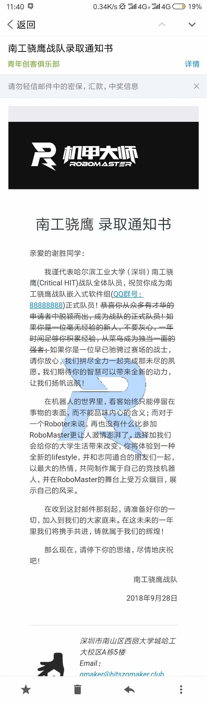

# RM2019 工作总结
> 谢胜

## 一、团队管理工作总结

这是我参加比赛的第三个年头，也是最后一个年头。呆了三年也终于混成了老油条。

今年还是以队长的身份带领整支队伍，新建了硬件组；新成员入队增加了笔试环节，还专门设计了新成员的入队通知邮件；新增了新成员培训环节；尝试整理培训教案和技术文档。新建立了《比赛建队参考手册》，新尝试了写周结，研发了队内规则评测系统，在电控组范围内试行了团队协作系统。这一年还是尝试了蛮多新鲜事情的。

这一年很多地方，我都力求它有仪式感，也希望以后的人能坚持下去。仪式感怎么说呢，能够一定程度上让人重视这件事情，试想如果没有仪式感，随随便便就被招进队里，那做事肯定也是随随便便的。比如新成员的录取通知邮件，我就去专门设计了一个版面，可能大家都没注意这一点，但确实和普通邮件感觉不一样。

到后面，为了让各位队员熟悉比赛规则，就使用官方规则测评的真题库做了一个队内的规则评测系统，而且放宽了要求，让大家在一周之内刷到80分以上，并且可以无限次刷题，最后取最高分，而官方的规则评测只有24小时刷题，而且每两次做题时间间隔至少40分钟，只取最后一次成绩。但奈何规则评测只发起了一次，事实上当时队内还处于培训阶段，对规则的需求不是很大，到后期研发阶段，规则几乎都忘了个干净，所以觉得后面有必要一年弄好几次评测，强迫每个人去翻看规则。但这次规则评测还是起到了一定的作用，因为我是当时的测评系统设计者，那些题库都是我一道一道录进去的，这样一番下来对规则掌握得还算牢固，结果到我们做规则评测的时候，我就在宿舍一个人做题，第三次刷题就拿到100分，是第二批规则评测学校中最快的，成功免费预订了一个6020电机。

官方这一年也做了很大的改变。从这一届开始，官方几乎每周都会进行一次“萝卜开会”（话说好久没有见到萝卜君了，有些想念），到后期演变为“RM圆桌”。有一周的“萝卜讲堂”就讲到了项目管理，其中提到了Jira和Confluence这两款软件，让我心中一动，但奈何是收费软件，有些昂贵，而且是联网的，不仅每台电脑要安装相应的软件，还需要一台电脑当作服务器。当时我就萌生了要开发一个属于战队自己的团队协作软件。

说干就干，马上我就撸起袖子干。利用以前学到的web技能，我用自己的私有云服务器上搭建了一个网站，在修复了若干bug后，很快有了一个雏形，但为了避免人员过多可能导致的混乱（当时队里有七十几号人），我只在电控组里试着用了一段时间（也有近二十人）。后来还觉得有点麻烦，又开发了对应的APP。但最后反响出来的结果并不是很乐观，虽说是让每个人把自己每天干的事情记录在系统里，但是从我统计出来的登录情况，其实大部分人根本就没有使用这个系统，而使用的人也只是每天写“今天补作业”，“今天复习考试”之类的，其实并没有起到什么用，但我觉得这种依靠软件的监督方法可以参考。我曾经接触过北京理工大学的队长，他们使用的是钉钉软件，每个队员每周都要写总结，而且写得少写得不好还会退回去重写，初期也是有的队员不想用，有些反抗，但后期坚持下来后也都觉得可以，进度确实提起来了。哈工大威海也使用钉钉进行指纹打卡，用以记录每个人的工作时长。

后来官方直接联合ONES.AI的工程师，为RM比赛专门申请了免费的项目管理软件使用，同时还起到监督项管工作的作用，但从后面各个学校的使用情况来看，其实很少有学校能坚持下来，到后面大多数报名使用的学校都将它废弃了，还是缺少强有力的执行手段，我们也是这样。但ONES其中最棒的我觉得还是wiki功能，在这上面可以写很多有用的东西，包括技术文档，管理手册，会议记录等，现在我已经隐退了，有空打算动手搭建一个队内的wiki系统。

写到会议记录，我就又想起一件没有坚持执行下来的事情。去年刚开始的时候我就想让项管把每一次的会议内容都记录下来，整理成文档，但奈何项管的文档格式真的很难，看着难受，转头就放弃了。会议记录是一个很重要的东西，一方面可以回顾当前研发的重点难点，掌握队伍的进度现状，另一方面可以给后面的备赛做参考，有了会议记录就知道大概什么时间段进度应该进行到哪一步，目前的进度是否已经拖延。这事儿以后一定要好好做。

周结这事儿吧，本以为是个挺小的事儿，没想到通知发出去反对的声音还挺大，我反正是想不通为什么当时有的人就这么讨厌写周结，真的写了会死人吗。周结还是要去做一做，起码队伍初期是要的，可以时刻提醒队员他正在参加这个比赛，这个比赛很重要，淘汰很残酷。

今年还多了一个拦路虎——赛季规划，这东西刚开始还属于选做环节，结果没多久就变为必做环节，重要性可见一斑。这里多提一句，每年参赛都会有几个很重要的任务，有几个很重要的时间点，比如这一届比赛就有规则评测、赛季规划、中期形态视频展示、设计报告、完整形态视频、裁判系统评测、志愿赛区这几个大环节。可能其中有几个是选做的，但还是建议尽力去做一做，有好处的。

说回赛季规划，其实哪怕官方不要求我们也是要做的，因为它真的非常重要。赛季规划，规划的是整个赛季，从资金需求，到组织架构，人员分配，机器人研发方向，人员管理方案，进度安排等，从新赛季刚开始的时候就要规划的一清二楚。说来也有意思，我把之前开发的团队协作系统写进了赛季规划中，还加了不少分。说实话一开始是写赛季规划态度还不太端正，但后面写着写着就不断地反省过去几个月整支队伍的运营管理情况，发现很多之前都规划好的事情都没有得到有效的执行，所以平时要是灵光一闪想到什么事一定要记下来，好记性不如烂笔头。今年我写的赛季规划，以及论坛里其他写的好的学校的一定都要拿来读读看看，会给队伍管理带来很多思考和想法。

之后的设计报告也差不多，我记得设计报告是寒假备赛结束后，也就是中期视频提交之后通知各组写的，一个寒假过去了，来年开学我收成果的时候，发现各组的报告都不咋滴，很多格式都不多，有的组压根就没法用，没办法，我后来一个一个改，内容不合适的打回去重写，实在不行就凑一点我比较了解的电控和硬件的东西上去，忙活了三四天，一行代码没写，才把设计报告搞定。

今年的赛季规划和设计报告最后的评分等级都是B级，还有一些提升空间，而威海老铁在这两个板块都是A级，直接斩获两套2018版裁判系统，着实羡慕。这两个东西我写了两年，始终发觉有些不妥，因为项管在其中发挥的作用都很小，几乎无用，但其实这东西应该队长和项管一起写，尤其是赛季规划，很大一部分都是项管的职责。

今年官方给的节点整体比去年早了一个月左右，未来可能更加，所以以后的进度要抓的更紧一点才行。

开会这件事，说来惭愧，我这人是真不喜欢开会，不管是参与者，还是主持者，都让我心惊胆战，不过这一届后半段我终究还是把每周一次的例会坚持下来了，也还好每周就一次例会，再多一点我就受不了了。鉴于我这人不会开会，所以我开会的方式不可取，也没更好的建议，只能靠后来者自身的本事了。其实早在最开始，去年暑假的时候，我在《比赛建队参考手册》中就提到了会议的召开方式，其实还挺有讲究的，当时我写到：

> 队长和项目管理要每周定期和技术组负责人、产品经理开例会；技术负责人要定期和小组成员开例会；产品经理要定期和项目组成员开例会。定期的例会不能长，按照参加会议的人数乘以5分钟为宜，不用讨论技术细节，只是为了同步进度以及发现风险，如果有人进度不达标，就要换人或者拆解他手头的工作。例会一定要形成会议记录，例会上发现的问题一定要形成执行计划。讨论技术细节的会议，由产品经理组织实际从事对应技术细节开发的同学进行。涉及越多技术细节的会议，参与的人越不能多，否则就会增加很多无意义的讨论，带来焦虑感。如果技术细节参与的人不多，怎么保证想出来的想法靠谱呢？就还要有评审会来保证。一个技术方案敲定并初步验证之后，必须引起其他机器人项目组或者其他技术小组里的骨干来评审、提问题，评审会上最需要各抒己见，所以参与的人越多越好，但是最终队长或者技术负责人必须对评审会上产生的新想法和意见拍板。所以队伍要学会开这三种会：例会，讨论会，评审会。

现在看来这段话依然是挺适合的。

队伍组织架构已经趋于完善了，但我觉得有些地方还是需要改进的。各技术组的组长没啥大问题，这个就看个人技术和能力，只要能力服众，有责任心，当技术组组长是没问题的。至于每辆车的组长，之前我贯彻的一直是由机械组员担任，因为机械组是整辆车的根基，所有的都围绕机械走。但通过这一年我发现，车辆组长最需要具备的不是技能，而是需要每个技术组的知识都了解一点，他不一定有对技术方案拍板的能力，但一定要有协调各组人员，协助各组资料互通的能力，车辆组长需要保证的是各个技术组的交流没有障碍，不能出现信息不对等的情况。

然后说到人员管理。我们这一届人数很多，是三届中最多的一届。大概是受往年人员衰减的阴影，今年最开始招新的时候海纳百川，基本报名就收，想着后面会过程淘汰，自然就少了。结果当时就收了七十多个人，加上原本上届留下来的十余人，一共有八十多个人，当时那个愁啊。后面培训走掉了一些人，寒假干活走掉了一些人，最后还有五十个人左右，最后没办法，订制队伍的时候，我把其中一部分人踢出了队伍（实在想不通，明明没来干活为什么还有脸来要队服），最后我们还剩下41个人。其实我电控组好几个人都应该清退的，但念想着之前还是挺努力的，每次开例会也都来了，就留着了。

这一届队伍一共有18名同学选择留队继续干，其实这人数已经很多了，第一年参赛最后也就剩20个，去年参赛只剩14个。一支队伍上限是35人，除去队长，项管，宣传，招商还剩31个名额。根据大多数队伍的经验，一支队伍的总人数在30人左右是比较合适的，其中电控7个，机械14个，硬件3个，视觉3个。前期可以多招一些人，到后期研发的时候人数太多反而不好，工作效率提不上去，总会有人显得没有事做。

人员管理最关键的一点就是惩罚机制，小到俯卧撑，大到直接清退，都要有一个明文规定。可以参考威海老铁的积分制，根据每周的工作时长，任务完成情况，例会出席情况等进行评分，得分累加，一段时间后总分低的人可能面临淘汰。

但最重要的还是执行者，执行者有没有决心，有没有信心把这套规则执行下去，是比规则本身更重要的一点。

项目推进则是老生常谈的问题，今年我们人数这么多但进度还是落下啦，说到底还是项目推进没有做好，项管在这一点上就跟空气一样。我之前尝试过让各组组长每天汇报进度，但后来反思发现还缺少重要的一点，组长应该提前把任务计划给列出来，然后管理者才能根据这个计划判断进度是否拉下。

说到列计划，今年备赛期间，我曾多次在会上要求各组组长把研发进度表列一个给我，但是到最后一个都没有列，比较好的是英雄组有一个口头承诺，最后也按照时间点完成了。但这些东西确实需要一个明确的文档记录，毕竟研发任务较重，光靠组长一人执行计划，很容易迷失其中，是需要队长和项管旁敲侧击的。

列计划也很有讲究，这就有涉及到《比赛建队参考手册》里的“项目需求”了，计划不是随随便便就能列出来的，他还要考虑很多突然意外情况，要对每一种意外情况想好应对措施，这东西列出来之后就是一个很好的依据，既可以在当年用于进度监督，也可以给后来者作备赛参考。

这就又说到意外情况的应对措施了。其实早在《比赛建队参考手册》中我就列了一点“突发情况应对”，但当时我只想到了备赛过程中进度的突发情况。从今年的比赛中可以很容易看出，我们对于比赛期间机器人本身的一些意外情况没有做充分的准备，退一步讲，我们甚至不知道机器人哪些地方会出现意外，更别提相应的补救措施了，说到底还是太粗心大意。现在回想起来，机器人的每一项功能都应该进行暴力测试和性能极限测试，比如气瓶里的气能使用多少次，一块电池能用多久，遥控器最远的操控距离，进一步的，每项功能改动之后也要重新测试一遍，确保工作正常。而这一切的前提，就在赛季规划中，要明确每一个机器人各方面的性能指标，这是研发机器人的一个大方向。一般来说，经过暴力测试后，机器人的一些问题就会暴露出来，一方面是尽力解决这些问题，另一方面要把这些问题写进一个检查文档里。最后这个文档会用于赛场检查。

然后是单独的一块——操作手。操作手这东西，我一直不建议比赛初期就选出来，须知操作手应该从队员中来，到队员中去。如果一个人在比赛初期就被任命为操作手，那么他想的可能就只有开车，而且想干的也只有开车，到后面无车可开，可能就走了。今年热身赛威海老铁过来的时候我感触很深，他们来那么多人，有几个全程玩手机，甚至跑不见，后来我了解到，那是几辆车的操作手。这几个人之前也是挺能干的，但自从被选为操作手之后，就开始不干活了，各种划水。

操作手到目前为止还没有什么选拔机制，原因很尴尬，几乎没人主动报名操作手，见到有人报名都欢喜的不得了，还选拔啥呢。操作手的培训是一个很尴尬的问题，三年了，到目前为止还没有一个像样的培训规范。操作手需要注意些什么，需要了解些什么，操作手自己都说不出来。今年我有意单独建了一个操作手群，就是想给各位操作手讲一些重要的事，但后面还是搞砸了。

操作手需要了解机器人的各项性能指标，熟知机器人常见问题的解决办法，具备基本的修车能力。甚至到后期，我更希望操作手是一整个车辆组的领导者，我觉得这是操作手的最高境界。操作手不应该等着被分配任务，而应该主动去寻找任务。

啊，一不小心就哔哔了这么多，也不知道大家会不会有耐心看下来，最后再说一件事，分区赛的宾馆一定要提早订好，一定要，不然路上会耗费很多时间，特别是发现有东西落在宾馆的时候，想死的心都有了。

## 二、电控组工作总结

电控组这一年也算是有一个很大的突破吧，自我感觉和前两年是完全不同的水平。今年电控培训出了一批年轻有为的大佬，思维活跃，想法新奇，能担重任。

电控组今年首先离开了标准库阵营，换成了HAL库，然后是重写实现了官方封装的函数库，实现了FreeRTOS操作系统，让代码开发更容易。说真的，要我现在转回标准库我肯定不干。

电控组今年还更新了机器人代码的整体结构，把控制逻辑和底层计算分离开，让代码开发更方便，更直观。

具体的技术方面，电控组先后攻克了裁判系统通信，PID调参技能，低通滤波应用，步兵小陀螺算法，辅助瞄准，卡尔曼滤波，陀螺仪姿态解算，flash读写，串口空闲中断，浮点数通信，USB通信等一系列难题，还搭建了技术博客[https://imuncle.github.io](https://imuncle.github.io)

目前还未解决的问题也有很多，包括CAN发送阻塞，陀螺仪零漂，功率限制，超级电容，热量限制，另外视觉辅助瞄准也可以有进一步的优化。

其实电控组还可以有更多的骚操作，包括射速的切换，传感器规避，弹丸计数等等。

电控组接下来的发展方向这一块，说实话每一年刚开始我都有种感觉，去年已经做得可以了，今年感觉没啥突破点，但其实干着干着问题就出来了。我现在能想到的不多，我认为电控组明年应该更加深入底层，首先是了解各种通信协议的实现方法，就拿CAN通信来说，首先抛出一个问题，CAN通信是否共地，其实理论上是不需要共地的，因为CAN通信依靠的是CANH和CANL的电位差大小来传输数据，但事实上，我们的CAN通信有时候不共地还真不能工作。另一点就是CAN通信的终端电阻，CAN总线上两端会各有一个120Ω的终端电阻，而这个电阻也很有讲究的，这里不细说，我也不太懂。另外CAN通信还可以去研究寄存器的相互配合，CAN信号究竟是怎么发出去的，消息是怎么接收的，怎么过滤的，这些都可以去研究，如果出现问题，可以直接查看寄存器的值，有时候能很快判断问题所在，说实话HAL库本身的问题反馈机制真的有点弱，错误种类太少了。

又比如说USART，它又是怎么发送数据，怎么接收数据的，它的移位寄存器，究竟是低位在前，还是高位在前，起始位、停止位和校验位究竟是啥，能不能从示波器中读出信息。其实逻辑分析仪是一个挺好的东西，以后也可以去尝试使用。

还有keil软件，虽然刘思宇整天说不用keil不用keil，甚至还想要C++编程，但我在这里严重警告，不要放弃keil，不要放弃C语言！说实话keil还有很多功能我们没用用到，你们可能还不知道keil的软件模拟功能有多么强大。在debug模式下，keil可以直接查看操作系统每个线程的工作情况，工作状态，堆栈使用情况，keil其实还自带了逻辑分析仪，性能分析仪等，虽然这些都很少用到，但都可以去尝试一下，我这一年其实已经没有时间去尝试这些新东西了。

要记住，在完全了解一款软件之前，不要轻易地放弃，更何况我们没用足够的理由去放弃现有的东西。

我们其实还可以更加深入，包括STM32启动文件里面到底写了些什么，单片机是怎么存储数据的，是怎么运行指令的，虽然很有可能这些知识一辈子都用不上，但还是那句老话，技多不压身，真心希望各位能在嵌入式这条路上越走越远，把知道的东西都专研透，大胆去开拓那些未知领域。现在机器人电控方面的研发压力其实已经不是很大了，很多东西前人已经帮你们铺垫好了，你们完全有时间有精力去研究其他的东西。

培训方面，我今年的培训其实特别仓促，当时的我对嵌入式了解的也不是很深，要是现在的我去培训那肯定又是另一种感觉了。电控培训不像机械，咱们要讲的东西很多，因为嵌入式开发这东西，和普通的软件开发有很大的差别，我们更加偏重的是硬件的驱动，而软件开发偏重的是数据结构，是系统框架，是API调用，是逻辑优化。

培训首先就要让大家理解一些常见的外设使用，包括GPIO，TIM，ADC，IIC，USART等等，还要讲解时钟树，调试下载，必备工具等等，对于新人来说，一时半会儿都很难完全接受，希望培训者要耐心讲解，不要像我一样。

一个人培训多个人其实多少还是有些吃力的，这一届因为最开始只有我一个电控的所以没办法，我希望的是多找几名同学培训，讲课的时候还是聚在一起授课，但是由几名同学轮流上台讲解，各自分配一部分的培训内容，同时每名同学都各自带一部分新成员，负责答疑解惑，这样每个人的培训任务都减轻了很多，而且新成员与老队员的交流也会容易很多。

今年培训的时候其实新成员之间的交流还不是很多，事实上几乎没有交流，大家都只跟我有些接触，遇到问题一般也直接找我，而不会找其他的成员，甚至连培训时坐在旁边的同桌叫啥都不知道。后续的培训活动应该注意这一点，要在初期就建立各个成员之间的友谊。

另外培训吧，还是要有教学日志的，把教学心得，教学资料，教学内容记录下来，这样子下一届培训就会轻松很多，而且可以在原有的培训基础上加一些东西，让培训内容更加丰富。很遗憾，今年第一次培训，我没有留下太多的教学资料，望后来人谨记。

最后说一下人员分配的问题。我开始没有想到电控组的人会有这么多，一开始有近二十个，一下子就超过了去年人数的总和，到最后还剩下11个人，其实人数有点多，这11个人当中，有2个步兵的电控和1个工程的电控都几乎全程划水，事实上，英雄的电控和工程的电控也可以减少为一个人。也就是说电控组其实6个人就可以carry全部。当然，这个有点极限，但还是希望给后面的电控组组长一个警钟，人多了就及时清退。

电控组还应该做的，是把一些常用的模块封装成库，用的时候直接复制文件就行的那种，把调用的API写好。可以参考我今年弄的几个库文件
[Embedded_Peripheral_Libs](https://github.com/imuncle/Embedded_Peripheral_Libs)

## 三、队伍建议

啊，回头一看居然哔哔了这么多，最开始动笔的时候还以为说不出什么话，结果越说越得劲。鉴于前面有很多都是个人唠叨，很多废话，所以这里统一做个干净利落的总结。

### （一）	团队管理
1.	有些地方要有仪式感
2.	多搞几次队内规则测评
3.	赛季规划提早写，好好写，队长项管一起写
4.	选一个优秀的团队协作管理系统，坚持弄下去
5.	周结好好写
6.	弄一个好的wiki系统，技术手册，比赛规则，FAQ，会议记录样样不能少
7.	例会、评审会、研讨会，都要试着召开
8.	组织架构微调，车辆负责人不一定具有方案拍板权，主要职责是协调各技术组工作
9.	惩罚机制完善，建议积分制。
10.	提早列好计划，用于项目推进，写好项目需求书。
11.	重视意外情况，提早暴力测试，性能极限测试，针对每一个意外情况做好应对措施。
12.	加强操作手教育和培训
13.	提早订酒店

### （二）	电控
1.	深入底层，了解各通信协议的工作原理及每个环节可能出现的问题
2.	深入研究STM32工作原理，了解数据存储，启动方式，取指运行等
3.	多人协作培训，注意教案资料存档
4.	及时清退多余人员，切忌人浮于事
5.	常用模块驱动库封装
