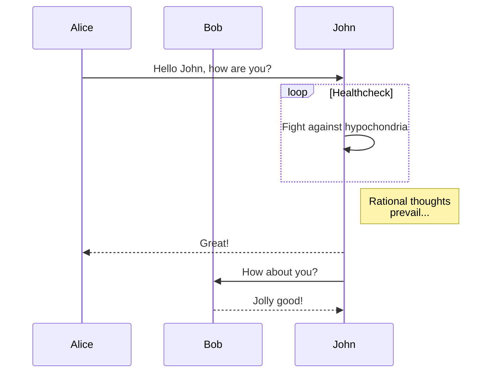

# 系统简介
这是哈尔滨工业大学（深圳）南工骁鹰战队的队内wiki系统，基于开源wiki框架[viki](https://github.com/tamlok/viki)二次开发。

## 为什么使用
1. 战队内部资料管理
2. 研发进度记录
3. 经费使用公示
4. 往届资料传承

---
# 使用说明
内容统一由项管或队长更新，如遇bug请联系**电话：15282577826，QQ；1378006772**

## 如何下载上传
使用前先安装好Git客户端。

如果是第一次使用，随便选择一个文件夹目录，打开Git命令行，把仓库内容克隆下来
```bash
git clone https://github.com/HITszRM/wiki
```

然后可以使用visual studio code或其他编辑器打开，进行编辑。
> 注意：
1. 编辑时请使用UTF-8编码
2. 如果不是第一次编辑，请在编辑前与云端同步
```bash
git pull origin master
```
如果本地文件与云端文件版本不一样，可能导致上传时出现冲突。

修改完之后，确认保存。然后在文件根目录下打开Git命令行。

首先可以查看有哪些文件被更改：
```bash
git status
```

将更改的文件添加进上传列表
```bash
git add *
```

添加更新日志
```bash
git commit -m "你的更新日志"
```

上传
```bash
git push origin master
```

## 如何修改文件
在根目录下有两个文件很重要：`viki.json`和`navigation.json`。

`viki.json`里面是系统配置，可设置网站标题、图标、页脚信息、Markdown解析配置等，建议不要轻易修改。

`navigation.json`里面配置的是网页的顶部导航栏，以及每一页的内容，具体如下：
```json
{
    "navigation":
    [
        {
            "text": "导航栏1",
            "target": "这是页面侧边导航栏的配置文件，可不填写",
            "navi": "填写true或false，是否展示侧边导航栏",
            "navi_index": "默认显示的页面内容"
        },
        {
            "text": "导航栏2",
            "target": "experience/note.json",
            "navi": true,
            "navi_index": "experience.md"
        }
    ],
    "actions":
    [
        {
            "text": "imuncle",
            "icon": "https://imuncle.github.io/images/avatar.jpg",
            "target": "https://imuncle.github.io"
        },
        {
            "text": "github",
            "icon": "https://github.com/fluidicon.png",
            "target": "https://github.com/HITszRM/wiki"
        },
        {
            "text": "这里是导航栏右侧图标链接的配置文件，可设置图标名称",
            "icon": "设置图标的链接",
            "target": "设置图标的超链接"
        }
    ]
}
```

侧边导航栏的配置文件如下：
```json
{
    "created_time": "",
    "files": [
        {
            "attachment_folder": "",
            "attachments": [
            ],
            "created_time": "",
            "modified_time": "",
            "name": "文件1（这里填写的是对应的Markdown文件名称，要加上后缀）",
            "tags": [
            ]
        },
        {
            "attachment_folder": "",
            "attachments": [
            ],
            "created_time": "",
            "modified_time": "",
            "name": "文件2",
            "tags": [
            ]
        }
    ],
    "sub_directories": [
        {
            "name": "文件夹1"
        },
        {
            "name": "文件夹2"
        }
    ],
    "version": "1"
}
```

支持多级文件系统。

## 书写内容
文件支持Markdown输入，letex公式输入，可设置标题、列表、字体**加粗**，*斜体*，***斜体加粗***，~~划去~~等样式

$$E = mc^2$$

> 记得开妙算
>> 放心，赛后我们就改规则
>>> 199 error(s), 455 warning(s)

支持`HTML`嵌入，比如

<text style="color:red">红色的字</text>

支持静态图片插入、动态图片插入、超链接设置。

支持视频插入：
<iframe src="//player.bilibili.com/player.html?aid=39155821&cid=68816167&page=1" scrolling="no" border="0" frameborder="no" framespacing="0" allowfullscreen="true"> </iframe>

支持表格绘制、流程图绘制。

|姓名|学号|电话|
|:--:|:--:|:--:|
|某某|某某的学号|某某的电话|

```flowchart
st=>start: Start:>http://www.google.com[blank]
e=>end:>http://www.google.com
op1=>operation: My Operation
sub1=>subroutine: My Subroutine
cond=>condition: Yes
or No?:>http://www.google.com
io=>inputoutput: catch something...
 
st->op1->cond
cond(yes)->io->e
cond(no)->sub1(right)->op1
```

