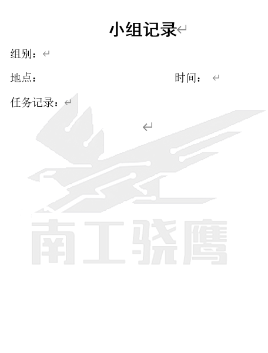
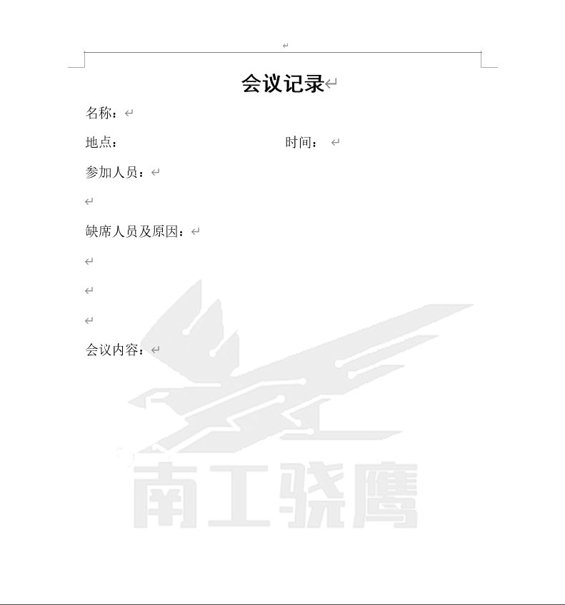

# Robomaster2020 南工骁鹰战队 管理制度

## 一、总则

本队为哈尔滨工业大学（深圳）依托于青年创客俱乐部的机器人战队。本队备赛及参赛期间，任何一名通过选拔的队员有义务服从本制度中的条例、团结友爱、沟通协作，以确保备赛的高效性以及战车的各方面性能。最终所得一切奖项均归青年创客俱乐部、南工骁鹰战队及其全体正式参赛队员个人所有。

## 二、人员安排

经考察他校战队及内部讨论，本队确定人员安排如下：

1. 核心队员：主要由前两届队员以及具有一定基础的同学组成，要对本比赛有高度的热情及了解，直接分配进入各小组；同时应起到激励预备队员并传授技术及经验的作用；

2. 预备队员：主要由基础相对薄弱的同学组成，要求具有**良好的学习态度**，并对Robomaster比赛具有极大的兴趣。分区赛前选拔部分预备队员与核心队员一起作为正式参赛队员；

3. 技术顾问：主要由有一定参赛经验的研究生及本科生组成，不做考勤要求，但需要根据自身参赛经验给出方向性指导，并可利用自身威信鼓励现存队员积极备赛；

4. 操作手：要求熟读规则手册，了解战车的原理以及操作方法，备赛时需进行科学的训练，**不得私自交换操控的战车，不得随意在工作场地操控车辆移动**；

5. 指导老师：希望校方能够指派二至三名老师进行技术性指导，包括方案评定、零件加工、疑难解决、项目管理指导等方面，建议计入指导老师在本科生教学方面的工作量。

## 三、  备赛条例

1. 所有参赛人员需遵循由队内统一讨论出的**备赛方针（赛季规划）**，明确每个阶段应该去做什么，并为之努力。

2. 备赛之初将由对内核心成员讨论出一份目标安排及最终时间表，各组负责人根据最终目标及最后完成时间对任务进行时间上和人员上的合理分配（精确到周，允许提前一周告知更改，但最终目标非遇不可抗力之因素不可更改），做成表格发至项管处，项管将以此作为每周评定之依据。

## 四、考勤条例

1. 队员的考勤实行打卡下班制度，时间段不做硬性的规定，自由选择时间打卡，至少保证每个星期**六**个小时的打卡时间，如果不满**六**个小时视为未出勤一次，特殊情况向队长进行报备，要求给出书面申请。（暂定）
2. 队内各种会议的签到记录也将记入考勤项。
3. 每个人允许三次缺勤，特殊情况向项管和队长处进行报备，超出三次的队内自动清除。

## 五、工作条例

1. 为保证参赛人员身体的健康，严禁队员在工作空间内用餐，用餐请移步至别处。

2. 参赛队员在结束一天工作后有义务对自己使用过的工具进行收拾，工具需放回原处，待工作环境收拾干净后方可离开（详情参阅工具管理条例）。

3. **允许高强度工作中的break time**。

4. 尽量保证各组成员互相认识，促进各组间的技术交流，也尽量规避性格内向的同学被边缘化的现象。

5. 建议每个组长一周至少组织一次组内的集体工作，便于同学们互相认识并提高办事效率及水平。

6. 工作内容：工作内容由各组组长给出，项目管理及其他负责监督进度的同学有义务在ddl前催促各组主要负责人及各细化的工作内容负责人，保证其在ddl之前完成即可，鼓励提前完成。工作完成时间、工作完成质量等指标另行评定，优秀的加以褒奖，有问题的要及时给予警醒；屡教不改、多次推脱进度的可以考虑劝退。

7. 日常保证通讯畅通，便于在紧急情况下进行联系。要求优先关注队内消息通知群，对于@全体成员及群公告中的内容或重要文件，要及时接收；由于开会时间早已公布的，未出勤的且未提前请假，也按未出勤一次的结果处理。

8. 周结制度：RM队员要能向他人清晰阐述自己所做的工作，如果你一个人单干，别人也不理解你的工作，这恐怕不行。同时，要为备赛留下足够的资料和素材，主要用于工程记事本以及其他地方。我们不希望每一年都是重新开始。

9. 要求：
    1. 字数控制在200字，但是不能低于200字。
    2. 文件名命名“xxx第x周周结.docx”（word自带字数统计，比较方便）
    3. 周结的内容仅限于RM，不要写成日记or文学作品。
    4. 周结好好写，当你的工作考核及进度不太理想的时候，就看你的周结了。

## 六、会议条例

1. 每周例会（时间要求：<15min）:队内大型例会由项管协助队长开展，届时每一个小组需将一周之内的进度及发现的问题进行汇报，由项管统一整理，每一周的目标由组长负责，做一个进度报表发至项目管理处作为下一周评判的根据。战队大会开完后，各小组根据自身情况进行组内自由讨论，讨论内容需要总结上报至项管处。遇上课等不可抗力之因素可以允许请假，但必须提前告知会议的队长及项目管理，与会人员需签到统计。项管需对会议的重要内容进行记录并上传至战队官网会议记录部分。

2. 谏言会：有提议就有民主，积极参与才有发言的机会，由成员自由发言，队长和项管只负责听，也算讨论会的一种。
    1. 战队不合理地方的讨论（诸如成员进度拖沓，组长分配任务量有待考量，场地卫生环境等等）。
    2. 成员对于该一周工作情况的感觉，或是可以提出什么的不足。

3. 其他讨论会（时间要求：<30min）：由项目负责人或技术负责人主持，参与者积极参加。
    1. 技术方案的讨论（最好提前确定内容，每个人都能发言，不要总出现方案总是一两个人提出，其他人附和的情况）,目的是解决目前工作中存在的技术问题，由组内项目管理或组内成员轮流对会议的主要内容进行记录，将问题和解决方案进行统计（标注问题人及解决人），会议后递交到项管处统一整理上传。
    注：但是方案一出，必须确认负责人，队员，而钱、时间、物料也需要估算才行。不能听你白扯淡。
    2. 头脑风暴。

4. 运营会（<15min）  
组织培训，宣传，拉赞助，财务，团建，招募谁开除谁，其他杂事儿  
说明：开会是为了更有效率，更高质量地完成备赛任务，秉承时间短，效率高的原则，会议内容尽量以紧急和重要的内容为主，其余的可以私下里进行交流。

## 小组讨论会的会议记录模板

## 每周例会的会议记录模板

## 七、经费使用条例

1. 战队的经费是属于战队每一个人的，我们有义务去协调使用好这些来之不易的经费。

2. 经费的使用涉及到报销等等一系列程序，在购买物资时要求能开**普通发票**，并留下交易记录的截图供以后使用。

    - **开票信息**  
    开户名称：**哈尔滨工业大学（深圳）**  
    开户银行：平安银行深圳大学城支行  
    银行账号：0142100327638  
    统一社会信用代码:**12440300MB2C762027**  
    单位地址：深圳市西丽深圳大学城

3. 所有用品的购买：购买的物品**均需要**报给队长和项管处审批，提供淘宝具体商品信息；战队的资金来之不易，且去年战队出现了后期发票积压的问题，希望大家可以理解并执行；特殊情况下可以购买后再行上交发票及订单截图。

4. 第一次未知第3条细则的私自购买物品的，不予追究；第二次再自行购买的，其购买物品均不予报销。

5. 合同的签订：根据战队的规章，单笔满1000元以上需要签订合同，合同签订需预先告知队长及项管。

6. 经费的分配：战队正式成立时将会召开以各组为单位的经费分配会，各组需控制经费在预算范围内，超出预算的部分需跟队长与项管协调解决。

7. 经费的统计：经费的总使用情况由项管负责整理，每个月以机器人小组为单位发放经费使用清单的表格，做到人人心里有数。

8. 平均两周左右项目管理把发票和物料清单汇总，由队长or专门的财务审核一遍，然后上报到团委。

## 

起草人：王圣 陈晓满

[^_^]: (date:2020-05-10)
