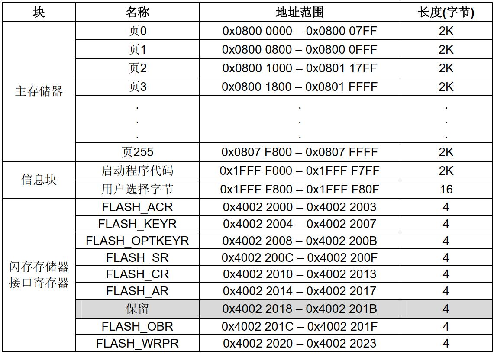

# 基本信息
* 课程名称：闪存 - FLASH
* 讲师：谢胜
* 培训时间：2019/9/29 14:00-16:00
* 培训地点：T3 706
* 培训人数：14人

# 教学要点
* FLASH组成
* IAP、ICP
* FLASH读操作
* FLASH写操作

# 教学重点
* FLASH读操作
* FLASH写操作

# 教学难点
* FLASH写操作

# 教学准备
1. 学生准备：电脑、单片机、下载器
2. 教师准备：借教室

# 教学过程
## 第一步：FLASH介绍
首先明确一点，**一个32位地址指向1个字节**，我们常说的flash空间，多少多少K，指的是多少多少K byte。

Flash 中文名字叫闪存，是一种长寿命的非易失性（断电数据不丢失）的存储器。可以对称为块的存储器单元块进行擦写和再编程，在进行写入操作之前必须先执行擦除。


STM32的FLASH地址起始于`0x0800 0000`，结束地址是0x0800 0000加上芯片实际的FLASH大小，不同的芯片FLASH大小不同。

RAM起始地址是`0x2000 0000`，结束地址是0x2000 0000加上芯片的RAM大小。不同的芯片RAM也不同。

Flash中的内容一般用来存储代码和一些定义为const的数据，断电不丢失，RAM可以理解为内存，用来存储代码运行时的数据，变量等等。掉电数据丢失。

STM32将外设等都映射为地址的形式，对地址的操作就是对外设的操作。stm32的外设地址从0x4000 0000开始，可以看到在库文件中，是通过基于0x4000 0000地址的偏移量来操作寄存器以及外设的。

一般情况下，程序文件是从 0x0800 0000 地址写入，这个是STM32开始执行的地方，0x0800 0004是STM32的中断向量表的起始地址。 

在使用keil进行编写程序时，其编程地址的设置一般是这样的： 


程序的写入地址从`0x0800 0000`（数好零的个数）开始的，其大小为`0x8 0000`也就是512K的空间，换句话说就是告诉编译器flash的空间是从`0x0800 0000`-`0x0808 0000`

RAM的地址从`0x2000 0000`开始，大小为`0x1 0000`也就是64K的RAM。这与STM32的内存地址映射关系是对应的。

单片机复位后，从`0x0800 0004`取出复位中断的地址，并且跳转到复位中断程序，中断执行完之后会跳到我们的`main`函数，`main`函数里边一般是一个死循环，进去后就不会再退出，当有中断发生的时候，单片机将指针强制跳转回中断向量表，然后根据中断源进入对应的中断函数，执行完中断函数之后，再次返回`main`函数中。大致的流程就是这样。

## 第二步：FLASH内部构造
按照不同容量，存储器组织成32个1K字节/页(小容量)、 128个1K字节/页(中容量)、 256个2K字节/页(大容量)的主存储器块和一个信息块。



闪存存储器被组织成32位宽的存储器单元，可以存放代码和数据常数。每一个STM32F10xxx微控制器的闪存模块都有一个特定的启始地址。

信息块分为两个部分：

* 系统存储器是用于存放在系统存储器自举模式下的启动程序，这个区域只保留给ST使用，启动程序使用USART1串行接口实现对闪存存储器的编程； ST在生产线上对这个区域编程并锁定以防止用户擦写
* 选择字节：选项字节用于配置 FLASH 的读写保护、电源管理中的 BOR 级别、软件/硬件看门狗等功能，这部分共 32 字节。可以通过修改 FLASH 的选项控制寄存器修改。

闪存存储器有两种保护方式防止非法的访问(读、写、擦除)：

* 页写入保护
* 读出保护

在执行闪存写操作时，任何对闪存的读操作都会锁住总线，在写操作完成后读操作才能正确地进行；即在进行写或擦除操作时，不能进行代码或数据的读取操作。

进行闪存编程操作时(写或擦除)，必须打开内部的RC振荡器(HSI)。

闪存存储器可以用ICP或IAP方式编程。

* IAP(In-Application Programming)： IAP是在用户程序运行时对闪存微控制器中存储器重新编程。
* ICP(In-Circuit Programming)： ICP是在芯片安装到用户应用板上后，通过JTAG协议对闪存微控制器中存储器编程。

## 第三步：FLASH的读/写操作
### 读操作
内置闪存模块可以在通用地址空间直接寻址，任何32位数据的读操作都能访问闪存模块的内容并得到相应的数据。

```c
uint32_t Robot_Num_Flash_Add = 0x08005000; 
ID_Num = *(__IO uint16_t*)( Robot_Num_Flash_Add ); //*(__IO uint16_t *)是读取该地址的参数值,其值为16位数据,一次读取两个字节，*(__IO uint32_t *)就一次读4个字节
printf("ID_num:0x%x\r\n", ID_Num);
```

### 写操作
闪存编程和擦除控制器(FPEC)处理闪存的编程和擦除操作。它包括7个32位的寄存器：

* FPEC键寄存器(FLASH_KEYR)
* 选择字节键寄存器(FLASH_OPTKEYR)
* 闪存控制寄存器(FLASH_CR)
* 闪存状态寄存器(FLASH_SR)
* 闪存地址寄存器(FLASH_AR)
* 选择字节寄存器(FLASH_OBR)
* 写保护寄存器(FLASH_WRPR)

复位后， FPEC模块是被保护的，不能写入FLASH_CR寄存器；通过写入特定的序列到FLASH_KEYR寄存器可以打开FPEC模块，这个特定的序列是在FLASH_KEYR写入两个键值(KEY1和KEY2)；错误的操作序列都会在下次复位前锁死FPEC模块和FLASH_CR寄存器。

* KEY1: `0x45670123`
* KEY2: `0xCDEF89AB`

写入错误的键序列还会产生总线错误；总线错误发生在第一次写入的不是KEY1，或第一次写入的是KEY1但第二次写入的不是KEY2时； FPEC模块和FLASH_CR寄存器可以由程序设置FLASH_CR寄存器中的LOCK位锁住，这时可以通过在FLASH_KEYR中写入正确的键值对FPEC解锁。

#### 闪存擦除
闪存可以按页擦除，也可以整片擦除。

**1、页擦除**


闪存的任何一页都可以通过FPEC的页擦除功能擦除；擦除一页应遵守下述过程：

* 检查FLASH_SR寄存器的BSY位，以确认没有其他正在进行的闪存操作；
* 设置FLASH_CR寄存器的PER位为`1`；
* 用FLASH_AR寄存器选择要擦除的页；
* 设置FLASH_CR寄存器的STRT位为`1`；
* 等待BSY位变为`0`；
* 读出被擦除的页并做验证。

**2、整片擦除**


可以用整片擦除功能擦除所有用户区的闪存，信息块不受此操作影响。建议使用下述过程：

* 检查FLASH_SR寄存器的BSY位，以确认没有其他正在进行的闪存操作；
* 设置FLASH_CR寄存器的MER位为`1`；
* 设置FLASH_CR寄存器的STRT位为`1`；
* 等待BSY位变为`0`；
* 读出所有页并做验证。

#### 主闪存编程
对主闪存编程每次可以写入16位。即在一个闪存地址写入一个半字将启动一次编程；写入任何非半字的数据， FPEC都会产生总线错误。

在编程过程中，任何读写闪存的操作都会使CPU暂停，直到此次闪存编程结束。


标准的闪存编程顺序如下：

* 检查FLASH_SR寄存器的BSY位，以确认没有其他正在进行的编程操作；
* 设置FLASH_CR寄存器的PG位为`1`；
* 在指定的地址写入要编程的半字；
* 等待BSY位变为`0`；
* 读出写入的地址并验证数据。

> 当FLASH_SR寄存器的BSY位为`1`时，不能对任何寄存器执行写操作。

FPEC先读出指定地址的内容并检查它是否被擦除，如未被擦除则不执行编程；如果指定的地址在FLASH_WRPR中设定为写保护，也不执行编程。

**所有的编程操作结束后要锁上FLASH**。

## 第四步：查看工程的内存分布
由于内部 FLASH 本身存储有程序数据，若不是有意删除某段程序代码，一般不应修改程序空间的内容，所以在使用内部 FLASH 存储其它数据前需要了解哪一些空间已经写入了程序代码，存储了程序代码的扇区都不应作任何修改。

通过查询应用程序编译时产生的`*.map`后缀文件，
打开`map`文件后，查看文件最后部分的区域，可以看到一段以`Memory Map of the image`开头的记录：


从这个文件中可以看到flash究竟哪些地址被使用了。keil在下载程序的时候有三种选项：


* Erase Full Chip：烧写程序之前擦除整个Flash存储器。
* Erase Sectors：烧写程序之前擦除程序要使用的扇区。
* Do not Erase：不进行擦除操作

默认选择第二个选项，所以我们只需要把数据存储在程序没有用到的flash区域就行了，不会在下载程序的时候被覆盖。

## 第五步：FLASH API
```c
/**
  * @brief  FLASH Erase structure definition
  */
typedef struct
{
  uint32_t TypeErase;   /*!< TypeErase: Mass erase or page erase.
                             This parameter can be a value of @ref FLASHEx_Type_Erase */
  
  uint32_t Banks;       /*!< Select banks to erase when Mass erase is enabled.
                             This parameter must be a value of @ref FLASHEx_Banks */    
  
  uint32_t PageAddress; /*!< PageAdress: Initial FLASH page address to erase when mass erase is disabled
                             This parameter must be a number between Min_Data = 0x08000000 and Max_Data = FLASH_BANKx_END 
                             (x = 1 or 2 depending on devices)*/
  
  uint32_t NbPages;     /*!< NbPages: Number of pagess to be erased.
                             This parameter must be a value between Min_Data = 1 and Max_Data = (max number of pages - value of initial page)*/
                                                          
} FLASH_EraseInitTypeDef;
```

```c
/**
  * @brief  Unlock the FLASH control register access
  * @retval HAL Status
  */
HAL_StatusTypeDef HAL_FLASH_Unlock(void)
```

```c
/**
  * @brief  Locks the FLASH control register access
  * @retval HAL Status
  */
HAL_StatusTypeDef HAL_FLASH_Lock(void)
```

```c
/**
  * @brief  Perform a mass erase or erase the specified FLASH memory pages
  * @note   To correctly run this function, the @ref HAL_FLASH_Unlock() function
  *         must be called before.
  *         Call the @ref HAL_FLASH_Lock() to disable the flash memory access 
  *         (recommended to protect the FLASH memory against possible unwanted operation)
  * @param[in]  pEraseInit pointer to an FLASH_EraseInitTypeDef structure that
  *         contains the configuration information for the erasing.
  *
  * @param[out]  PageError pointer to variable  that
  *         contains the configuration information on faulty page in case of error
  *         (0xFFFFFFFF means that all the pages have been correctly erased)
  *
  * @retval HAL_StatusTypeDef HAL Status
  */
HAL_StatusTypeDef HAL_FLASHEx_Erase(FLASH_EraseInitTypeDef *pEraseInit, uint32_t *PageError)
```

```c
/**
  * @brief  Program halfword, word or double word at a specified address
  * @note   The function HAL_FLASH_Unlock() should be called before to unlock the FLASH interface
  *         The function HAL_FLASH_Lock() should be called after to lock the FLASH interface
  *
  * @note   If an erase and a program operations are requested simultaneously,    
  *         the erase operation is performed before the program one.
  *  
  * @note   FLASH should be previously erased before new programmation (only exception to this 
  *         is when 0x0000 is programmed)
  *
  * @param  TypeProgram:  Indicate the way to program at a specified address.
  *                       This parameter can be a value of @ref FLASH_Type_Program
  * @param  Address:      Specifies the address to be programmed.
  * @param  Data:         Specifies the data to be programmed
  * 
  * @retval HAL_StatusTypeDef HAL Status
  */
HAL_StatusTypeDef HAL_FLASH_Program(uint32_t TypeProgram, uint32_t Address, uint64_t Data)
```

## 第六步：FLASH读写实验
```c
/*FLASH写入程序*/
void writeFlash(uint32_t addr, uint32_t WriteFlashData)
{
    /* 1/4解锁FLASH*/
    HAL_FLASH_Unlock();

    /* 2/4擦除FLASH*/
    /*初始化FLASH_EraseInitTypeDef*/
    FLASH_EraseInitTypeDef FlashSet;
    FlashSet.TypeErase = FLASH_TYPEERASE_PAGES;
    FlashSet.Banks = FLASH_BANK_1;
    FlashSet.PageAddress = addr;
    FlashSet.NbPages = 1;

    /*设置PageError，调用擦除函数*/

    uint32_t PageError = 0;
    HAL_FLASHEx_Erase(&FlashSet, &PageError);

    /* 3/4对FLASH烧写*/
    HAL_FLASH_Program(FLASH_TYPEPROGRAM_WORD, addr, WriteFlashData);

    /* 4/4锁住FLASH*/
    HAL_FLASH_Lock();
}

/*FLASH读取程序*/
uint32_t readFlash(uint32_t addr)
{
	uint32_t temp = *(__IO uint32_t*)(addr);
	return temp;
}
```

# 参考
* [STM32学习笔记：读写内部Flash（介绍+附代码）](https://www.cnblogs.com/pertor/p/9484663.html)
* 《STM32F1XX闪存编程参考手册》