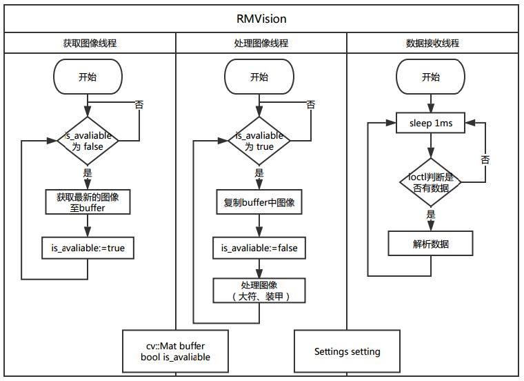
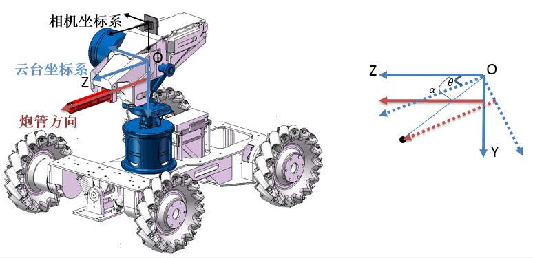
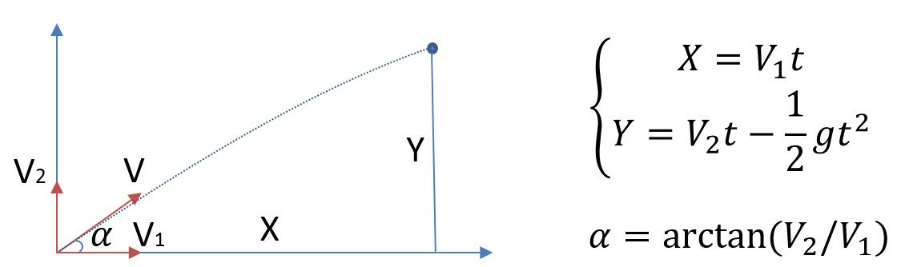
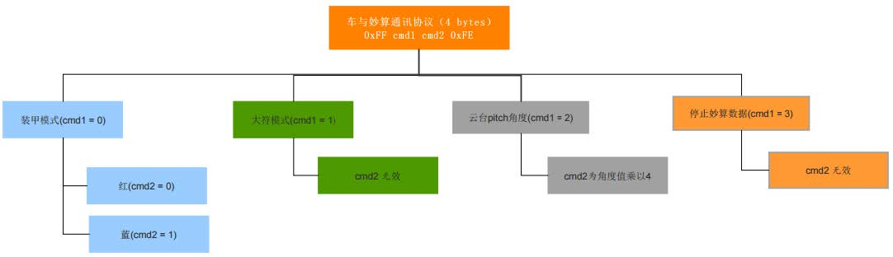

# RM3Vision 文档

## 功能需求

### 神符检测

功能： 检测九宫格中的目标，并输出目标位置信息给下位机  

- 保证每次目标识别+打击的时间小于1.5s
- 对车身位置有较大范围的适应性

### 装甲检测

功能：检测场景中目标的位置，

- 在目标旋转时保证目标的位置的稳定性
- 系统延时尽可能短
- 在多目标时，保证打击的一致性

## 整体架构

### 文件描述

|文件名|包含类|用途|
|:-:|:-:|:-:|
|AngleSolver.cpp|RectPnPSolver / AngleSolver /AngleSolverFactory|目标角度解析|
|ArmorDetector.cpp| ArmorParam / ArmorDetector |装甲检测|
|ImageConsProd.cpp| ImageConsProd| 用于获取图像以及处理图像|
|LedController.cpp| LedController| GPIO控制LED进行状态显示|
|Predictor.cpp| Predictor| 利用历史数据进行预测|
|RemoteController.cpp| RemoteController| 接收其他终端数据|
|RMVideoCapture.cpp| RMVideoCapture| 与Opencv的VideoCapture功能类似
|RuneDetector.cpp| RuneDetector| 神符检测|
|Filter.cpp| RuneResFilter / ArmorFilter / Filter1D / FilterZ| 滤波器|
|serial.cpp| |串口通信|
|Settings.hpp| Settings |配置文件载入器|
|sse_to_neon.hpp||SSE接口与NEON接口转换|

### 系统框图



## 实现方案

购买的摄像头模组为KS2A17，支持  
- 30fps YUV 640X480
- 120fps MJPG 640X480
- 60fps MJPG 1280X720

其中720P在垂直方向视角小于640X480，在神符模式时，对垂直方向视角要求较大，因此神符模式下选择640X480，而120fps模式下必须为低曝光，对图像的质量有一定影响，因此采用30fps YUV。而对于辅助、自动瞄准，则要求系统延时尽可能短，因此在近距离时使用120fps MJPG 640X480，而在远距离时使用60fps MJPG1280X720，兼顾了系统的适应性与实时性。而opencv所提供的VideoCapture无法实现帧率与分辨率的选择（测试环境 ubuntu14.04 opencv3.0.0），因此采用V4l2重写了兼容opencv中Mat的RMVideoCapture类，实现了不同的分辨率与帧率的切换。

实现的总体方案如下图所示：


### 神符检测

基本原理

1. 二值化
2. 在二值图像中进行轮廓查找
3. 用最小的矩形包围所有轮廓，筛选出满足一定宽高比的矩形区域
4. 满足宽高比的矩形刚好等于9，则进行下一步，否则利用矩形间的距离关系选出最合适的9个作为九宫格
5. 找出九宫格的四个顶点，利用透视变换将图像变为正视图，并截取出9个cell对应的图像
6. 找出9个cell中目标的位置
    - 方案1： 利用ORB特征，进行特征匹配，匹配度最低的cell为目标
    - 方案2： 利用梯度（边缘）的数量，边缘的数量最少的为目标
    - 方案3： 利用cell中心区域的边缘数量与两侧的边缘数量比值，比值最大的为目标

投票选择

为了防止错误的检测导致大符的激活失败，我们采用了投票机制，保存最近的k次检测结果，若当前的检测结果与k次投票的检测结果一致，则输出，否者不输出并更新历史数据。

### 装甲检测

```c++
struct ArmorParam {
unsigned char min_light_gray; // 板灯最小灰度值，用于对敌方颜色通道进行二值化
unsigned char min_light_height; // 板灯最小高度值
unsigned char avg_contrast_threshold; // 对比度检测中平均灰度差阈值，大于该阈值则为显著点
unsigned char light_slope_offset; // 允许灯柱偏离垂直线的最大偏移量，单位度
int max_light_delta_h; // 左右灯柱在水平位置上的最大差值，像素单位
unsigned char min_light_delta_h; // 左右灯柱在水平位置上的最小差值，像素单位
unsigned char max_light_delta_v; // 左右灯柱在垂直位置上的最大差值，像素单位
unsigned char max_light_delta_angle; // 左右灯柱在斜率最大差值，单位度
unsigned char avg_board_gray_threshold; // 矩形区域平均灰度阈值，小于该阈值则选择梯度最小的矩阵
unsigned char avg_board_grad_threshold; // 矩形区域平均梯度阈值，小于该阈值则选择梯度最小的矩阵
unsigned char grad_threshold; // 矩形区域梯度阈值，若大于该阈值，则累加 梯度/阈值
unsigned char br_threshold; // 红蓝通道相减后的阈值
unsigned char enemy_color; // 0 for red, otherwise blue
};
```

基本原理

1. 若`last_result` 结果有效，则当前检测区域为上一帧位置的附近，否则逐帧扩大检测区域，直至连续60帧未检测到目标，清除`last_result` 。

2. 二值化（仅在目标颜色通道上进行）

3. 在前景区域，若该区域的目标颜色通道灰度值最大，则利用模板进行灯柱识别
    - 左侧灯柱模板： `o` 区域上目标颜色通道上的灰度均值为`avg_o` ， `x` 区域上绿色通道上的灰度均值为`avg_x` ，若`avg_o ‐ avg_x > avg_contrast_threshold` ，则当前位置为左侧灯柱候选点  
        o o x x x x x x x x  
        o o x x x x x x x x  
        o o x x x x x x x x  
    - 右侧灯柱模板：原理同上  
        x x x x x x x x o o  
        x x x x x x x x o o  
        x x x x x x x x o o  

4. 对所有标记为灯柱的区域进行椭圆拟合，剔除偏离垂直方向较大的候选区域

5. 利用左右灯柱组成候选的矩形目标区域，并记录矩形区域的得分`score` ，由三部分组成
    - 左右灯柱角度差绝对值
    - 左右灯柱偏离垂直方向的角度的绝对值/6
    - 左右灯柱中心点的连线与水平线之间的角度值

6. 对目标区域进行透视变换，变为正视图，利用先验知识对候选目标区域进行选择
    - 若存在上一次的检测目标，则当前目标与上一次目标的宽度差不能超过50%
    - 若接收云台pitch轴角度数据，则目标区域解算出来的高度不能高于/低于云台一定范围
    - 灯柱周围区域的目标通道灰度均值需大于其他通道的灰度均值
    - 黑色装甲中间区域绿色通道的梯度值较大的比例 `r1` ， `r1` 必须小于一定阈值
    - 目标二值图像与目标模板二值图像进行距离计算，距离比例 `r2` 等于与模板的汉明距离除以目标像素个数， `r2` 必须小于一定阈值

7. 若仍然存在多个候选目标区域，则选择权重最小的区域作为目标区域
    - 权重： w = r1 * r2 / exp(‐score * scale) ，其中scale 为调节score 比重的尺度因子
    
远近切换

远近的切换取决于PnP计算出来的目标距离，为了防止过于频繁的切换分辨率，采取了以下两个措施：

- 距离更新公式如下，其中r为更新速率

    $dist = (1 - r)dist + r * curdist$

- 设置了两个不同的阈值：
    - 在远距离模式下，切换至近距离模式的阈值为2.0m
    - 在近距离模式下，切换至远距离模式的阈值为2.8m

由于找到目标后接下来一段时间仅在目标周围区域对目标进行搜索，因此在远近的切换的过程，应特别注意切换图像分辨率后应将目标的有效搜索区域进行对应的缩放与平移。

### 角度解算

装甲检测与神符检测输出皆为一个旋转矩形，用于描述目标所在图像中位置。为了输出真实的角度信息，需对目标进行位置解算，由于知道目标的真实大小以及相机的标定参数，则可以利用PnP解算目标相对于相机的位置，在利用相机的安装信息，可以将摄像机坐标系与云台坐标系进行转换，最终计算出云台到达目标所需的转角。



炮管偏移

将目标转换至云台坐标系后，由于炮管在云台的Y轴上存在偏移，因此云台的转角计算时需考虑该偏移的影响。（如上图所示，若不考虑炮管偏移，则云台转角位alpha，若考虑则转角应为theta）

重力影响

为了消除重力带来的子弹弹道改变，需要在原本的角度上向上提高一个角度，该角度与子弹速度、目标的距离相关。

- 近似情况
    - 近似的考虑子弹到达目标的时间为t = d/v，d为云台到目标的距离，v为子弹的初速度（忽略风阻），假设子弹速度为水平方向，则重力加速度带来的垂直向下的位移为 (gt^2)/2，因此在计算角度时将该距离考虑到Y轴的坐标上。
- 真实情况
    - 由于子弹初速度方向与目标位置和云台当前Pitch轴角度有关。通过Pitch角度，可将目标在云台位置转换至水平坐标系中，利用下图公式即可算出云台的角度。



编程实现

角度解算主要利用工厂类AngleSolverFactory ，通过对工厂类设置解算器（ AngleSolver ）以及不同类型目标（神符、大装甲、小装甲）的真实尺寸来求解炮管指向目标所需的云台转角。

- 基类`RectPnPSolver` ：

```c++
/*
* @brief 设置目标尺寸
* @param width 输入，矩形目标宽度
* @param height 输入，矩形目标高度
*/
void setTargetSize(double width, double height)
/*
* @brief 设置相机参数
* @param camera_matrix 输入，相机内参
* @param dist_coeff 输入，相机畸变参数
*/
void setCameraParam(const cv::Mat & camera_matrix, const cv::Mat & dist_coeff)
/*
* @brief 解算PnP
* @param points2d 输入，矩形4个点的图像坐标
* @param rot 输出，旋转矩阵
* @param trans 输出，平移向量
*/
void RectPnPSolver::solvePnP4Points(const std::vector<cv::Point2f> & points2d, cv::Mat & rot,
cv::Mat & trans)
```

- 派生类`AngleSolver` ：
```c++
/**
* @brief 获取云台转角
* @param rect 输入，目标矩形位置
* @param angle_x 输出，云台Yaw轴转角
* @param angle_y 输出，云台Pitch轴转角
* @param bullet_speed 输入，子弹初始速度
* @param current_ptz_angle 输入，云台Pitch轴当前角度
* @param offset 输入，rect 的偏移, 默认 (0,0)
*/
bool getAngle(const cv::RotatedRect & rect, double & angle_x, double & angle_y, double
bullet_speed = 0, double current_ptz_angle = 0.0, const cv::Point2f & offset = cv::Point2f());
```

- 工厂类`AngleSolverFactory` :
```c++
/*
* @brief 设置解算器
* @param angle_slover 输入，解算器
*/
void setSolver(AngleSolver * angle_slover);
/*
* @brief 设置目标类型与大小
* @param width 输入，目标真实宽度
* @param height 输入，目标真实高度
* @param type 输入，目标类型（TARGET_RUNE, TARGET_ARMOR, TARGET_SAMLL_ATMOR）
*/
void setTargetSize(double width, double height, TargetType type);
/**
* @brief 获取云台转角
* @param rect 输入，目标矩形位置
* @param type 输入，目标矩形类型
* @param angle_x 输出，云台Yaw轴转角
* @param angle_y 输出，云台Pitch轴转角
* @param bullet_speed 输入，子弹初始速度
* @param current_ptz_angle 输入，云台Pitch轴当前角度
* @param offset 输入，rect 的偏移, 默认 (0,0)
*/
bool getAngle(const cv::RotatedRect & rect, TargetType type, double & angle_x, double & angle_y,
double bullet_speed, double current_ptz_angle, const cv::Point2f & offset = cv::Point2f());
```

### 运动预测

对于辅助、自动瞄准，由于打击目标为移动目标，即使检测识别算法做到了实时，也存在拨弹、子弹出膛、飞行等过程，有着无法消除的系统延时，如果能对目标运动做一定的预测，则能够有效的打击目标。在`Predictor` 类中，利用最近的5次有效数据，进行2次函数拟合，来估计下一帧的目标距离云台的位置。

## 下位机通讯

### 上位机至下位机协议

|byte0|byte1|byte2|byte3|byte4|byte5|byte6|byte7|
|:-:|:-:|:-:|:-:|:-:|:-:|:-:|:-:|
|0xFF|data0|data1|data2|data3|data4|data5|0xFE|


- 0xFF 帧头
- [data0, data1] : 16bit int Yaw轴角度 * 100
- [data2, data3] : 16bit int Pitch轴角度 * 100
- [data4, data5] : 16bit int
    - 瞄准模式：
        - 步兵：（0表示数据无效，1表示当前近距离模式，2表示远距离模式）
        - 基地：目标距离（单位mm）
    - 大符模式：
        - 目标cell在九宫格中的编号（左上为1，右下为9）
- 0xFE 帧尾

### 下位机至上位机协议

|byte0|byte1|byte2|byte3|
|:-:|:-:|:-:|:-:|
|0xFF|cmd1|cmd2|0xFE|



## 配置与调试

配置：
由于需要将程序部署至多台步兵上，而整个系统存在诸多参数需要调试，因此一个合理高效的调试方法显得十分重要。我们采用配置文件的方式，将整个参数放入配置文件中，配置文件如下：

```c++
<?xml version="1.0"?>
<opencv_storage>
<!‐‐Parameter for Debug‐‐>
<show_image>1</show_image>
<save_result>0</save_result>

<!‐‐Parameter for Rune System‐‐>
<sudoku_cell_width>66</sudoku_cell_width>
<sudoku_cell_height>37</sudoku_cell_height>
<shoot_filter_size>7</shoot_filter_size>

<!‐‐Parameter for Armor Detection System‐‐>
<min_light_gray>170</min_light_gray>
<min_light_height>5</min_light_height>
<avg_contrast_threshold>110</avg_contrast_threshold>
<light_slope_offset>30</light_slope_offset>
<max_light_delta_h>280</max_light_delta_h>
<min_light_delta_h>16</min_light_delta_h>
<max_light_delta_v>15</max_light_delta_v>
<max_light_delta_angle>20</max_light_delta_angle>
<avg_board_gray_threshold>60</avg_board_gray_threshold>
<avg_board_grad_threshold>25</avg_board_grad_threshold>
<grad_threshold>20</grad_threshold>
<br_threshold>0</br_threshold>

<!‐‐Parameter for Enemy Color, 0(default) means for red, otherwise blue‐‐>
<enemy_color>1</enemy_color>

<!‐‐Minimum / Maximun distance (cm) of detection‐‐>
<min_detect_distance>10.0</min_detect_distance>
<max_detect_distance>800.0</max_detect_distance>

<!‐‐Parameter for Template‐‐>
<template_image_file>/home/ubuntu/projects/RMVision/RMVision/template.bmp</template_image_file>
<small_template_image_file>/home/ubuntu/projects/RMVision/RMVision/small_template.bmp</small_template_image_file>

<!‐‐Parameter for Camera‐‐>
<intrinsic_file_480>/home/ubuntu/projects/RMVision/RMVision/calibration‐param/camera‐RM3‐04‐640.xml</intrinsic_file_480>
<intrinsic_file_720>/home/ubuntu/projects/RMVision/RMVision/calibration‐param/camera‐RM3‐04.xml</intrinsic_file_720>

<!‐‐Parameter for Vision System Mode, 0(default) means for armor detection mode, 1 means for rune
system mode‐‐>
<mode>0</mode>

<!‐‐Bullet speed (m/s)‐‐>
<bullet_speed>22</bullet_speed>

<!‐‐Scale factor to adjust the distance (z‐axis) obtained by PnP‐‐>
<scale_z>1.4704</scale_z>
<scale_z_480>1.0</scale_z_480>
</opencv_storage>
```

调试：

所有的调试信息输出都将在一定程度上影响算法的实时性，因此在发布终版程序时，尽量关闭所有调试选项。调试
的选项如下：
- 配置文件中`show_image` 设置为1，可以看到实时的算法结果。
- 配置文件中`save_result` 设置为1，将保存当前的算法结果以及原始视频流
- 将源码中的`USE_VIDEO` 宏开启，可以对视频流进行逐帧调试
- 将源码中的`SHOW_DEBUG_IMG` 宏开启，可以显示算法每一步的图像输出
- 将源码中的`COUT_LOG` 宏开启，可以显示更多的算法细节

## 总结展望

总结

RMVision实现了神符系统与自动瞄准两项功能，视觉算法直接输出云台到达目标所需的转角，除了需对相机进行离线标定外，无需过多调试，有较强的硬件可移植性。

- 神符系统
    - 较强的光线适应能力
    - 较强的位置适应能力

- 自动瞄准
    - 算法简单高效，采用NEON指令集，可应对高帧率。对于640X480，可在8ms处理整图，对于1280X720可在20ms处理整图。在找到目标的情况下，由于只在小范围进行搜索，算法整体耗时非常低
    - 有效的采用若干权重来选择目标，在不减少漏检的情况下有效的减少了误检情况。
    - 有效的分辨率变化，即满足了算法的低延时，也将加大了算法的适用距离。

展望

- 由于卷帘曝光在运动过程中存在果冻效应，因此会导致存在少量的漏检，可考虑采用高帧率的全局曝光相机。

- 对于移动目标，系统的延迟主要由拨弹、出弹、子弹飞行等导致，而非检测算法。因此一个有效的预测算法对于移动目标显得更为重要。目前仅简单的采用了二次函数拟合最近的历史数据来进行目标预测，对于云台和目标都在运动的情况，效果并不是十分理想，能否结合云台Pitch、Yaw运动数据，更真实的还原目标的运动轨迹来预测目标位置进行打击，可以作为自动瞄准的一个重点研究方向。