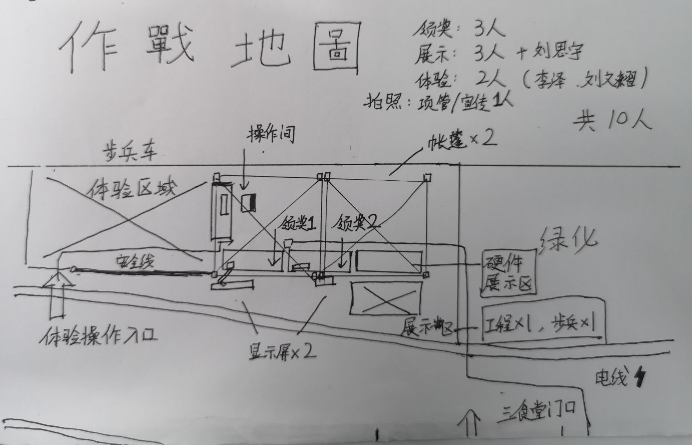

# 会议记录
## 关于小学期招新

> 记录人：C.

> 时间：2019.06.25  
> 地点：T3 701  
> 参加人员：全体成员

### 会议内容

#### 摆摊

##### 计划

1. 摆摊时间：6.26-6.28（周三到周五）（6.29未定，根据前几日情况决定）  
2. 摆摊位置：三食堂门口草坪处  
3. 摆摊区域划分（如图所示）

4. 周三（明天）早上机械没课，全体机械系队员参与搬运；（11点）
5. 当日摆摊队员每天11点前到活动中心搬桌子与椅子；
6. 然后集中T3 701 在11点20前，将工程车、两台步兵车、两台显示屏、排插、操作用电脑与设备 搬运至三食堂门口；
7. 1点30后，将上述物品搬回T3 701，桌子与椅子搬回活动中心。
8. 物资需求: 3辆小推车 3张桌子 8张椅子 

##### 人员安排：

1. 步兵车体验：李泽 & 刘文熠  
2. 小礼品派发：  
刘培焱 胡圆天 张大明 姚智君 黄旭佳 王圣 陈晓满（每天3人）    
Day1 刘培焱 胡圆天 张大明  
Day2 王圣 陈晓满 姚智君  
Day3 黄旭佳 张大明 陈晓满   
3. 机器人展示：季源 金朝喆 林洽 李昕（每天2人）  
Day1 季源 金朝喆  
Day2 李昕 林洽 金朝喆  
Day3 李昕 季源 金朝喆  
4. 拍照&宣传：王圣 & 陈晓满  
5. 答疑：邓紫龙  
6. 额外场地清理人员：潘鸿宇 何智航 叶文泰 （每人一天）（56节没课）  

#### 招新

- 问卷星、招新群
- 分组开会讨论招新培训
