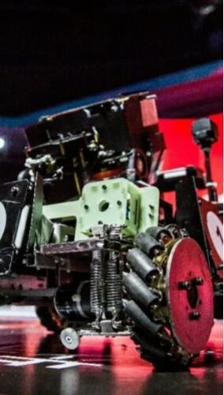
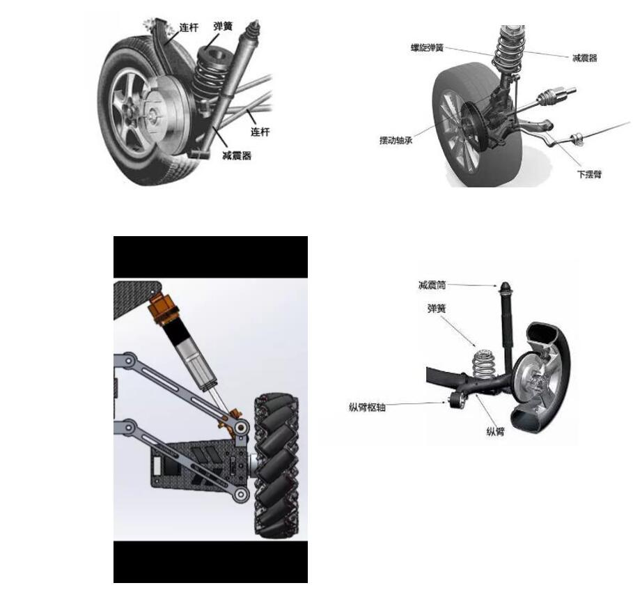
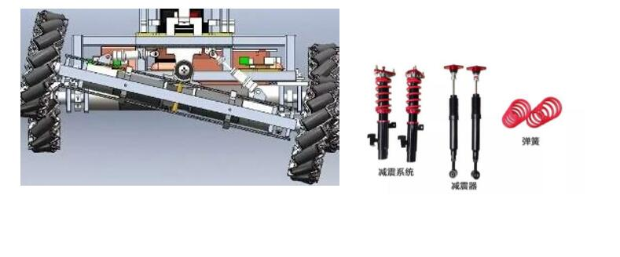
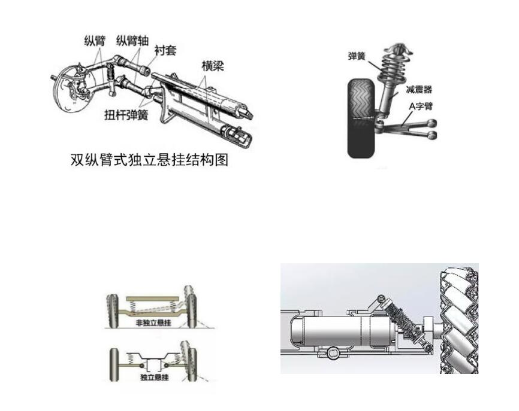

# RM2018 工作总结
> 罗臻 2018-06-09 

## 一．2018RM 整个系列赛期间进度 

10 月份中旬建队，进入英雄组，负责机械部分。   

10 月份开过三次组内会议，确定方案。规则出来后并未进行全队的讨论各车的功能，潜移默化大家默许了英雄上岛而工程仅拖尸的方案。决定“履带上岛”，并否所有人都想过该方案是否可行，也并不是所有人都承认其可行性，部分人觉得方案定下来就好。 

11 月用同步带代替履带做过不太靠谱的初步试验，测试其爬梯时的力是否够大。 

上半学期期末前一月，梁家乐师兄进入英雄组，全队才开始建模。 

寒假留校大概 20 天左右，期间完成底盘（麦轮组和本部一模一样），机械爪，弹仓（从本部图上拿来。几乎没改），搭架子。开始进行加工，大部分零件发出去加工，但仍有部分未发出或是未设计完全。 

下半学期开学，3 月份完成建模及所有零件出图。梁家乐师兄准备出国。 

从发出的零件回来开始组装，组装耗时极长，进入 4 月份，英雄车粗看上去还是散的。 

4 月 5 号热身赛（此前并不知道英雄车热身赛不一定要上场）于是 4 月 2 号到 5 号这几天，开始变魔术了，最后通宵赶在 5 号凌晨几点的样子把英雄除了摆臂和机械爪的部分安装完毕，几个小时后就出发去热身赛现场。 

热身赛出发前车子随意跑动一下，有螺丝会松（此前没全用防松，麦轮组的活页用的螺丝加弹垫，麦轮的轴用的普通螺母，等等）热身赛现场大概模拟了一下上岛的情况（此前对于岛的情况不明，这是第一次看到一个岛），确定履带上岛因为重量、功率、中心、精确性等原因不可行，改方案为抬腿上岛。 

从 4 月 5 号晚上开始了新一轮变魔术。由于时间有限，经费不足，人手紧缺，尽可能使用原英雄 2.0（履带上岛的最终确定版）的已有零部件，参考电科 16年夺冠英雄车的上岛方式（跟人家的车结构真完全不一样），6 号晚上休息前设计完麦轮提升组。 

7 号晚上休息前完成底盘建模。 

8 号基本搭成英雄 3.0.（这期间严格控制总重） 

9 号开始把需要加工的新零件出图，修改机械爪方案，联系焊接的工厂（底盘+提升腿）。 

焊接工厂本来承诺 3 天以内发货所有零件，后因工程师读不懂图没焊底盘框架，提升腿的发货也是推了一周，据说是因为顺丰不让寄这种大型的又不能受压的件，估计是在顺丰寄出之前就出问题了。 

4 月 29 号和师兄出去找了个没有精度的焊接加工，用钢尺划线量距，用手压着焊的，但是经比较和测量，感觉这个框是焊出来精度最高的，且受力情况极好（压几下试一下受力，师兄一不小心站上去了…），而且很便宜（这个铝框五一工钱加倍只要 400，对比校门口 2000）

最后一周，家乐师兄回来帮忙。 

5 月 1 号开始大规模组装，工程组的学弟帮忙，在大家努力下在 5 月 4 日基本完成底盘。最后一周在多次各种催促下等来了中间框架（几乎是不能用的），各种改动后基本装好车。 

5 月 8 日出发前一晚紧急处理麦轮组同步带跳齿的问题（张紧轮的弹簧距离难把握，有一个轮子的同步带出现脱离的问题） 

通宵后出发比赛了。 

## 二．2018RM 比赛情况 

由于最终上场的是南部赛，热身赛仅去了一场就回来改方案了，故不讲热身赛的情况。 
 
备赛期间，两位电控组同学调步兵和补给站，英雄底盘是之前已经驱动了的，考虑全队的进度与团队和谐，让谢胜放弃英雄去弄别的容易的、快的了。 

1. 第一场比赛，对上海第二工业大学 

    对面上场三辆车，没有一辆是可以开枪的，工程车轮子都掉了。 

    我方账面实力很强的样子，第一局哨兵没有挂上去，英雄和工程只是移动大车，看似我方步兵能左右战局。 

    比赛开始后我方步兵试弹几枪后补给，弹仓装满后，拨弹轮力不够，无法打弹，另一辆步兵本来就只有底盘能动。 

    - 第一局因为我方超功率或者撞击有扣血，对方胜。  
    - 第二局，短暂的中场时间无法解决问题，双方打太极，平。   
    - 第三局加赛，对方碰墙扣血，我方胜。   

    1:1 平，各积一分，说来嘲讽，这是哈工大深圳历史第一分，也是建队两年来唯一的一分。 

第一天比赛中午电控组解决第二辆步兵的射击问题，但云台还是很抖。 

2. 第二场比赛，对北理珠海学院 

    实力差距大，对手并非强大到毁天灭地，但他应有尽有，且有模有样，在整个RM 比赛中算是中偏上的水准。在对方的攻击下毫无招架之力。 

    - 第一局，各种检查后开打，补给站拨弹轮转反，步兵无法补弹，惨遭吊打。 
    - 第二局，上场前解决补给站拨弹轮问题，步兵枪口射速不行，打出来的弹没有力，弹道抛物线明显，再次遭吊打。 

第一天晚上视觉组师兄师姐来到佛山，希望能抢救一下，描述了当前情况后认识到一晚上抢救不过来英雄。我个人进入观摩别人比赛、检修英雄底盘的状态。部分研究生返校考试，英雄组留下我和黄荣樟。 

3. 第三场比赛，对仲恺农业学院 

    对手绝对不算强，应该也是从未出线过，但他应有尽有，虽然英雄工程结构很不怎么地，动作缓慢，但是他可以取到弹，英雄有大弹丸输出，步兵比我们的稳，唯一可以安慰的是最后一局攻击到了对方基地。 

    - 第一局，败。 
    - 第二局，败，但终于攻击到了对方基地。

比赛结束，带着不甘、遗憾、愤懑以及非同平常的难过还有对强大的渴望，收拾东西返校。2018RM 比赛算是结束了，同时 2019 的新战队开始筹划。  

## 三．技术储备 

- 传统抬腿上岛： 

    详见 18 年英雄车，或 16 年电科英雄车，上岛时需要做好红外感应，否则对于操作手来说，是灾难性的操作难题。 

- 前后式抬腿上岛： 

    整体是前后做腿，整个车体竖直提升上岛，但在前后都要给轮子动力，要多出 4 个电机。 

- 抱柱上岛： 

    18 年顶级强队用得多，这是人家经过讨论深思熟虑确定的方案，事实证明这套方案上岛极快，但转动的角度不太好控制，操作不慎可能会在半空中侧翻，甚至是毁灭性的打击。参考华南理工，电科，本部的工程车，需要好好使用涵道，不得不说，涵道很强。

- 悬挂：

    悬挂只要是能让车轮能有缓冲移动的空间即可，接轮子的轴或者电机座什么的或者是其他更有想法的是更好。 

  
  
  
  

- 结构： 

    参考许多学校的小步兵底盘结构，金属铝框部分尽可能少，多用玻纤和碳纤板

- 滑车： 
    这东西是仿的电科的抬腿润滑用的，哈工大的那种是在淘宝上找到了标准件零售商，但他倒闭了，所以就自己切板子组装，这东西用是好用，但是真的好难装，而且要去通宵切板子。 

- 外骨架机械臂： 
    常见的中型机器，如切割机，轴向移动用的东西，有学校用在取弹部分做机械手的部分。优点是能够很好的运动，缺点是有点占空间，而且不是很好控制的样子，有兴趣觉得可行可以尝试。 

- 气动推杆提升取弹： 
    有了气后，大幅度的解决了重量和功率的问题，但气也有弊端，气动每次做功冲击太凶了，其他都挺好。 

- 双排摩擦轮枪管： 
    我们目前的炮管基本是一排摩擦轮，设计的时候有的直接从别人的图上复制过来，也不考虑我们的弹丸从弹仓到炮管过来这一段经过的情况。也有的设计的时候基本没有一个大致的计算或试验。我们现在的炮管弹道基本是不合格的，双排只是一个建议，但在西交和一些队伍确实用起来还不错，可是可能会不大好控制。 

- 网筛滤弹： 
    具体操作方式还没去细想，大概是让所有弹在网上停留一定时间后让网上剩余的大弹丸进入炮管，小弹就排出去。 大小槽双层大小弹分流： 这个是自己突然想到的，上面是三角的大槽朝前斜向下，大三角槽的中间是略深一点点的小槽向其他方向走小弹。 

- 玻纤材料： 
    略便宜一点点，学校有雕刻机可以加工操作，问题是强度、刚度都不是那么大。

- 碳纤维材料： 
    学校有雕刻机可加工，强度刚度都很 nice，就是贵。所以对比两种材料，在必要的地方用碳纤，多代修改确定上场的车用碳纤，而初代试验机可以用玻纤。 
 
- 曲柄摇杆（滑块）： 
    18 年英雄中间的腿原计划用的机构，但舵机力不够改成固定的了，实际上很多地方可以考虑连杆机构设计一下，需要的急回动作什么的机构能解决的问题就少给电控添麻烦，机构出了问题是看得见的，电控出了问题谁一下子就想到是哪几句不对

**尽量避免:**

- 同步带： 

    高速运作的地方，如麦轮，能做简单直接是最好的，同步带的使用还要做一套可靠的张紧装置，甚至还得考虑到同步轮的顶丝，同步带使用起来很不方便，在一些不常用的传动的地方可能没关系，但在轮子这种一直在高速运作的地方，极易出错。 

- 丝杠： 
    做功效率低下，其他方面还好，如果掌握气动，在不易损耗，可以接受冲击的地方建议直接气泵吧。

还有些东西可能看到了提到了才能想起，估计一时半会儿想不起的不觉得是什么有用的东西还比较多，建议各组商讨时队内公开讨论课题，集思广益多一份方案总没错。 

## 四．失败原因总结归纳 

1. 个人能力不够。

2. 团队没有凝聚力，起码我是感觉不到我们团队的凝聚力，问题从来只会出现在自己身上，而不是队友的锅。 

3. 队员责任心不够，不把比赛当做自己的事，心里想着自然有人帮你扛着把该做的做完。也没有人出来监管，管理层不够力度。 

4. 管理松散，队长确实是鞠躬尽瘁，但你没有让这个队伍运作起来，你是把别人的那份工也做了，导致有的人就会觉得我不一定要来啊，我又不是团队不可或缺的那个，也没有人说过我非来不可。结果就是表面上看到的每个组都有人在做事，官方deadline前看得到进度，自己定下来的deadline根本没有执行力，完全可以有惩罚机制，有些话自己不好说，找人说或者明年招进几个女生来说。
 
5. 没有体系，入队初期新队员根本不知道该干嘛，或者说绝大多数队员都不确定在什么时候应该有怎样的进度，所以到后期给个别人肝。 

6. 大部分成果是在半夜做出来的，人的精神状态并不佳，通宵的工作效率并不高，做出来的东西远不如精力旺盛时。 

7. 人心惶惶，连报销报不报得下来都不敢确定，怎么放开手脚去干。 

8. 对于车的性能及可行性测试不到位，初期没有场地模拟，做出来的一代机根本无法完成动作。还有射击功能的测试，仅仅是测试了弹仓里未装满时的情况，上场比赛后各种情况都出来了，这是调试测试工作没做到位。 

9. 经费有限 

10. 队员没有工作积极性，没有任何褒奖，辛苦一年，但根本没有人认可。或者说在这个队里工作缺少一些乐趣，大家在一起辛苦努力，需要一些让大家开心的东西。 

11. 比赛缺乏经验，没有比赛的战略战术，打的是匹配局（今年比赛因为自己实力太弱还不显得吃亏，日后总有一天强大） 

12. 我感觉大部分人都很乐观，盲目乐观，我认为要做最坏的打算去估计这场比赛，明年可能团队有了突飞猛进，要是抽签不利也得接受事实，所有人都要有好的心态共同面对强敌。 

## 五．未来可期 

我们这个学校太年轻，年轻付出的代价还是可以接受的，毕竟已经接受了。我们这个学校还是有不少人才的，那些 deadline 前一两个小时能从头做一份单片机或是 C 语言大作业的，不得不说人家突击、学习能力很强，毕竟做比赛和学习听课是完全不一样的，做比赛是有自己的浓厚兴趣在其中的，如果能发现对比赛、机器、机械、电控等等感兴趣的有能力的人，我们的队伍肯定会越来越强大的。 

## 六．对于 2019RM 的目前准备 

暂时确定了战队的队长和项管，也在公众号上对下一届进行了招募（学校的公众号有几个学生会看，早点准备摆摊开宣讲会吧）

初步设计了新生入队的学习内容，机械组可以各组内部开小会分析介绍别人的战车结构（我手上有几个学校的展示pdf，论坛上多的是），电控组自学后先调试去年的车练级，18 年强大的视觉功能完全没用上，并不代表 18 年视觉组师兄师姐的努力完全白费了，19 年新队伍的视觉组肯定要去虚心交接一下。 

## 七．要求 

- **团队氛围：**

    团结，队员间互相尊重谦让，不仅是做比赛，无时不刻在做人，学长面前叫一声学长，给人一个好印象以后好交流，学长也要懂得谦让学弟，有个学长的样子。氛围不死板，偶尔也有点欢笑，团队的氛围要和谐到所有人都心甘情愿投入其中。 

- **个人素质：**
    工作技能要对得起校训，并且要踏实，好强，钻研，严谨，有责任心，这点不细讲，都不是小孩了。 

- **工作环境：**

    稍微收拾一下卫生工作，510 的老鼠可以组个足球队了，也尽量不要把东西摆得太乱，老师给你收起来了你都不知道去哪里找，好的工作环境让人也有好心情做事。工作时间内绝对不允许在工作场地打游戏，（如果不影响到他人，且完成了工作，允许做自己的事情适当放松） 
 
- **进度把关：**

    管理层和各组组长严格把关，有一定威慑的惩罚机制（延期报销，俯卧撑，上台唱歌跳舞等） 

- **任务分配：**

    各做各的事，除非是帮忙，不能把其他人的工作放在自己的任务之前。所有零部件什么的都要自己设计画出来的，当然提倡去学习模仿，但模仿不是复制粘贴。 

- **人员：**

    把做事的人留在队里，不做事的、做不了事的（打杂，拧螺丝，贴发票，点盒饭也是做事）谈话后请离，个人认为队伍里并没有不能清退的人，做事的人一直在做事，根本没理由清退，不做事的人连事都不做了，还留着养老吗？ 

- **招募强人：**

    大力宣传一下吧，请那些有能力的人来，不要等胆子大的人进，需要的是有能力的人，不是今天来明天走的过客。 

- **队员管理：**

    入队以后，一切从严，但也不能压榨到队员没有一点时间过自己的生活，来哈工大是来读书的，首先正常学习得摆在比赛的前面，其次队员有事不能在需要他的时候出现也得酌情考虑，这只队伍是一支不仅严格也很有人情味，让大家都能互相欣赏尊重，让所有队员都愿意为团队奉献。与学校活动冲突时尊重队员个人意愿，比如有篮球赛或者合唱比赛，队员个人愿意去参赛结合其个人进度情况考虑，如果队员并不想参加学校的其他比赛而被辅导员强行拉入，老队员出面去谈一下，辅导员都很理解我们的。
 
- **队伍建设：**

    要让大部分人重视这个比赛，不希望看到今年这样大规模退队无所谓的情况，在入队初期想办法让所有人都有点事情做，每个人都有一定任务量，当到了真正做车的时候队员考虑到自己已经付出了不少，不会希望自己的努力白费。发现有动摇的队长和组长等等应该及时谈心疏导一下，否则队员会觉得自己根本不受重视，可有可无，一旦让队员有了这样的心理，别人凭什么为你卖命。

    这只队伍是本科生的队伍，研究生一方面不方便管理，另一方面会有自己的课题等。 

    队伍里需要一定的嘉奖机制，辛苦忙碌结果从未听过半句嘉奖，是个人都会很心寒，在高强度的工作下能有一点点小小的表扬，能够很好的调动队员的工作积极性。   

可能还有很多东西没有写进来，明年是我个人的最后一年了，希望能做出点成绩，要对得起自己对得起团队。  