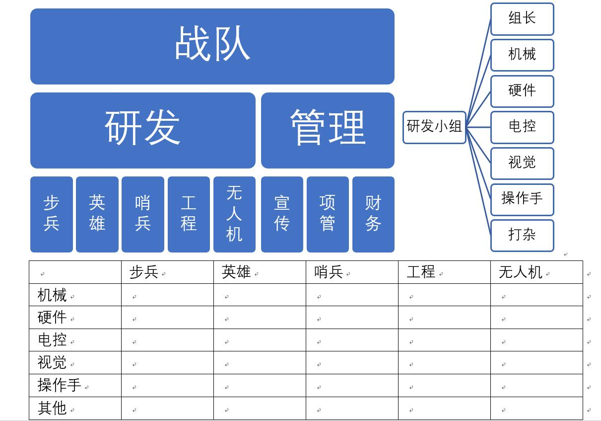

# RM2019 工作总结
> 刘思宇

先说一下个人经历。很多总结的内容都和我的个人经历相关。

高中我是成都石室中学机器人队的核心成员，打过两大高中机器人竞赛VEX和FTC，每个比赛我所在的队都曾拿到过相当于国赛冠军的奖项。成都石室中学的机器人队在整个高中机器人比赛圈子里也是相当出名的。但是我们也是白手起家，我高一刚进队的时候什么也没有，基本就是靠当时4个核心成员的积累（有初中搞过相关竞赛的人以及有技术能力的人）做出来的。第一年成绩也是非常差，四川省省赛倒一，但是在小组赛里却击败了冠军队伍。三年的机器人比赛带给我的不只是技术积累，更重要的是一个小团队的管理与新生教学的经验。

高中我们机器人队一般是4-8人，1台车，与我们现在RM负责某台车的一个组的人数相当。队伍只有名义上的队长，很多事大家是商量着一起做的。我在队里是一个核心成员，起部分队长的作用，负责机器的总体协调与硬件、电控，对机械、视觉都有了解。

高二之后由于升学原因无法继续参加比赛，我开始专门做教学，录制了很多类似慕课的视频。现在石室中学的机器人队仍然保留了录制教学视频的传统，每年都会对这些视频进行更新。

因此，很多我在高中机器人队的经验其实可以直接拿到RM这里来用。这些经验是经过实践检验行之有效的。

接下来分类总结。

## 一、	硬件组

我加入硬件组只是因为实在没有人加入这个组，同时我也有相关经验。事实证明我后来成为了硬件组主力。

硬件组成立第一年，感觉陈骏安学长在这方面 had no more experience than me（指都不多，无意冒犯）（请无视我随口飙英文），基本上就是白手起家。很多地方我做得并不好，比如没有及时提供电路板模型等等。今年也完全就是技术积累的一年，除了中心板什么都没有做成，而且中心板都还是有问题的。超级电容尝试做了，效果并不好。好在最后买了成品模块。这些成品模块估计明年要接着用。

技术积累不会停，炸再多板子都是要搞的。自己开发的超级电容一定要做出来。

主控板迭了很多代，但是最后还是不稳定。在高频电路上我还是欠缺很多设计经验的。

接下来说三个重要问题。

### 1. 走线。

走线在我们高中机器人队，每辆车都是专人负责（我所在的队是我）。这个人需要对车的机械结构、硬件系统与电控算法都有一定的了解，但也仅限于了解，不需要会设计。同时这个人需要会比较熟练地制作各类线材。建议有的素质是条理清晰与一定的强迫症。

今年走线相当混乱。我不知道这方面是怎么安排的。主要是由电控走线，但是硬件组却负责制作各类线材，硬件与机械也完全没有对接。

接下来拟进行这样的分工：每个负责某台车的组需要有一个专门的负责走线的同学。我会进行相关培训。机械在设计时必须考虑硬件电路板的位置，硬件组设计的电路板全部采用固定孔位，设计初稿即确定固定孔，之后不再修改。走线全程由专门的负责走线的同学完成。

对于团队分工我会在后面的板块提到。

对于车上每一种线材必须有相应的布线规范。CAN总线的布线规范我已经有总结初稿，完善后会发在群里。这些规范由硬件组制定。

### 2. 焊接设备管理。

目前对于焊台等设备的管理非常混乱。拟定标准如下：

1. 实验室设置一个加工区，采用不易被损坏且稳固的桌面，如果是木质桌面必须垫上保护材料。所有机械与硬件的加工都在此进行，其他工作不能在此区域进行（比如电脑绝不能放这边）。加工区分为机械加工区和硬件加工区。机械加工区放置各类机床等，同时配备台虎钳。

    （！！！此处应有机械组的同学补全！！！）

    硬件加工区配备以下设备:

    1. 焊台，至少2台，以及配套的烙铁架等。要求能至少2人同时工作。

    2. 风枪1台，加热台一台。配备于一台焊台附近，或者采用三合一的形式。
    
    3. 简易SMT流水线，包括钢网，元件排布，加热台焊接，洗板（超声波清洗器）与rework。
    
    4. 储存区。各类药品的冰箱（如果有的话）。放置钢网。

    示意图如下：

部分设备我会考虑自费购买。

加工区是一个很有用的设计。高中我的机器人队在开设这样一个加工区之后变得相当有序了。

2. 除了负责走线的同学与硬件组的同学外，其他人使用相关设备必须先征求同意。

3. 硬件组的一些工具是专用的。比如镊子、刮刀。此类工具如果按照机械组的方式使用会相当容易损坏，无法继续用于硬件相关工作。对于此类工具，硬件组每个同学自己携带，不能随意外借。其他组的同学也不能随意占用。

### 3. 电控、机械和硬件的对接。

今年的对接很混乱，很多地方信息不同步。这里放在人员管理分配里详细阐述。

## 二、	人员管理

本赛季初期各个组都处于一个相对独立的状态，机械按车分组干自己的，硬件干自己的，电控干自己的。直到后期才开始有比较多的交流。按照我在高中的经验，拟定标准如下：

每个技术研发人员同时隶属于2个组，一个是各个车的组，另一个是按照机械、电控等分的组。

各车分组人员不宜过多（除步兵），4~8人即可。步兵人数较多（毕竟2台车）。
分工如下：

1.	组长（1人，建议兼职）。

    组长只是名义上的，并不是研发主要负责人。

    组长负责走线，以及与其他组的技术交流，统筹协调组内工作。走线是因为这是一个能联通机械、硬件、电控、视觉四大块的工作，要能够走好线必须对机器的所有组成部分都有了解。同理，与其他组的交流也主要由组长完成。

    组长最好是兼职的。组长并不具有决定机器整体设计的权力，之所以叫做组长，是因为他需要是对这辆车的各个部分都有了解的人。

    组长必须是机械、电控、视觉之一。组长需要对每个组的工作有一定的了解，懂一点相关专业知识。这一点需要培养。

2.	机械设计人员（2~4人，工程较多）

    机械设计人员有决定机器整体设计的权力，负责车的机械设计部分。但是在设计时需要充分考虑硬件，电控与视觉的调试与安装难易度。

3.	硬件（1人，可多组兼职，即多个组共用一个硬件人员）

4.	电控（1~2人，步兵翻倍）

5.	视觉/算法（1~2人，哨兵相对较多，工程可以不配备，可多组兼职）

6.	操作手（按要求配备，不考虑无人机补弹员，可以兼职，也可以不兼职）
操作手需要提前练习操作。最好有相关基础（比如打CS很6的那种（雾））。

7.	打杂人员（适量，可以没有，建议新生）

    打杂的队员其实锻炼很大的。新生经过一个打杂的过程会熟悉比赛的各个方面。

    另外每个人都必须会拧螺丝（指简单机械装配）。部分非机械同学需要会基础SW，激光切割与3D打印。硬件由硬件组统一研发提供。硬件组人要少而精。
    整体分组应该在赛季开始完成。以下大致拟了一个组织结构图：

此后：  
每个组是一个相对独立但是也紧密联系的单位。机器人四大系统（机械，硬件，电控，视觉）被打散到各个研发小组中，保证了各个系统之间的交流。组长需要负责统筹协调。对于英雄和工程这种需要对接的组来说，也需要加强交流。
总体来说研发是两组平行的组织结构。

## 三、	招新，培训与技术积累

从我个人的角度来看，今年的招新一般可以接受，但是之后的培训就不太好。培训时人员流失严重，讲的很多东西冗杂无序。

这里还是提供一些我高中的经验。

1.	培训周期延长。很多知识都是经验积累出来的，硬件尤其如此。硬件的东西很杂。基本上会占用至少2个月的时间，手把手地教学。

2.	分两批招新。小学期很有必要预招新。这批人在暑假进行培训，而且是全方位详细的培训。之后秋季学期招新进来的人主要是大一新生，队内的工作先以打杂为主，之后在长期培训积累经验之后转正。

3.	教学资料留存。可以考虑编写一些简单的教程，录制简单易懂的教学慕课，或者写一些博客之类的。形式可以多样，但必须要有，而且是详实的，涉及方方面面。

## 四、	赛前与赛场

首先明确一个重要问题：比赛对于每个兵种的要求。

先看一些通用的。

比赛对每辆车最根本的要求是能上场。上了场，哪怕是不能打弹，甚至于不能动当靶子，在大多数情况下，都是比不上场好的。

首先哨兵必须上场。哨兵必须有一个停止模式，在出现任何可能会影响哨兵出场的问题时，启用停止模式。停止模式下哨兵不动，不射击，必须保证该模式下哨兵能
上场且不会有隐患。哨兵也需要一些部分功能模式。

无人机也必须上场。即使不能飞，也是可以通过合理地放置图传提供一个高地视野的。

规则手册并没有对机器人下一个定义。不过我们可以简单概括为：RM的参赛机器人是一个安装了符合规范的裁判系统并具有符合规范的附属机构的装置。也就是说，裁判系统是一个机器人的灵魂。如果到后期某台车没做出来，就做一个装好了符合规范的裁判系统的框架或底盘上场比赛都是可以接受的。因此针对哨兵需要有一个备用机器人，这个备用机器人应该简单到只有一个底盘和成套裁判系统，底盘能稳固地悬挂在轨道上。

接下来逐个分析各个机器人的要求。括号中数字越小，代表优先级越高。仅代表个人看法。

1. 步兵
    - (1)上场
    - (2)底盘移动
    - (3)云台基本运动及稳定性
    - (3)基本射击
    - (3)底盘功率限制
    - (4)射击不掉速，不卡弹
    - (4)底盘云台跟随
    - (4)基于IMU的云台控制
    - (4)超级电容
    - (4)可靠的悬挂
    - (5)摆尾
    - (5)视觉自瞄
    - (5)射击散布优化
    - (6)小陀螺
    - (6)高级视觉功能，例如距离判定并根据距离修正射击初速，神符等
    - (6)视觉自瞄优化
    - (6)飞坡
    - (6)自检程序
    - (7)其他高级功能

2. 英雄
    - (1)上场
    - (2)底盘移动
    - (3)云台基本运动及稳定性
    - (3)基本射击
    - (3)底盘功率限制
    - (4)射击不掉速，不卡弹
    - (4)底盘云台跟随
    - (4)超级电容
    - (4)可靠的悬挂
    - (4)与工程的交接
    - (5)视觉自瞄
    - (5)射击散布优化
    - (5)基于IMU的云台控制
    - (6)高级视觉功能，例如距离判定并根据距离修正射击初速等
    - (6)视觉自瞄优化
    - (6)摄像头系统，UI
    - (6)自检程序
    - (7)其他高级功能

3. 工程
    - (1)上场
    - (2)底盘移动
    - (3)资源岛岛下前排弹药箱夹取
    - (3)救援拖车
    - (3)与英雄弹药交接
    - (4)资源岛岛下后排弹药箱夹取
    - (4)摄像头系统
    - (4)可靠的悬挂
    - (5)上岛与资源岛岛上弹药箱夹取
    - (5)连续取岛下弹药箱
    - (5)取弹速率优化
    - (6)视觉功能，例如视觉取弹
    - (6)摄像头的UI
    - (6)自检程序
    - (7)其他高级功能

4. 哨兵
    - (1)上场
    - (1)能上场的无功能备用哨兵
    - (2)底盘移动
    - (2)停止模式
    - (2)简单短距离巡逻
    - (2)底盘快拆
    - (3)逃跑，巡逻与避障算法
    - (3)底盘功率限制
    - (3)仅底盘模式
    - (4)云台基本运动及稳定性
    - (4)视觉自瞄与扫描敌方
    - (4)基础射击
    - (4)仅射击模式
    - (5)射击不掉速，不卡弹
    - (5)轨道定位
    - (6)视觉自瞄优化
    - (6)射击散布优化
    - (6)导电滑环与360°云台
    - (7)高级视觉功能，例如距离判定并根据距离修正射击初速等
    - (7)高级AI
    - (7)自检程序
    - (8)其他高级功能

5. 无人机
    - (1)上场
    - (1)开视野
    - (2)基础飞行
    - (3)基本射击
    - (3)云台基本运动
    - (4)射击不掉速，不卡弹
    - (4)稳定的飞控
    - (4)全包围（包括底部）的桨叶保护罩
    - (4)机体结构强度优化
    - (5)射击散布优化
    - (5)视觉自瞄
    - (5)射频优化
    - (6)高级视觉功能
    - (6)视觉自瞄优化
    - (6)自检程序
    - (7)其他高级功能

下面来看一些有关赛前与赛场准备的。

1.	检查清单。

分为检录前检查清单，三分钟准备时间检查清单，赛中检查清单，赛后检查清单。

检录前检查与赛后检查内容相近，是全方位无死角的检查，可能会很花时间，但是必须详尽。检录前检查旨在发现各种可能会影响比赛的隐患，赛后检查旨在及时定损并修理。

三分钟准备时间检查必须简洁，对于机器易损易出错的关键部分进行检查，同时保证能找出问题。针对各种问题都要有应急预案，并且规划好解决方案与应使用的技术暂停类型。在不得已的情况下才允许机器人下场。这个清单应制作两类，一个是第一局比赛前，一个是两局比赛中。

三分钟检查必须提前演练，确保能在2分00秒内按时保质保量完成。

赛中检查是淘汰赛中10分钟的间隙时间的检查。内容多于三分钟检查，少于检录前检查。

赛前制作相应的检查表，多印一些，赛场上专人负责带上纸笔一项一项对照执行。对于比赛中才发现的易损问题，应及时加入检查清单。

所有检查过程要有演练。尤其是三分钟准备时间。

2.	赛场

比赛进程中不要轻易大改机器人！  
比赛进程中不要轻易大改机器人！  
比赛进程中不要轻易大改机器人！  

上场人员除去7个操作手外还有6人。无人机补弹员由无人机的技术负责兼任，这样无人机可以不需要额外人员。这样剩下所有车每车配备2人。在这些人中需要涵盖队长，机械，硬件，电控，视觉与操作手。

针对各种突发情况要有应急预案和替补。另外，保证操作手的休息。

最后一些自己的总结。

说实话，我不甘心。高中我来自一个冠军队伍，到了这里的落差还是很大。看得出来，我们的南工骁鹰还不成熟，三年的历史刚刚让我们有了技术积累。大三的前辈们干了三年，已经为我们铺下了一条良好的道路。在此基础上，我们必须干出一番事业。

后面的路还很遥远，战队的问题也很多。可能我大部分都是在提供解决方案，没有详细地分析问题。也许这方面我做的不足。不过，实干和落实才是目前最重要的。

先从硬件组的视频微课做起。

我们现在还缺什么？很多。

我们现在能解决什么？不知道。

这是绝对不允许的。

现在我们需要一种Excellence的精神。

或者，按FTC的话说，叫做Gracious Professionalism。

双赢，执著，乐于分享，享受比赛，不功利。

这就是我参加机器人比赛的初衷。也应该是所有队员参加比赛的初衷。

这篇总结，肯定还是不详尽的。我的经验与能力有限，也犯了很多错误。只能说，希望大家不吝赐教，批评指正。