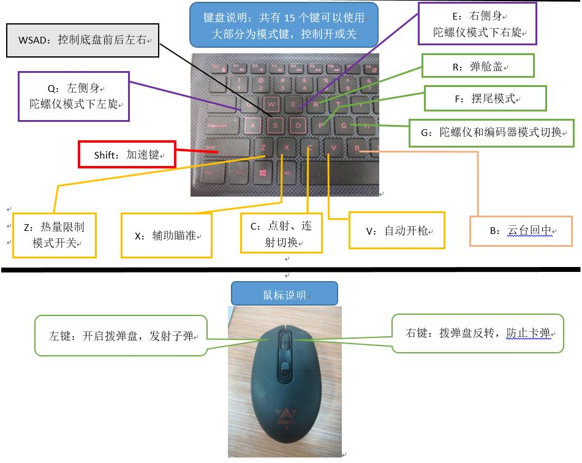
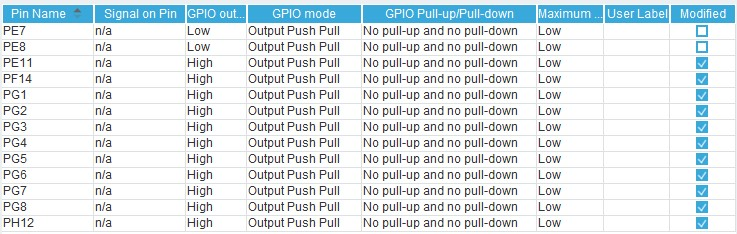
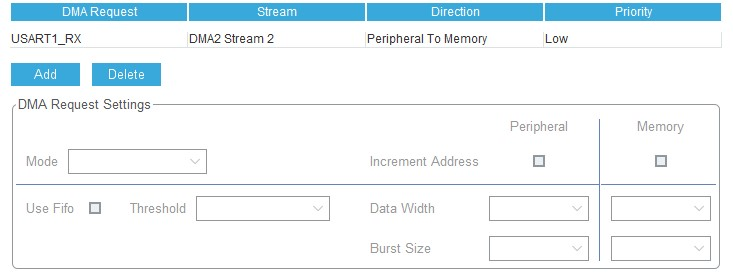
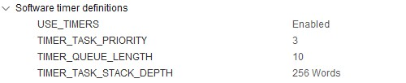

# 步兵机器人-电控技术文档
> 刘文熠、谢胜

## 一、功能综述
RM2019所用的步兵机器人实现了大赛要求的所有基本功能要求，包括可全向移动的底盘、二轴云台和发射机构。内置编码器和陀螺仪、小电脑辅助瞄准三种工作模式，且具备扭腰、辅助瞄准、自动开枪、全自动打击功能，底盘部分集成了超级电容。

机器人的编码器模式和陀螺仪模式可实现无缝切换，扭腰和辅助瞄准、自动开枪也能实现一键启动。超级电容为一个独立单元自行运作，受主控板的指令控制。

使用了单独设计的监控模块，可时刻监控机器人的各个外设，并在外设丢失时及时作出反应，在此基础上有遥控器丢失保护措施，陀螺仪丢失保护措施等。外设监控的数量没有上限，也可手动更改外设失联时间上限。
机器人使用了FreeRTOS操作系统，各个模块之间更加独立，程序可维护性更强。

## 二、代码结构
* Bsp	外设的驱动库
    * `can_motor.c`	电机的驱动库
    * `remote.c`		遥控器的驱动库
* Task	操作系统的几大任务
    * `calculate.c`		电机的PID计算
    * `judgement.c`	     裁判系统的初始化
    * `judgement_data.c`	裁判系统的数据接收
    * `mpu6500.c`		陀螺仪的驱动库
    * `pc_communicate.c`	与miniPC（小电脑）通信
    * `robot.c`			机器人参数初始化
    * `send_signal.c` 	向电机发送信号
    * `user_logic.c`		机器人状态改变逻辑
* Judgement		    裁判系统的驱动库
* Timer		         各种函数库
    * `pid.c`		    PID库
    * `ramp.c`		    斜坡函数库
    * `soft_i2c.c`         软件IIC库
    * `supervise.c`	    监控库
* user_logic	        用户逻辑
    * `chassis.c`         底盘实现逻辑
    * `gimbal.c`	        云台实现逻辑

## 三、操作说明书




## 四、外设初始化

### RCC


### SYS


### GPIO
设置指定的GPIO口为推挽输出模式。主要用于点亮LED灯或点亮激光。此外使用软件IIC也需要使能GPIO为输出模式（也可使能输入模式）。


### CAN
CAN1和CAN2都使能，要注意使能的引脚与硬件原理图中的硬件是否相同。设置预分频为3，BS1为9，BS2为4，SJW为1（这种设置方式建立在时钟频率为168MHz的基础上），使能RX0中断


### USART
唯一要注意的是遥控器接收机对应的串口，需要硬件上有一个取反电路，否则读取到的数据不对。遥控器的串口波特率设置为100000bps，偶校验，8位，建议使能DMA。
![USART波特率设置]{USART1.jpg}


### FreeRTOS
如果要使用虚拟定时器，需要在Config parameters里面手动使能定时器

其中TIMER_TASK_PRIORITY建议设置为3（对应于线程的优先级为osPriorityNormal），若优先级太低可能会被其他线程饿死。

## 五、外设驱动
### 电机驱动
* [步兵车底盘驱动](https://imuncle.github.io/content.html?id=3)
* [英雄车云台PID调试总结](https://imuncle.github.io/content.html?id=13)

### 遥控器驱动
* [步兵车底盘驱动](https://imuncle.github.io/content.html?id=3)

### 陀螺仪驱动
* [MPU9250姿态解析](https://imuncle.github.io/content.html?id=39)
* [MPU9250六轴算法](https://imuncle.github.io/content.html?id=44)

## 摩擦轮驱动
摩擦轮电机使用的是DJI Snail竞速电机，电调使用的是好盈航模电调。驱动方式为PWM驱动。PWM要求周期为20ms，高电平时间为1ms到2ms（即占空比为5%-10%），分别对应了航模遥控器的油门0和油门100。千万不要把油门给到100，否则很危险。在代码中，PWM由定时器产生，预分频后定时器频率为1MHz，ARR为20000，CCR在1000和1180之间变动。

### 裁判系统数据读取
[裁判系统数据读取探索](https://imuncle.github.io/content.html?id=8)

### 超级电容驱动
[Robomaster 机器人竞赛 超级电容 充电器 恒功率70W模组 法拉电容](https://item.taobao.com/item.htm?spm=a1z09.2.0.0.c2e02e8dRSuXPz&id=589353742953&_u=k2osqi7adf77)

## 六、线程详解
### 1、底盘线程
该线程每1ms执行一次，核心代码见`chassis.c`中的`ChassisParamChange()`函数，如下：
```c
/**
* @brief 机器人底盘参数更新
* @param None
* @retval None
*/
void ChassisParamChange()
{
  if(infantry.workstate == RemoteControl)           //遥控器控制模式
  {
    FBSpeed = (Remote.rc.ch1 - CH0_BIAS) * 15;
    LRSpeed = (Remote.rc.ch0 - CH1_BIAS) * 15;
    #ifdef GIMBAL
    if(yaw_motor.real_position - infantry.gimbal.YawBiasAngle > 40 || yaw_motor.real_position - infantry.gimbal.YawBiasAngle < -40)
    {
      infantry.chassis.RotateAngle = (infantry.gimbal.YawBiasAngle - yaw_motor.real_position) * 8;
    }
    else
    {
      infantry.chassis.RotateAngle = 0;
    }
    #else
    infantry.chassis.RotateAngle = (Remote.rc.ch2 - CH2_BIAS) * 5 ;
    #endif 
  }
  else if(infantry.workstate == MouseKeyControl)    //鼠标键盘模式
  {
    ChassisRemoteMouseKey();
  }
  else if(infantry.workstate == STOP || infantry.workstate == PREPARE)    //停止或准备状态，禁止机器人底盘运动
  {
    FBSpeed = 0;
    LRSpeed = 0;
    infantry.chassis.RotateAngle = 0;
  }
  
  /*底盘小陀螺实现（摆尾），相当于无人机无头模式*/
  #ifdef GIMBAL
  if(infantry.chassis.ChassisMode == Follow_Gyro_Mode && swingmode == 1)
  {
    //底盘运动分解
    infantry.chassis.RotateAngle += FlickFunc(flick_time,1250,5000) * 1.6f;
    flick_time++;
    if(flick_time > 1250)
    {
      flick_time = 0;           
    }
  }
  #endif

  /*底盘小陀螺实现（摆尾），相当于无人机无头模式*/
  #ifdef GIMBAL
  angle = yaw_motor.fdbPosition + 370;
  if(angle < 0)
  {
    angle += 8192;
  }
  angle = angle * 0.00076f;        //偏移值计算
  #endif
  //底盘运动分解
  infantry.chassis.FBSpeed = (float)FBSpeed * cos(angle) + (float)LRSpeed * sin(angle);
  infantry.chassis.LRSpeed = (float)FBSpeed * (-sin(angle)) + (float)LRSpeed * cos(angle);
  
  /* 更新各个底盘电机的速度环设定值 */
  #ifdef CHASSIS
  m3508_1.speed_pid.ref = infantry.chassis.FBSpeed + infantry.chassis.LRSpeed + infantry.chassis.RotateAngle;
  m3508_2.speed_pid.ref = -infantry.chassis.FBSpeed + infantry.chassis.LRSpeed + infantry.chassis.RotateAngle;
  m3508_3.speed_pid.ref = -infantry.chassis.FBSpeed - infantry.chassis.LRSpeed + infantry.chassis.RotateAngle;
  m3508_4.speed_pid.ref = infantry.chassis.FBSpeed - infantry.chassis.LRSpeed + infantry.chassis.RotateAngle;
  #endif
}
```
#### 遥控器控制
上述代码中体现的主要是遥控器控制的逻辑，很简单。底盘前进后退的速度都是直接由遥控器拨杆数据直接赋值。如果没有云台，那么旋转速度也由遥控器控制，如果有云台，则由云台yaw轴电机的偏转量控制旋转速度，即“底盘跟随”现象。

摆尾（又称扭腰）模式是通过改变底盘的旋转速度实现的，此时云台yaw轴跟随陀螺仪，不受底盘的影响。底盘旋转速度的改变由下面这个函数实现：
```c
/**
* @brief 摆尾函数DEBUG
* @param None
* @retval None
*/
int FlickFunc(int flick_time,int period,int scale)
{
  while(flick_time > period)
  {
    flick_time -= period;
  }
  while(flick_time < 0)
  {
    flick_time += period;
  }
  if(flick_time >=0 && flick_time <period/2)
    return (scale - 4*flick_time * scale / period);
  else if(flick_time >=period/2 && flick_time <period)
    return (4*flick_time * scale / period -3 * scale);
  else
    return 0;
}
```
因为底盘的旋转速度是在原先的yaw轴电机偏转角度上再加上一个周期函数，所以在摆尾模式下依然可以实现整体的旋转。

另外代码里还对底盘的运动速度进行了分解，根据yaw轴电机的编码器数据可以判断机器人当前的运动正前方，实现摆尾过程中的直线运动，具体可以参考[步兵底盘小陀螺的实现](https://imuncle.github.io/content.html?id=14)。

#### 鼠标键盘控制
键鼠控制的主要逻辑在下面的函数中：
```c
/**
* @brief 机器人键盘鼠标控制（底盘）
* @param None
* @retval None
* @TODO 
*/
void ChassisRemoteMouseKey()
{
  key_last_status = key_status;//摆尾，跟随模式切换
  key_f_last_status = key_f_status;
  infantry.chassis.Last_ChassisMode = infantry.chassis.ChassisMode;//底盘状态更新
  if(Remote.key.v & 0x200) //key: f
  {
    key_f_status = 1;
  }
  if(!(Remote.key.v & 0x200))// key: f
  {
    key_f_status = 0;
  }
  if(swingmode == 0 && key_f_status == 1 && key_f_last_status == 0) 
  {
    swingmode = 1;
  }
  else if(swingmode == 1 && key_f_status == 1 && key_f_last_status == 0) 
  {
    swingmode = 0;
  }
  
  key_last_auto_shoot = key_auto_shoot;
  if(Remote.key.v & 0x4000)//自动开枪模式  key : V
    key_auto_shoot = 1;
  if(!(Remote.key.v & 0x4000))// key: V
    key_auto_shoot = 0;
  if(infantry.shoot.auto_shoot_mode == Open && key_auto_shoot == 1 && key_last_auto_shoot == 0) 
    infantry.shoot.auto_shoot_mode = Stop;
  else if(infantry.shoot.auto_shoot_mode == Stop && key_auto_shoot == 1 && key_last_auto_shoot == 0) 
    infantry.shoot.auto_shoot_mode = Open;
  
  key_last_mix_status = key_mix_status;
  if(Remote.key.v & 0x1000)//混合模式（辅助瞄准）key: x
    key_mix_status = 1;
  if(!(Remote.key.v & 0x1000))// key: x
    key_mix_status = 0;
  if(infantry.chassis.ChassisAim == MixMode && key_mix_status == 1 && key_last_mix_status == 0) 
    infantry.chassis.ChassisAim = SimpleMode;
  else if(infantry.chassis.ChassisAim == SimpleMode && key_mix_status == 1 && key_last_mix_status == 0) 
    infantry.chassis.ChassisAim = MixMode;
  
  if(Remote.key.v & 0x400) //key: g
  {
    key_status = 1;
  }
  if(!(Remote.key.v & 0x400))// key: g
  {
    key_status = 0;
  }
  if(infantry.chassis.ChassisMode == Follow_Encoder_Mode && key_status == 1 && key_last_status == 0) 
  {
    infantry.chassis.ChassisMode = Follow_Gyro_Mode;
  }
  else if(infantry.chassis.ChassisMode != Follow_Encoder_Mode && key_status == 1 && key_last_status == 0) 
  {
    infantry.chassis.ChassisMode = Follow_Encoder_Mode;
  }
  
  /*按键检测（一直按shift键）*/
  if(Remote.key.v & 0x10) //key : shift
  {
    forward_back_speed =  700;
    left_right_speed = 750;
  }
  if(!(Remote.key.v & 0x10))
  {
    forward_back_speed =  400;
    left_right_speed = 500;
  }
  
  if(Remote.key.v & 0x01)// key: w
  {
    FBSpeed = forward_back_speed * 9;
  }
  else if(Remote.key.v & 0x02)//key: s
  {
    FBSpeed = -forward_back_speed * 9;
  }
  else
  {
    FBSpeed = 0;
  }
  
  if(Remote.key.v & 0x04) // key: d
  {
    LRSpeed = -left_right_speed * 8;
  }
  else if(Remote.key.v &0x08)//key: a
  {
    LRSpeed = left_right_speed * 8;
  }
  else
  {
    LRSpeed = 0;
  }
  
  #ifdef GIMBAL//DEBUG  （增加陀螺仪）
  if(infantry.chassis.ChassisMode == Follow_Encoder_Mode)
  {
    if(Remote.key.v & 0x40)//key : q
      infantry.chassis.RotateAngle = - rotate_speed * 5 - (yaw_motor.real_position - infantry.gimbal.YawBiasAngle);
    else if(Remote.key.v & 0x80)//key : e
      infantry.chassis.RotateAngle = rotate_speed * 5 - (yaw_motor.real_position - infantry.gimbal.YawBiasAngle);
    else
    {
      if(yaw_motor.real_position - infantry.gimbal.YawBiasAngle > 20||yaw_motor.real_position - infantry.gimbal.YawBiasAngle < -20)
        infantry.chassis.RotateAngle = - (yaw_motor.real_position - infantry.gimbal.YawBiasAngle) * 6;
      else
        infantry.chassis.RotateAngle = 0;
    }
  }
  if(infantry.chassis.ChassisMode == Follow_Gyro_Mode || infantry.chassis.ChassisMode == Follow_PC_Mode)
  {
    if(yaw_motor.real_position - infantry.gimbal.YawBiasAngle > 20||yaw_motor.real_position - infantry.gimbal.YawBiasAngle < -20)
      infantry.chassis.RotateAngle = - (yaw_motor.real_position - infantry.gimbal.YawBiasAngle) * 6;
    else
      infantry.chassis.RotateAngle = 0;
  }
  #else
  if(Remote.key.v & 0x40)//key : q
  {
    infantry.chassis.RotateAngle = -rotate_speed + Remote.mouse.x * 500;
  }
  else if(Remote.key.v & 0x80)//key : e
  {
    infantry.chassis.RotateAngle = rotate_speed + Remote.mouse.x * 500;
  }
  else
  {
    infantry.chassis.RotateAngle = Remote.mouse.x*100;
  }
  #endif
  
  key_last_duoji_status = key_duoji_status;
  if(Remote.key.v & 0x100)//舵机舱盖控制  key: r
  {
    key_duoji_status = 1;
  }
  else
  {
    key_duoji_status = 0;
  }
  if(key_duoji_status == 1 && key_last_duoji_status == 0 && TIM4->CCR3 == 2100)//DEBUG
  {
    TIM4->CCR3 = 1000;
  }
  else if(key_duoji_status == 1 && key_last_duoji_status == 0 && TIM4->CCR3 == 1000)
  {
    TIM4->CCR3 = 2100;
  }
}
```
这个函数看起来很长，但大部分都是键盘按键对应的模式切换逻辑，这些部分看代码的注释就能看懂。

关键部分是底盘的前后左右旋转运动的控制。键盘的WSAD分别控制底盘的前后左右移动。

如果有云台，那么底盘旋转速度由yaw轴电机的偏转角度决定（跟随编码器模式下设置了旋转死区），如果没有云台，那么底盘的旋转速度直接由鼠标的移动速度决定。

#### 底盘电机参数计算函数
```c
void Chassis_Calculate()
{
    #ifdef CHASSIS                        //如果定义了底盘，则计算底盘四个电机的速度环
    if(cap.cap_electric <= 18.0f)
    {
        m3508_1.speed_pid.KP = m3508_2.speed_pid.KP = m3508_3.speed_pid.KP = m3508_4.speed_pid.KP = 15;
        if(judge_recr_msg.heat_data.chassis_power > 65)//底盘功率限制
            m3508_1.speed_pid.outputMax = m3508_2.speed_pid.outputMax = m3508_3.speed_pid.outputMax = m3508_4.speed_pid.outputMax = 2000;
        else
            m3508_1.speed_pid.outputMax = m3508_2.speed_pid.outputMax = m3508_3.speed_pid.outputMax = m3508_4.speed_pid.outputMax = 4000;
    }
    else
    {
        m3508_1.speed_pid.KP = m3508_2.speed_pid.KP = m3508_3.speed_pid.KP = m3508_4.speed_pid.KP = 18;
        m3508_1.speed_pid.outputMax = m3508_2.speed_pid.outputMax = m3508_3.speed_pid.outputMax = m3508_4.speed_pid.outputMax = 10000;
    }
    m3508_1.speed_pid.fdb = m3508_1.fdbSpeed;
    m3508_2.speed_pid.fdb = m3508_2.fdbSpeed;
    m3508_3.speed_pid.fdb = m3508_3.fdbSpeed;
    m3508_4.speed_pid.fdb = m3508_4.fdbSpeed;
    PID_Calc(&m3508_1.speed_pid);         //进行PID速度环计算
    PID_Calc(&m3508_2.speed_pid);
    PID_Calc(&m3508_3.speed_pid);
    PID_Calc(&m3508_4.speed_pid);
    #endif
}
```
这个函数需要注意的是加入了功率限制逻辑。

当超级电容的电压高于18V的时候，取消底盘的功率限制，低于18V时（避免电压过低使C620无法正常工作），则进行功率限制。

限制逻辑大致为：当底盘功率超过65W时，将四个底盘电机的速度环输出上限改为2000（因为实测当四个电机的output之和为8000时，对于步兵机器人来说大致为80W）。
### 2、云台线程
该线程由底盘线程发送的信号驱动。该线程中的主要逻辑是`GimbalParamChange()`函数和`ShootParamChange()`函数。前者是云台电机的参数设置函数，后者是发射机构的参数设置函数。

#### 云台电机设置函数
```c
/**
* @brief 机器人云台参数更新
* @param None
* @retval None
*/
void GimbalParamChange()
{
  if(infantry.workstate == RemoteControl)         //遥控器控制模式
  {
    #ifdef GIMBAL
        if(infantry.chassis.ChassisMode == Follow_Gyro_Mode)       //摆尾模式云台yaw轴参数更新
        {
            if(mpu6500_lost_state == 1)
                infantry.chassis.ChassisMode = Follow_Encoder_Mode;
            else
            {
                yaw_angle = yaw_angle - (Remote.rc.ch2 - CH2_BIAS) / 100;
                infantry.gimbal.YawAngle = yaw_angle ;//yaw轴电机相对地面绝对角
                infantry.gimbal.PitchAngle = infantry.gimbal.PitchAngle + (Remote.rc.ch3 - CH3_BIAS) * 0.008f;
            }
        }
        else if(infantry.chassis.ChassisMode == Follow_Encoder_Mode)
        {
            yaw_angle = mpu6500.angle.encoder_yaw;       //yaw_angle用来记录云台与地面的绝对角
            infantry.gimbal.YawAngle = infantry.gimbal.YawBiasAngle - (Remote.rc.ch2 - CH2_BIAS);
            infantry.gimbal.PitchAngle = infantry.gimbal.PitchAngle + (Remote.rc.ch3 - CH3_BIAS) * 0.008f;
        }
        else if(infantry.chassis.ChassisMode == Follow_PC_Mode)
        {
            yaw_angle = mpu6500.angle.encoder_yaw;
            if(PC_lost_state == 1)
                infantry.chassis.ChassisMode = Follow_Gyro_Mode;
            infantry.gimbal.YawAngle = yaw_motor.real_position - PC_Data.yaw * 22.75f;
            infantry.gimbal.PitchAngle = pitch_motor.real_position - PC_Data.pitch * 22.75f;
        }
        #endif
  }
  else if(infantry.workstate == MouseKeyControl)  //键盘鼠标控制模式
  {
        GimbalMouseKey();
  }
  else if(infantry.workstate == PREPARE)          //机器人准备状态下，云台缓抬起
  {
      #ifdef GIMBAL
    infantry.gimbal.PitchAngle = pitch_motor.real_position + (infantry.gimbal.PitchBiasAngle - pitch_motor.real_position) * PitchRamp.calc(&PitchRamp);
        infantry.gimbal.YawAngle = yaw_motor.real_position + (infantry.gimbal.YawBiasAngle - yaw_motor.real_position) * YawRamp.calc(&YawRamp);
    #endif
  }
  
  /*云台PID改变*/
    #ifdef GIMBAL
  if(infantry.chassis.Last_ChassisMode != Follow_Encoder_Mode && infantry.chassis.ChassisMode == Follow_Encoder_Mode)
  {
        MotorParamInit(&yaw_motor,20,0,0,3500,1.1,0,0,3500); 
        //MotorParamInit(&yaw_motor,0,0,0,3500,0,0,0,3500); 
  }
  if(infantry.chassis.Last_ChassisMode != Follow_Gyro_Mode && infantry.chassis.ChassisMode == Follow_Gyro_Mode)
  {
        MotorParamInit(&yaw_motor,30,0,0,3500,0.5,0,0,3500);
        //MotorParamInit(&yaw_motor,0,0,0,3500,0,0,0,3500);         
  }
  if(infantry.chassis.Last_ChassisMode != Follow_PC_Mode && infantry.chassis.ChassisMode == Follow_PC_Mode)
  {
        MotorParamInit(&yaw_motor,25,0,0,3500,1,0,0,3500); //编码器
        MotorParamInit(&pitch_motor,17,0,0,3500,1,0,0,3500); //编码器
//      MotorParamInit(&yaw_motor,0,0,0,3500,0,0,0,3500); //编码器
        //MotorParamInit(&yaw_motor,30,0,0,3500,0.5,0,0,3500); //编码器
  }
    #endif
}
```
和底盘线程的写法很相似，上面的函数展示出来的也是遥控器的控制模式，其中判断了陀螺仪是否丢失，若丢失则自动切换为编码器模式。在编码器模式时，设置了一个全局变量（yaw_angle）时刻存储当前陀螺仪的数值，用于切换为陀螺仪模式时使用。Pitch轴始终跟随编码器，采用的是累加的形式，能更方便地控制pitch轴的角度。

云台一共有三种工作模式：跟随编码器模式、跟随陀螺仪模式和跟随miniPC（小电脑）模式，其中跟随miniPC模式也使用了编码器的数值作为反馈值。

该函数中还涉及到一个斜坡函数，用于云台刚启动时的云台缓启动（防止云台快速达到设定位置对云台机械结构的破坏）。该斜坡函数的实现如下：
```c
/**
* @brief 斜坡计算函数
* @param 斜坡结构体
* @retval 0~1之间的浮点数
*/
float RampCalc(struct ramp_t *ramp)
{
  if (ramp->scale <= 0)
    return 0;
  ramp->count++;
  if (ramp->count >= ramp->scale)
    ramp->count = ramp->scale;
  
  ramp->out = ramp->count / ((float)ramp->scale);
  return ramp->out;
}
```
该函数就是一个正比例函数，返回的是一个从0到1匀速增长的浮点数，函数斜率为1。

#### 键鼠控制
云台的键鼠控制逻辑如下：
```c
/**
* @brief 机器人键盘鼠标控制（云台）
* @param None
* @retval None
* @TODO 
*/
void GimbalMouseKey()
{
  #ifdef GIMBAL
  VAL_LIMIT(Remote.mouse.x,-50,50);
  VAL_LIMIT(Remote.mouse.y,-50,50);
  //鼠标操作改进
  if(Remote.mouse.x > 5 || Remote.mouse.x < -5)//鼠标操作改进
        Remote.mouse.y = 0;
  else
        Remote.mouse.x = 0;
  if(Remote.mouse.y > 5 || Remote.mouse.y < -5)
        Remote.mouse.x = 0;
  else
        Remote.mouse.y = 0;

    if(infantry.chassis.ChassisAim == MixMode)
    {
        if(PC_lost_state == 1)
        {
            if(mpu6500_lost_state == 1)
                infantry.chassis.ChassisMode = Follow_Encoder_Mode;
            else
                infantry.chassis.ChassisMode = Follow_Gyro_Mode;
        }
        else if(PC_lost_state == 0)
            infantry.chassis.ChassisMode = Follow_PC_Mode;
    }
    else if(infantry.chassis.ChassisAim == SimpleMode)
    {
        if(infantry.chassis.ChassisMode == Follow_PC_Mode)
        {
            if(mpu6500_lost_state == 1)
                infantry.chassis.ChassisMode = Follow_Encoder_Mode;
            else
                infantry.chassis.ChassisMode = Follow_Gyro_Mode;
        }
    }
        
  if(infantry.chassis.ChassisMode == Follow_Gyro_Mode)       //摆尾云台yaw参数更新
  {
        if(mpu6500_lost_state == 1)
            infantry.chassis.ChassisMode = Follow_Encoder_Mode;
        else
        {
            if(Remote.mouse.x < 20 && Remote.mouse.x > -20)
                yaw_angle = yaw_angle - Remote.mouse.x * 0.12f;
            else
                yaw_angle = yaw_angle - Remote.mouse.x * 0.28f;
            
            infantry.gimbal.PitchAngle = infantry.gimbal.PitchAngle - Remote.mouse.y * 0.1f;//pitch可以使用
            infantry.gimbal.YawAngle = yaw_angle;//yaw相对地面绝对角
        }
  }
  else if(infantry.chassis.ChassisMode == Follow_Encoder_Mode)
  {
        yaw_angle = mpu6500.angle.encoder_yaw;       //yaw_angle记录云台与地面的绝对角
        infantry.gimbal.YawAngle = infantry.gimbal.YawBiasAngle - Remote.mouse.x*18;
        infantry.gimbal.PitchAngle = infantry.gimbal.PitchAngle - Remote.mouse.y * 0.1f;//pitch可以使用
  }
  else if(infantry.chassis.ChassisMode == Follow_PC_Mode)
  {
        yaw_angle = mpu6500.angle.encoder_yaw;       //yaw_angle记录云台与地面的绝对角
        if(PC_lost_state == 1 && infantry.chassis.ChassisAim == SimpleMode)
            infantry.chassis.ChassisMode = Follow_Gyro_Mode;
        if(PC_Data.yaw < 1 && PC_Data.yaw > -1)
            infantry.gimbal.YawAngle = infantry.gimbal.YawBiasAngle;
        else
            infantry.gimbal.YawAngle = infantry.gimbal.YawBiasAngle - PC_Data.yaw * 22.75f;
        infantry.gimbal.PitchAngle = pitch_motor.real_position - PC_Data.pitch * 22.75f * 1.2;
  }

  if(Remote.key.v &0x8000)//key : b    DEBUG£（云台pitch轴回中）
        infantry.gimbal.PitchAngle = infantry.gimbal.PitchBiasAngle;

  #endif
}
```
#### 发射机构参数设置函数
```c
/**
* @brief 机器人发射机构参数更新
* @param None
* @retval None
* @TODO 啥都还没写呢，所有的逻辑都待完成
*/
void ShootParamChange()
{
    if(infantry.workstate == STOP)
    {
        TIM4->CCR1 = TIM4->CCR2 = 1000;
        infantry.shoot.shootstate = StopShoot;
        HAL_GPIO_WritePin(GPIOH,GPIO_PIN_12,GPIO_PIN_RESET);
    }
    else if(infantry.workstate == RemoteControl)
    {
        Last_LRRotateMode = LRRotateMode;
        infantry.chassis.Last_ChassisMode = infantry.chassis.ChassisMode;
        if(Remote.rc.s1 == 3)
        {
            LRRotateMode = 3;
            swingmode = 0;
            TIM4->CCR3 = 1000;
        }
        else if(Remote.rc.s1 == 1)
        {
            if(Remote.rc.last_s1 == 3 && infantry.shoot.shootstate == StopShoot)
                infantry.shoot.shootstate = ContinuousShoot;//开启摩擦轮连射模式
            else if(Remote.rc.last_s1 == 3 && infantry.shoot.shootstate == ContinuousShoot)
                infantry.shoot.shootstate = StopShoot;      //关闭摩擦轮
            HAL_GPIO_WritePin(GPIOH,GPIO_PIN_12,GPIO_PIN_SET);
            TIM4->CCR3 = 2100;
            if(Remote.rc.last_s1 == 3 && PC_lost_state == 0)
                infantry.chassis.ChassisMode = Follow_PC_Mode;//debug
            Remote.rc.last_s1 = 1;
        }
        else if(Remote.rc.s1 == 2)
        {
            if(Remote.rc.last_s1 == 3)
            {
                if(infantry.chassis.Last_ChassisMode != Follow_Gyro_Mode)//摆尾状态切换
                {
                    infantry.chassis.ChassisMode = Follow_Gyro_Mode;
                }
                else if(infantry.chassis.Last_ChassisMode != Follow_Encoder_Mode)
                {
                    infantry.chassis.ChassisMode = Follow_Encoder_Mode;
                }
                Remote.rc.last_s1 = Remote.rc.s1;
                LRRotateMode = 2;
                swingmode = 1;
            }
        }   
        
        if(mpu6500_lost_state == 1)
            infantry.chassis.ChassisMode = Follow_Encoder_Mode;
    
        if(Remote.rc.ch4 >1400 && Remote.rc.ch4 <=1684)
            infantry.shoot.FireRate = Firerate;//开启拨弹轮
        else if(Remote.rc.ch4 < 600 && Remote.rc.ch4 >=364)
            infantry.shoot.FireRate = -Firerate;//开启拨弹轮
        else if((Remote.rc.ch4 >= 600 && Remote.rc.ch4 <= 1400) || Remote.rc.s1 != 1)
            infantry.shoot.FireRate = 0;//关闭拨弹轮

        switch(infantry.shoot.shootstate)//DEBUG
        {
            case StopShoot:
            infantry.shoot.ShootSpeed = 1000;
            break;
            case ContinuousShoot:
            infantry.shoot.ShootSpeed = 1180;//PWM（原来1176）
            break;
            default:;
        }
        TIM4->CCR1 = infantry.shoot.ShootSpeed;
        TIM4->CCR2 = infantry.shoot.ShootSpeed;
  }
  else if(infantry.workstate == MouseKeyControl)
  {
        ShootMouseKey();
        TIM4->CCR1 = TIM4->CCR2 = 1180;
        HAL_GPIO_WritePin(GPIOH,GPIO_PIN_12,GPIO_PIN_SET);
  }
}
```
发射机构这里反而是遥控器的控制逻辑较为复杂。遥控器的控制主要靠遥控器左上角的s1和ch4两个控制，综合了底盘的运工作模式、发射机构的工作模式和弹仓盖的模式切换。具体的见代码，或者见机器人操作说明部分。

#### 键鼠控制逻辑
```
/**
* @brief 机器人键盘鼠标控制（发射机构）
* @param None
* @retval None
* @TODO 
*/
void ShootMouseKey()
{
  key_last_status2 = key_status2;
  if(Remote.key.v & 0x2000)//DEBUG为点射，连射做准备
        key_status2 = 1;
  if(!(Remote.key.v & 0x2000))// key: c
        key_status2 = 0;
  if(infantry.shoot.shootmode == 0 && key_status2 == 1 && key_last_status2 == 0) 
        infantry.shoot.shootmode = 1;
  else if(infantry.shoot.shootmode == 1 && key_status2 == 1 && key_last_status2 == 0) 
        infantry.shoot.shootmode = 0;
    
    key_last_status3 = key_status3;
  if(Remote.key.v & 0x800)//发射热量限制开关
        key_status3 = 1;
  if(!(Remote.key.v & 0x800))// key: z
        key_status3 = 0;
  if(infantry.shoot.shootlimit == 0 && key_status3 == 1 && key_last_status3 == 0) 
        infantry.shoot.shootlimit = 1;
  else if(infantry.shoot.shootlimit == 1 && key_status3 == 1 && key_last_status3 == 0) 
        infantry.shoot.shootlimit = 0;

  if(Remote.mouse.press_l == 1)      //鼠标左键（控制拨弹轮）
  {
        if(infantry.shoot.shootmode == 0)
            infantry.shoot.shootstate = SingleShoot;
        else if(infantry.shoot.shootmode == 1)
        {
            infantry.shoot.shootstate = ContinuousShoot;
            infantry.shoot.FireRate = Firerate;
        }
  }
  else
        infantry.shoot.shootstate = StopShoot;

  if(Remote.mouse.press_r == 1)        //鼠标右键（拨弹盘反转）
  {
        infantry.shoot.shootstate = ContinuousShoot;
        infantry.shoot.shootmode = 1;
        infantry.shoot.FireRate = -Firerate;
  }
    
    if(infantry.shoot.auto_shoot_mode == Open)
    {
        if(PC_Data.pitch < 5 && PC_Data.pitch > -2.5f && PC_Data.yaw < 6 && PC_Data.yaw > -6 && PC_Data.some_data != 0)
        {
            infantry.shoot.shootstate = ContinuousShoot;
            infantry.shoot.shootmode = 1;
            infantry.shoot.FireRate = 1800;
        }
        else 
            infantry.shoot.shootstate = StopShoot;
    }
}
```
发射机构也有多种模式，一种是点射、一种是连射，可手动选择是否进行热量开关，可手动旋选择是否开启自动发射模式（检测到炮管瞄准装甲板后自动发射子弹）。

#### 云台发射计算函数
云台和发射机构的参数计算合并为一个函数：
```c
void Gimbal_Shoot_Calculate()
{
    #ifdef GIMBAL                         //如果定义了云台，作为计算云台
    if(infantry.gimbal.PitchAngle > infantry.gimbal.PitchBiasAngle + 650)//pitch轴云台限位(DEBUG)
    {
        infantry.gimbal.PitchAngle = infantry.gimbal.PitchBiasAngle + 650;
    }
    if(infantry.gimbal.PitchAngle < infantry.gimbal.PitchBiasAngle - 500)
    {
        infantry.gimbal.PitchAngle = infantry.gimbal.PitchBiasAngle - 500;
    }
    pitch_motor.position_pid.ref = infantry.gimbal.PitchAngle;
    pitch_motor.position_pid.fdb = pitch_motor.real_position;
    PID_Calc(&pitch_motor.position_pid);
    pitch_motor.speed_pid.ref = pitch_motor.position_pid.output;//PID速度环
    pitch_motor.speed_pid.fdb = pitch_motor.velocity;
    PID_Calc(&pitch_motor.speed_pid);
    
    
    yaw_motor.position_pid.ref = infantry.gimbal.YawAngle;
    if(infantry.chassis.ChassisMode == Follow_Gyro_Mode)       //摆尾模式yaw轴参数计算
    {
        if(yaw_motor.real_position +370 < -1200)
        {
            if(yaw_angle < mpu6500.angle.encoder_yaw)
            {
                yaw_motor.position_pid.ref = mpu6500.angle.encoder_yaw;
            }
            else
            {
                yaw_motor.position_pid.ref = yaw_angle;
            }
        }
        if(yaw_motor.real_position + 370 > 1200)//对陀螺仪模式设定值进行限制，防止云台疯抖(1200)
        {
            if(yaw_angle > mpu6500.angle.encoder_yaw)
            {
                yaw_motor.position_pid.ref = mpu6500.angle.encoder_yaw;
            }
            else
            {
                yaw_motor.position_pid.ref = yaw_angle;
            }
        }
        yaw_motor.position_pid.fdb = mpu6500.angle.encoder_yaw;
        yaw_motor.speed_pid.fdb = mpu6500.gyro.z;
    }
    else if(infantry.chassis.ChassisMode == Follow_Encoder_Mode || infantry.chassis.ChassisMode == Follow_PC_Mode)
    {
        if(infantry.gimbal.YawBiasAngle == 460 && infantry.gimbal.YawAngle - infantry.gimbal.YawBiasAngle > 600)
            yaw_motor.position_pid.ref = infantry.gimbal.YawBiasAngle + 600;
        if(infantry.gimbal.YawBiasAngle == -1300 && infantry.gimbal.YawAngle - infantry.gimbal.YawBiasAngle < -500)
            yaw_motor.position_pid.ref = infantry.gimbal.YawBiasAngle - 500;
        yaw_motor.position_pid.fdb = yaw_motor.real_position;
        yaw_motor.speed_pid.fdb = yaw_motor.velocity;
    }
    PID_Calc(&yaw_motor.position_pid);
    yaw_motor.speed_pid.ref = yaw_motor.position_pid.output;
    PID_Calc(&yaw_motor.speed_pid);
    #endif
    
    #ifdef SHOOT
    if((infantry.shoot.shootlimit == 0) || (infantry.shoot.shootlimit == 1 && ((judge_recr_msg.robot_state.robot_level == 1 && judge_recr_msg.heat_data.shooter_heat0 < 190) ||  \
        (judge_recr_msg.robot_state.robot_level == 2 && judge_recr_msg.heat_data.shooter_heat0 < 310) || \
        (judge_recr_msg.robot_state.robot_level == 3 && judge_recr_msg.heat_data.shooter_heat0 < 430))))
    {
        if(infantry.shoot.shootmode == 0 && TIM4->CCR1 > 1100)
        {
            if(infantry.shoot.shootstate == SingleShoot && infantry.shoot.lastshootstate == StopShoot)
            {
                m2006.position_pid.ref = m2006.real_position + 29491;//点射（设定位置环的位置）
            }
            m2006.position_pid.fdb = m2006.real_position;
            PID_Calc(&m2006.position_pid);                           //位置环计算
        }
        else
        {
            m2006.position_pid.ref = m2006.real_position;   //记录位置环设定值的初始值
            if(infantry.shoot.shootstate == ContinuousShoot && infantry.shoot.shootmode == 1 && TIM4->CCR1 > 1100)
            {
                m2006.speed_pid.ref = infantry.shoot.FireRate;//连射速度
            }
            else 
            {
                m2006.speed_pid.ref = 0;
            }
            m2006.speed_pid.fdb = m2006.fdbSpeed;
            PID_Calc(&m2006.speed_pid);                      //速度环计算
        }
    }
    else
    {
        m2006.speed_pid.output = m2006.position_pid.output = 0;
    }
    if(judge_recr_msg.robot_state.remain_HP == 0)
        TIM4->CCR1 = TIM4->CCR2 = 0;
    #endif
}
```
对于云台电机，这里对pitch轴的运动范围进行了限制（防止电机有堵转的现象），然后就是串级PID的计算。PID计算这里的速度环反馈值做了一点处理。
今年的步兵机器人云台电机使用的是6623电机，本身无转速反馈，如果使用编码器模式，则电机的速度反馈值是由位置反馈值计算得到的，具体可参考[英雄车云台PID调试总结](https://imuncle.github.io/content.html?id=13)。
如果是陀螺仪模式，则速度反馈值为陀螺仪的角速度数据。
对于发射机构，主要是对拨弹电机m2006的参数计算。这里再次加入了热量限制逻辑。如果是连发模式，那么拨弹电机使用速度环控制，如果是单发模式，拨弹电机使用位置环速度环（与云台串级PID不同，这里的m2006使用加入ID的单环控制控制）。
### 3、监控线程
监控线程是处理机器人意外情况的强硬手段。核心函数如下：
```c
/*机器人监控函数*/
void SuperVise()
{
    for(int i = 0; i < 8; i++)     //依次扫描各个外设
    {
        if(lost_counter[i] < 20)              //如果没有溢出则继续计数，并将丢失标志位置0
        {
            lost_counter[i]++;
            errorstate = 0;
        }
    }
    if(lost_counter[0]==20)                  //判断是否有重要外设丢失
    {
        HAL_GPIO_WritePin(GPIOG, GPIO_PIN_4, GPIO_PIN_RESET);      //遥控器丢失则亮灯并让机器人停止
        infantry.workstate = STOP;
        errorstate = 1;
    }
    else
    {
        HAL_GPIO_WritePin(GPIOG, GPIO_PIN_4, GPIO_PIN_SET);        //没有错误熄灯
        if(Remote.inputmode == RC_Stop)                           
            infantry.workstate = STOP;
    }
    
    if(lost_counter[1]==20||lost_counter[2]==20||lost_counter[3]==20 ||lost_counter[4]==20)
        HAL_GPIO_WritePin(GPIOG, GPIO_PIN_5, GPIO_PIN_RESET);      //底盘丢失则亮灯
    else
        HAL_GPIO_WritePin(GPIOG,GPIO_PIN_5,GPIO_PIN_SET);
    
    if(lost_counter[5]==20||lost_counter[6]==20||lost_counter[7]==20)
        HAL_GPIO_WritePin(GPIOG, GPIO_PIN_6, GPIO_PIN_RESET);      //云台丢失则亮灯
    else
        HAL_GPIO_WritePin(GPIOG,GPIO_PIN_6,GPIO_PIN_SET);
    
    if(lost_counter[8] < 250)
    {
        lost_counter[8]++;
        PC_lost_state = 0;
    }
  else
        PC_lost_state = 1;
    
    if(lost_counter[9]<40)
    {
        lost_counter[9]++;
        mpu6500_lost_state = 0;
    }
    else
        mpu6500_lost_state = 1;
}
```
监控函数本质就是为每一个外设构造了一个看门狗。每个外设有一个计数，该计数默认以500Hz（即2ms进行累加）的频率进行累加，每次外设反馈数据回来清零一次计数，如果计数大于某个阈值就认为该外设丢失。

监控函数使用一个16位的数字，为每一个外设单独设置标志位（支持上限16个外设，如果有更多的外设则需要更改标志位的数据类型）。

## 七、调步兵车主要问题

**云台调节问题**：调云台6623电机的PID时优先保证yaw轴电机的稳定性，速度环的P应该调到15以上，位置环的P调到0.8以上，这样yaw轴云台才能有足够的动力、快速的响应及稳定性。同时，在扭腰模式下，云台将会在极小的范围内抖动（第一视角完全看不出来）。

Pitch轴电机也要调节到足够的扭力，调好的标准时步兵车加速减速时pitch轴抖动幅度较小。可是由于2019年我们的6623电机保养的不够好，导致电机没有足够的力矩防止云台抖动。

另：调云台注意结合J-scope曲线，观测位置环设定值及反馈值的变化。

**PID计算问题**：编码器模式下速度环反馈值为编码器前后24次反馈的数据算出来的速度，位置环为当前真实角度（yaw_motor.real_position）；陀螺仪模式下速度环反馈值为陀螺仪（mpu6500或mpu6050）算出来的角速度（mpu6500.gyro.z），位置环为当前算出来的陀螺仪旋转后的真实角度（mpu6500.angle.encoder_yaw，此数据已转化为编码器的取值范围0-8192）。

**电机ID问题**：不同战车的电机can通信ID号可能各不相同，因此我们可以在DEBUG模式下通过转动电机进而确定电机的ID。当然，我们也可以手动修改电机ID（具体方法详见说明书）。每次更换电机及电调时都应该重新查询一下ID，防止can数据发送到错误的电机上造成云台疯转、堵转（容易造成机械结构的损坏）。

**操作系统优先级问题**：将线程及虚拟定时器的优先级设置为相同。

以上列出的只是调步兵车问题的一小部分，如在调车过程中发现问题无法解决可及时询问老队员。