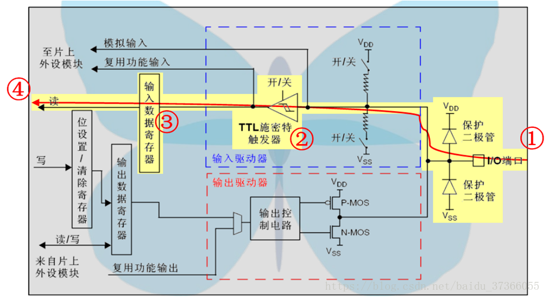
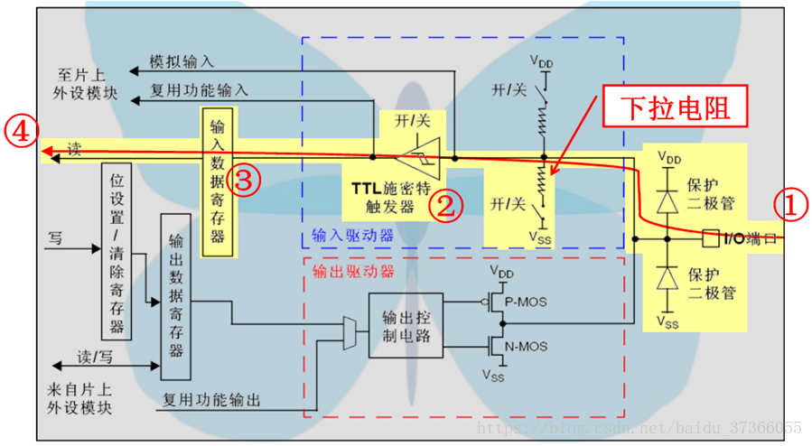
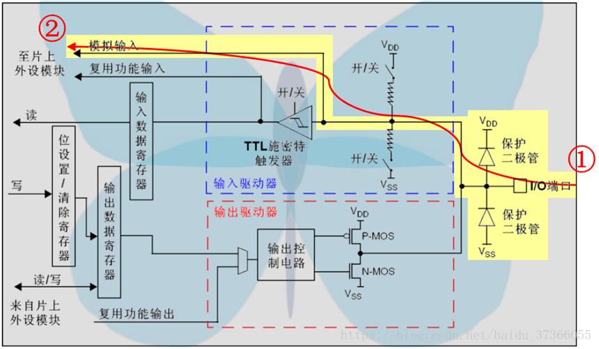
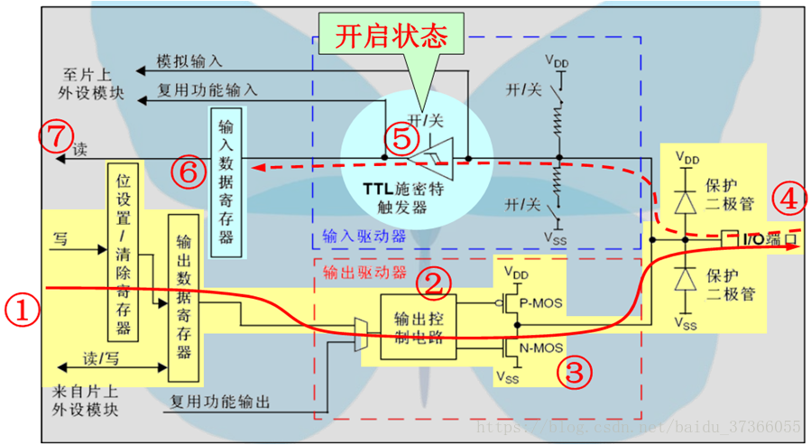

# 基本信息
* 课程名称：通用输入输出端口 - GPIO
* 讲师：谢胜
* 培训时间：2019/9/17 21:00-23:00
* 培训地点：T3 706
* 培训人数：15人

# 教学要点
1. 初识STM32
2. 了解HAL库（与其他几个库的对比，在程序开发中发挥什么作用）
3. 软件工具学习使用
4. 掌握GPIO引脚结构、八种工作模式及其配置
5. 实现LED流水灯（讲解延时函数，while死循环）
6. 实现数码管数字显示（讲解原理图）

# 教学重点
1. 需要让学员对STM32有一个大概的认识，对手里写的代码在干什么要有一个初步的认识
2. 需要让学员掌握STM32CubeMX的基本使用
3. 需要让学员掌握GPIO八种工作模式的作用及其使用方法
4. 需要让学员实现LED流水灯

# 教学难点
1. GPIO模式讲解
2. LED流水灯、数码管显示数字实操

# 教学准备
1. 学生准备：需提前安装好keil软件和STM32CubeMX软件，以及配套对应的固件库
2. 教师准备：借教室、STM32学习板、下载器

# 教学过程
## 第一步：STM32入门
STM32系列专为要求高性能、低成本、低功耗的嵌入式应用设计。STM32是由ST公司设计的一款MCU（Micro Controller Unit），其他的MCU厂商还有Freescale(飞思卡尔半导体)、Atmel(爱特梅尔)、ADI(亚德诺半导体)、Infineon(英飞凌)、NXP(恩智浦半导体)等。

STM32用途广泛，功能强大，可以点亮LED，驱动电机，控制气阀，控制彩屏，也可以感知温度湿度，测量电压电流，远距离通信，甚至可以搭建网络服务器，实现一个游戏机，可以说有自动化的地方就可以有它的身影。

对于初学者来说，最常听说的单片机大概有三类：Atmel公司的89C51、ST公司的STM32，以及有着广大开源社区的arduino。三者之中arduino是最适合新手开发的，其高度封装，自带IDE，一键下载，无限的库函数，分分钟就能做出一件小玩具。51系列的单片机快被时代淘汰了，但因为其结构简单，资源较少，非常适合初学者入门，同时还很便宜，在某些场景还能派上用场，所以就被保留了下来，目前市面上能找到的51单片机绝大多数都是89C51系列。

STM32是一个系列的MCU，根据实际情况对性能的要求，可以选择不同的系列。主流产品（STM32F0、STM32F1、STM32F3）、超低功耗产品（STM32L0、STM32L1、STM32L4、STM32L4+）、高性能产品（STM32F2、STM32F4、STM32F7、STM32H7）。

STM32命名规范：

序号|命名|含义
:--|:--|:--
1|	STM32|	STM32代表ARM Cortex-M内核的32位微控制器。
2|	F|	F代表芯片子系列。
3|	103|	103代表增强型系列。
4|	R|	R这一项代表引脚数，其中T代表36脚，C代表48脚，R代表64脚，V代表100脚，Z代表144脚，I代表176脚。
5|	B|	B这一项代表内嵌Flash容量，其中6代表32K字节Flash，8代表64K字节Flash，B代表128K字节Flash，C代表256K字节Flash，D代表384K字节Flash，E代表512K字节Flash，G代表1M字节Flash。
6|	T|	T这一项代表封装，其中H代表BGA封装，T代表LQFP封装，U代表VFQFPN封装。
7|	6|	6这一项代表工作温度范围，其中6代表-40——85℃，7代表-40——105℃。

## 第二步：开发工具介绍
目前我们还是倾向于使用MDK Keil 5以及STM32CubeMX进行开发。同时出名的IDE还有IAR，TrueStudio以及STM32CubeIDE等，根据队里往年传统，我们还是选择使用Keil 5 + STM32CubeMX的组合，同时辅以J-Scope和XCOM两个小工具进行调试。

Keil 5界面介绍

STM32CubeMX界面介绍

## 第三步：GPIO介绍
GPIO（General Purpose Input Output）通用输入输出，是 STM32 的一种外设， 与大部分芯片引脚直接挂钩。我们使用的是STM32F103ZET6，总共有 7 个 GPIO 外设，定义为 GPIOA、 GPIOB、GPIOC、 GPIOD、 GPIOE、 GPIOF 以及 GPIOG，每个 GPIO 外设有 16 个引脚，定义为 PA0……PA15、 PB0……PB15 等等，总共有 112 个 GPIO 引脚。

GPIO是单片机最基本最基本的功能，简单的说，单片机的电平高低，单片机的0和1的实现就靠它。单片机对外设的所有操作都通过GPIO进行的。

GPIO 可以配置成八种模式：输入浮空，输入上拉，输入下拉，模拟输入，开漏输出，推挽输出，推挽式复用功能，开漏复用功能。


### 输入浮空


浮空就是逻辑器件与引脚即不接高电平，也不接低电平。由于逻辑器件的内部结构，当它输入引脚悬空时，相当于该引脚接了高电平。

一般实际运用时，引脚不建议悬空，易受干扰。通俗讲就是浮空就是浮在空中，就相当于此端口在默认情况下什么都不接，呈高阻态，这种设置在数据传输时用的比较多。

浮空最大的特点就是电压的不确定性，它可能是0V，也可能是VCC，还可能是介于两者之间的某个值（最有可能）

### 输入上拉


拉就是把点位拉高，比如拉到Vcc。上拉就是将不确定的信号通过一个电阻嵌位在高电平。电阻同时起到限流的作用。

### 输入下拉


就是把电压拉低，拉到GND。与上拉原理相似

### 模拟输入


通过数模转换，转换成模拟信号

### 开漏输出


一般来说，开漏是用来连接不同电平的器件，匹配电平用的，因为开漏引脚不连接外部的上拉电阻时，只能输出低电平，如果需要同时具备输出高电平的功能，则需要接上拉电阻，很好的一个优点是通过改变上拉电源的电压，便可以改变传输电平。

### 推挽输出


可以输出高，低电平，连接数字器件。

推挽结构一般是指两个三级管分别受到互补信号的控制，总是在一个三极管导通的时候另一个截止。

### 推挽式复用功能


可以理解为GPIO口被用作第二功能时的配置情况（即并非作为通用IO口使用）

### 开漏复用功能


可以理解为GPIO口被用作第二功能时的配置情况（即并非作为通用IO口使用）

## 第四步：API使用
* 设置GPIO电平高低
```c
HAL_GPIO_WritePin(GPIOx, GPIO_Pin, GPIO_State);
```
* 翻转GPIO电平状态
```c
HAL_GPIO_TogglePin(GPIOx, GPIO_Pin);
```
* 读取GPIO电平状态
```c
HAL_GPIO_ReadPin(GPIOx, GPIO_Pin);
```
时钟树介绍

## 第五步：流水灯编程


首先带领学员写闪灯程序，然后带领学员写流水灯程序（涉及新建头文件，包含头文件，包含文件目录等操作，介绍延时函数、while循环介绍，移位介绍，寄存器介绍）。

## 第六步：按键扫描


## 第七步：数码管显示
原理图介绍


# 普中科技开发板资料
[百度网盘链接](https://pan.baidu.com/s/1Rj2MBzxiPJy7WHQox2K4oA)， 提取码：mxag

# 推荐参考网站
* [正点原子](http://www.openedv.com/)
* [野火论坛](http://www.proewildfire.cn/)
* [硬石电子](http://www.ing10bbs.com/forum.php)
* [普中科技](http://www.prechin.net/)