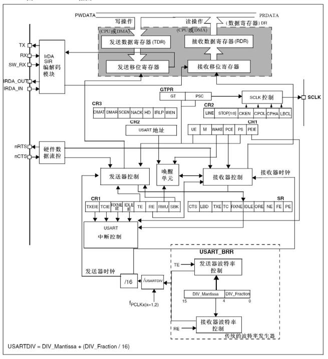

# 基本信息
* 课程名称：通用同步/异步串行接收/发送器 - USART
* 讲师：谢胜
* 培训时间：2019/9/21 13:00-15:00
* 培训地点：T3 706
* 培训人数：15人

# 教学要点
1. 认识USART（用途，模式，接线）
2. 学习波特率、奇偶校验位、停止位
3. 了解串口发送，串口接收的大致过程
4. 掌握串口中断的使用
5. 掌握USART+DMA的使用

# 教学重点
1. 波特率、奇偶校验位、停止位
2. 串口中断
3. DMA

# 教学难点
1. DMA

# 教学准备
1. 学生准备：电脑、单片机、下载器
2. 教师准备：借教室

# 教学过程
## 第一步：USART介绍
Universal Synchronous/Asynchronous Receiver/Transmitter，通用同步/异步串行接收/发送器。支持最基本的通用串口同步、异步通讯，还具有 LIN 总线功能(局域互联网)、 IRDA 功能(红外通讯)、 SmartCard 功能。最常使用的是串口的异步通信。与USART相对于的还有UART，即通用异步串行接收/发送器，所以对于我们来说，USART和UART都是一样的，因为我们只需要使用异步通信就行了。

USART是异步串口通信协议的一种，工作原理是将传输数据的每个字符一位接一位地传输，它能将要传输的资料在串行通信与并行通信之间加以转换，能够灵活地与外部设备进行全双工数据交换。

USART有两个引脚用于传输数据，RX和TX，接线的时候应使用交叉线，此外如果是不同设备之间通信还必须有一个GND线，VCC线为可选项。

## 第二步：USART的通信协议


1. 起始位：当未有数据发送时，数据线处于逻辑“1”状态；先发出一个逻辑“0”信号，表示开始传输字符。
2. 数据位：紧接着起始位之后。数据位的个数可以是4、5、6、7、8等，构成一个字符。通常采用ASCII码。从最低位开始传送，靠时钟定位。
3. 奇偶校验位：数据为加上这一位后，使得“1”的位数应为偶数（偶校验）或奇数（奇校验），以此来校验资料传送的正确性。
4. 停止位：它是一个字符数据的结束标志。可以是1位、1.5位、2位的高电平。 由于数据是在传输线上定时的，并且每一个设备有其自己的时钟，很可能在通信中两台设备间出现了小小的不同步。因此停止位不仅仅是表示传输的结束，并且提供计算机校正时钟同步的机会。适用于停止位的位数越多，不同时钟同步的容忍程度越大，但是数据传输率同时也越慢。
5. 空闲位或起始位：处于逻辑“1”状态，表示当前线路上没有资料传送，进入空闲状态。处于逻辑“0”状态，表示开始传送下一数据段。
6. 波特率：即每秒传输的二进制位数， 用 b/s (bps)表示，通过对时钟的控制可以改变波特率。USART具有独立的高精度波特率发生器，不占用定时/计数器。常用的波特率有：9600、115200……

## 第三步：USART工作原理


1. FIFO 操作

FIFO 是“First-In First-Out”的缩写，意为“先进先出”，是一种常见的队列操作。 Stellaris 系列ARM 的UART 模块包含有2 个16 字节的FIFO：一个用于发送，另一个用于接收。可以将两个FIFO 分别配置为以不同深度触发中断。可供选择的配置包括：1/8、 1/4、1/2、3/4 和7/8 深度。例如，如果接收FIFO 选择1/4，则在UART 接收到4 个数据时产生接收中断。

发送FIFO的基本工作过程： 只要有数据填充到发送FIFO 里，就会立即启动发送过程。由于发送本身是个相对缓慢的过程，因此在发送的同时其它需要发送的数据还可以继续填充到发送 FIFO 里。当发送 FIFO 被填满时就不能再继续填充了，否则会造成数据丢失，此时只能等待。这个等待并不会很久，以9600 的波特率为例，等待出现一个空位的时间在1ms 上下。发送 FIFO 会按照填入数据的先后顺序把数据一个个发送出去，直到发送 FIFO 全空时为止。已发送完毕的数据会被自动清除，在发送FIFO 里同时会多出一个空位。

接收FIFO的基本工作过程： 当硬件逻辑接收到数据时，就会往接收FIFO 里填充接收到的数据。程序应当及时取走这些数据，数据被取走也是在接收FIFO 里被自动删除的过程，因此在接收 FIFO 里同时会多出一个空位。如果在接收 FIFO 里的数据未被及时取走而造成接收FIFO 已满，则以后再接收到数据时因无空位可以填充而造成数据丢失。

收发FIFO 主要是为了解决UART 收发中断过于频繁而导致CPU 效率不高的问题而引入的。在进行 UART 通信时，中断方式比轮询方式要简便且效率高。但是，如果没有收发 FIFO，则每收发一个数据都要中断处理一次，效率仍然不够高。如果有了收发FIFO，则可以在连续收发若干个数据（可多至14 个）后才产生一次中断然后一并处理，这就大大提高了收发效率。

完全不必要担心FIFO 机制可能带来的数据丢失或得不到及时处理的问题，因为它已经帮你想到了收发过程中存在的任何问题，只要在初始化配置UART 后，就可以放心收发了， FIFO 和中断例程会自动搞定一切。

2. 发送接收

发送逻辑：从发送FIFO 读取的数据执行“并→串”转换。控制逻辑输出起始位在先的串行位流，并且根据控制寄存器中已编程的配置，后面紧跟着数据位（注意：最低位 LSB 先输出）、奇偶校验位和停止位。

接收逻辑：在检测到一个有效的起始脉冲后，对接收到的位流执行“串→并”转换。此外还会对溢出错误、奇偶校验错误、帧错误和线中止（line-break）错误进行检测，并将检测到的状态附加到被写入接收FIFO 的数据中。

3. 波特率产生

波特率除数（baud-rate divisor）是一个22 位数，它由16 位整数和6 位小数组成。波特率发生器使用这两个值组成的数字来决定位周期。通过带有小数波特率的除法器，在足够高的系统时钟速率下，UART 可以产生所有标准的波特率，而误差很小。

4. 数据收发

发送时，数据被写入发送FIFO。如果USART 被使能，则会按照预先设置好的参数（波特率、数据位、停止位、校验位等）开始发送数据，一直到发送FIFO 中没有数据。一旦向发送FIFO 写数据（如果FIFO 未空），UART 的忙标志位BUSY 就有效，并且在发送数据期间一直保持有效。BUSY 位仅在发送FIFO 为空，且已从移位寄存器发送最后一个字符，包括停止位时才变无效。即 USART 不再使能，它也可以指示忙状态。

在USART 接收器空闲时，如果数据输入变成“低电平”，即接收到了起始位，则接收计数器开始运行，若起始位持续时间达到阈值，则起始位有效，否则会被认为是错误的起始位并将其忽略。

如果起始位有效，则根据数据字符被编程的长度，对连续的数据位进行采样。如果奇偶校验模式使能，则还会检测奇偶校验位。

最后，如果Rx 为高电平，则有效的停止位被确认，否则发生帧错误。当接收到一个完整的字符时，将数据存放在接收FIFO 中。

5. 中断控制

出现以下情况时，可使UART 产生中断：


由于所有中断事件在发送到中断控制器之前会一起进行“或运算”操作，所以任意时刻 USART 只能向中断产生一个中断请求。通过查询中断状态函数，软件可以在同一个中断服务函数里处理多个中断事件（多个并列的if 语句）。


6. 使用DMA收发
直接存储器存取(DMA)用来提供在外设和存储器之间或者存储器和存储器之间的高速数据传输。无须CPU干预，数据可以通过DMA快速地移动，这就节省了CPU的资源来做其他操作

## 第四步：USART重要寄存器
### 状态寄存器(USART_SR)


TC：发送完成 (Transmission complete)
当包含有数据的一帧发送完成后，并且TXE=1时，由硬件将该位置’1’。如果USART_CR1中的TCIE为’1’，则产生中断。由软件序列清除该位(先读USART_SR，然后写入USART_DR)。 TC位也可以通过写入’0’来清除，只有在多缓存通讯中才推荐这种清除程序。
0：发送还未完成；
1：发送完成。

IDLE：监测到总线空闲 (IDLE line detected)
当检测到总线空闲时，该位被硬件置位。如果USART_CR1中的IDLEIE为’1’，则产生中断。由软件序列清除该位(先读USART_SR，然后读USART_DR)。
0：没有检测到空闲总线；
1：检测到空闲总线。
注意： IDLE位不会再次被置高直到RXNE位被置起(即又检测到一次空闲总线)

### 控制寄存器(USART_CRx)
有CR1、CR2、CR3三个寄存器，具体的配置较复杂，就不展开讲了，具体的可以参考《STM32中文参考手册》。

## 第五步：USART API
### 接收
```c
/**
  * @brief  Receives an amount of data in blocking mode.
  * @note   When UART parity is not enabled (PCE = 0), and Word Length is configured to 9 bits (M1-M0 = 01),
  *         the received data is handled as a set of u16. In this case, Size must indicate the number
  *         of u16 available through pData.
  * @param  huart Pointer to a UART_HandleTypeDef structure that contains
  *               the configuration information for the specified UART module.
  * @param  pData Pointer to data buffer (u8 or u16 data elements).
  * @param  Size  Amount of data elements (u8 or u16) to be received.
  * @param  Timeout Timeout duration
  * @retval HAL status
  */
HAL_StatusTypeDef HAL_UART_Receive(UART_HandleTypeDef *huart, uint8_t *pData, uint16_t Size, uint32_t Timeout)
```

```c
/**
  * @brief  Receives an amount of data in non blocking mode.
  * @note   When UART parity is not enabled (PCE = 0), and Word Length is configured to 9 bits (M1-M0 = 01),
  *         the received data is handled as a set of u16. In this case, Size must indicate the number
  *         of u16 available through pData.
  * @param  huart Pointer to a UART_HandleTypeDef structure that contains
  *               the configuration information for the specified UART module.
  * @param  pData Pointer to data buffer (u8 or u16 data elements).
  * @param  Size  Amount of data elements (u8 or u16) to be received.
  * @retval HAL status
  */
HAL_StatusTypeDef HAL_UART_Receive_IT(UART_HandleTypeDef *huart, uint8_t *pData, uint16_t Size)
```

```c
/**
  * @brief  Receives an amount of data in DMA mode.
  * @note   When UART parity is not enabled (PCE = 0), and Word Length is configured to 9 bits (M1-M0 = 01),
  *         the received data is handled as a set of u16. In this case, Size must indicate the number
  *         of u16 available through pData.
  * @param  huart Pointer to a UART_HandleTypeDef structure that contains
  *               the configuration information for the specified UART module.
  * @param  pData Pointer to data buffer (u8 or u16 data elements).
  * @param  Size  Amount of data elements (u8 or u16) to be received.
  * @note   When the UART parity is enabled (PCE = 1) the received data contains the parity bit.
  * @retval HAL status
  */
HAL_StatusTypeDef HAL_UART_Receive_DMA(UART_HandleTypeDef *huart, uint8_t *pData, uint16_t Size)
```
### 发送
```c
/**
  * @brief  Sends an amount of data in blocking mode.
  * @note   When UART parity is not enabled (PCE = 0), and Word Length is configured to 9 bits (M1-M0 = 01),
  *         the sent data is handled as a set of u16. In this case, Size must indicate the number
  *         of u16 provided through pData.
  * @param  huart Pointer to a UART_HandleTypeDef structure that contains
  *               the configuration information for the specified UART module.
  * @param  pData Pointer to data buffer (u8 or u16 data elements).
  * @param  Size  Amount of data elements (u8 or u16) to be sent
  * @param  Timeout Timeout duration
  * @retval HAL status
  */
HAL_StatusTypeDef HAL_UART_Transmit(UART_HandleTypeDef *huart, uint8_t *pData, uint16_t Size, uint32_t Timeout)
```

```c
/**
  * @brief  Sends an amount of data in non blocking mode.
  * @note   When UART parity is not enabled (PCE = 0), and Word Length is configured to 9 bits (M1-M0 = 01),
  *         the sent data is handled as a set of u16. In this case, Size must indicate the number
  *         of u16 provided through pData.
  * @param  huart Pointer to a UART_HandleTypeDef structure that contains
  *               the configuration information for the specified UART module.
  * @param  pData Pointer to data buffer (u8 or u16 data elements).
  * @param  Size  Amount of data elements (u8 or u16) to be sent
  * @retval HAL status
  */
HAL_StatusTypeDef HAL_UART_Transmit_IT(UART_HandleTypeDef *huart, uint8_t *pData, uint16_t Size)
```

```c
/**
  * @brief  Sends an amount of data in DMA mode.
  * @note   When UART parity is not enabled (PCE = 0), and Word Length is configured to 9 bits (M1-M0 = 01),
  *         the sent data is handled as a set of u16. In this case, Size must indicate the number
  *         of u16 provided through pData.
  * @param  huart  Pointer to a UART_HandleTypeDef structure that contains
  *                the configuration information for the specified UART module.
  * @param  pData Pointer to data buffer (u8 or u16 data elements).
  * @param  Size  Amount of data elements (u8 or u16) to be sent
  * @retval HAL status
  */
HAL_StatusTypeDef HAL_UART_Transmit_DMA(UART_HandleTypeDef *huart, uint8_t *pData, uint16_t Size)
```
### 中断
```c
/**
  * @brief This function handles USART1 global interrupt.
  */
void USART1_IRQHandler(void)
{
  /* USER CODE BEGIN USART1_IRQn 0 */

  /* USER CODE END USART1_IRQn 0 */
  HAL_UART_IRQHandler(&huart1);
  /* USER CODE BEGIN USART1_IRQn 1 */

  /* USER CODE END USART1_IRQn 1 */
}
```

```c
/**
  * @brief  Tx Transfer completed callbacks.
  * @param  huart  Pointer to a UART_HandleTypeDef structure that contains
  *                the configuration information for the specified UART module.
  * @retval None
  */
__weak void HAL_UART_TxCpltCallback(UART_HandleTypeDef *huart)
{
  /* Prevent unused argument(s) compilation warning */
  UNUSED(huart);
  /* NOTE: This function should not be modified, when the callback is needed,
           the HAL_UART_TxCpltCallback could be implemented in the user file
   */
}
```

```c
/**
  * @brief  Rx Transfer completed callbacks.
  * @param  huart  Pointer to a UART_HandleTypeDef structure that contains
  *                the configuration information for the specified UART module.
  * @retval None
  */
__weak void HAL_UART_RxCpltCallback(UART_HandleTypeDef *huart)
{
  /* Prevent unused argument(s) compilation warning */
  UNUSED(huart);
  /* NOTE: This function should not be modified, when the callback is needed,
           the HAL_UART_RxCpltCallback could be implemented in the user file
   */
}
```

## 第六步：串口通信实验
* TX和RX短接，自己给自己发信息
* 实现printf功能
```c
#include "stdio.h"

#pragma import(__use_no_semihosting)
//标准库需要的支持函数
struct __FILE
{
	int handle;
};
FILE __stdout;
//定义_sys_exit()以避免使用半主机模式
void _sys_exit(int x)
{
	x = x;
}
//重定义 fputc 函数
int fputc(int ch, FILE *f)
{
	while((USART1->SR&0X40)==0);//循环发送,直到发送完毕
	USART1->DR = (u8) ch;
	return ch;
}
```
> 注意要勾选`Use MicroLIB`

# 参考
* [基于STM32之UART串口通信协议（一）详解](https://www.cnblogs.com/ChurF-Lin/p/10793111.html)