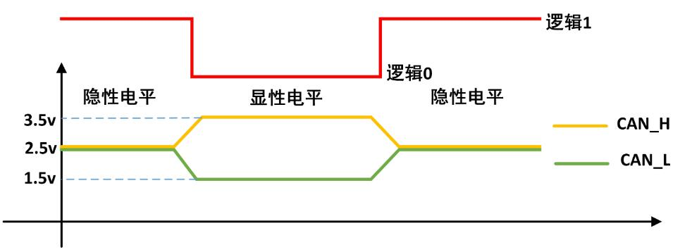
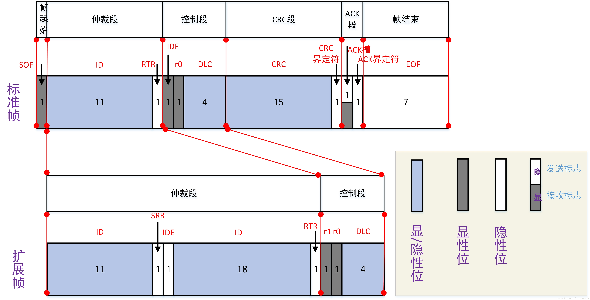
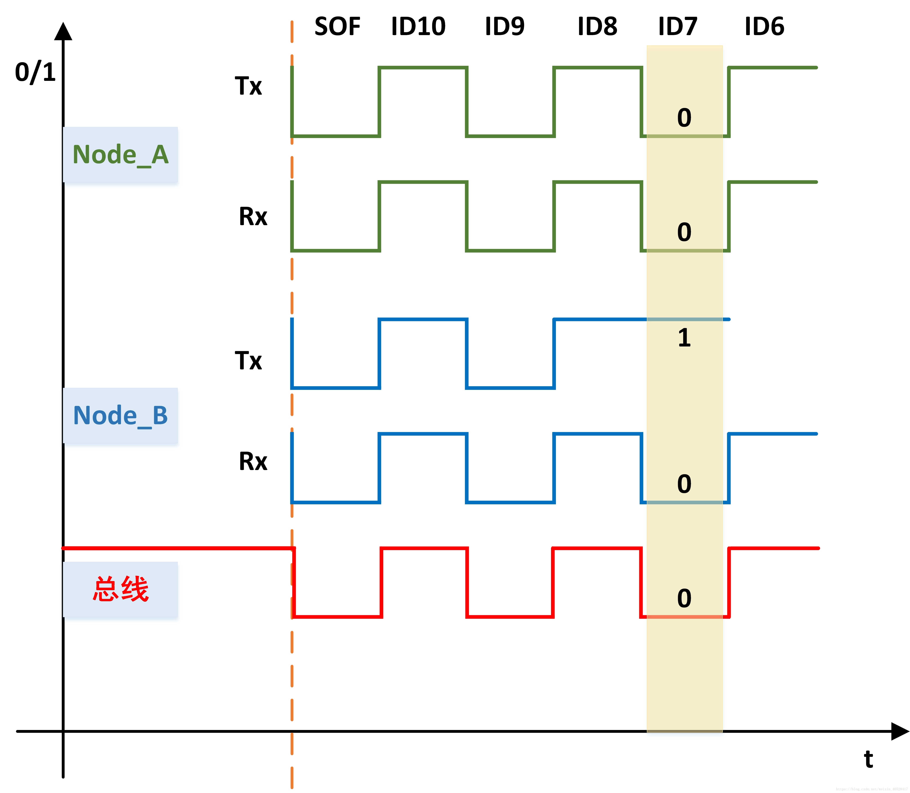
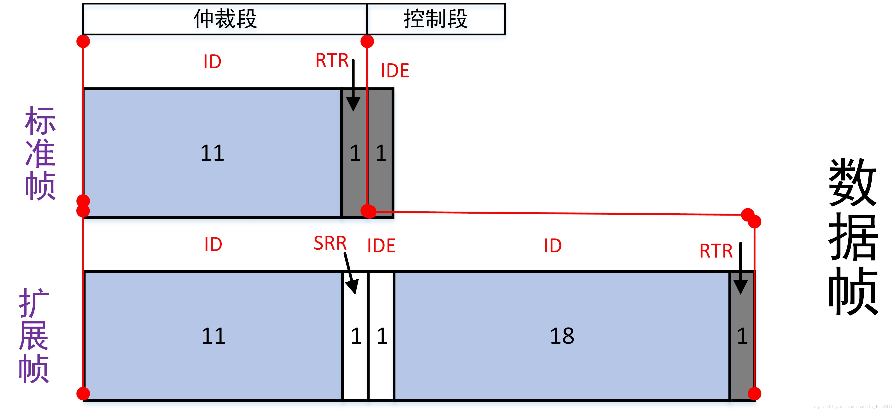
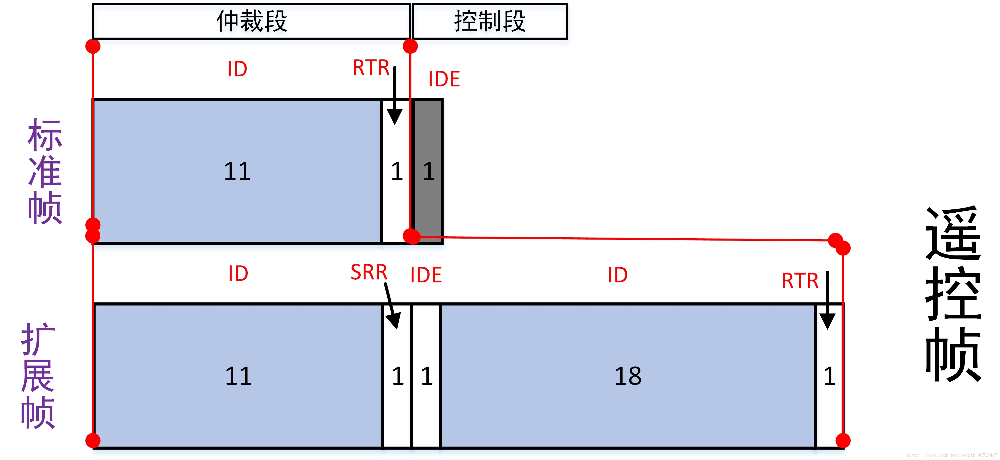
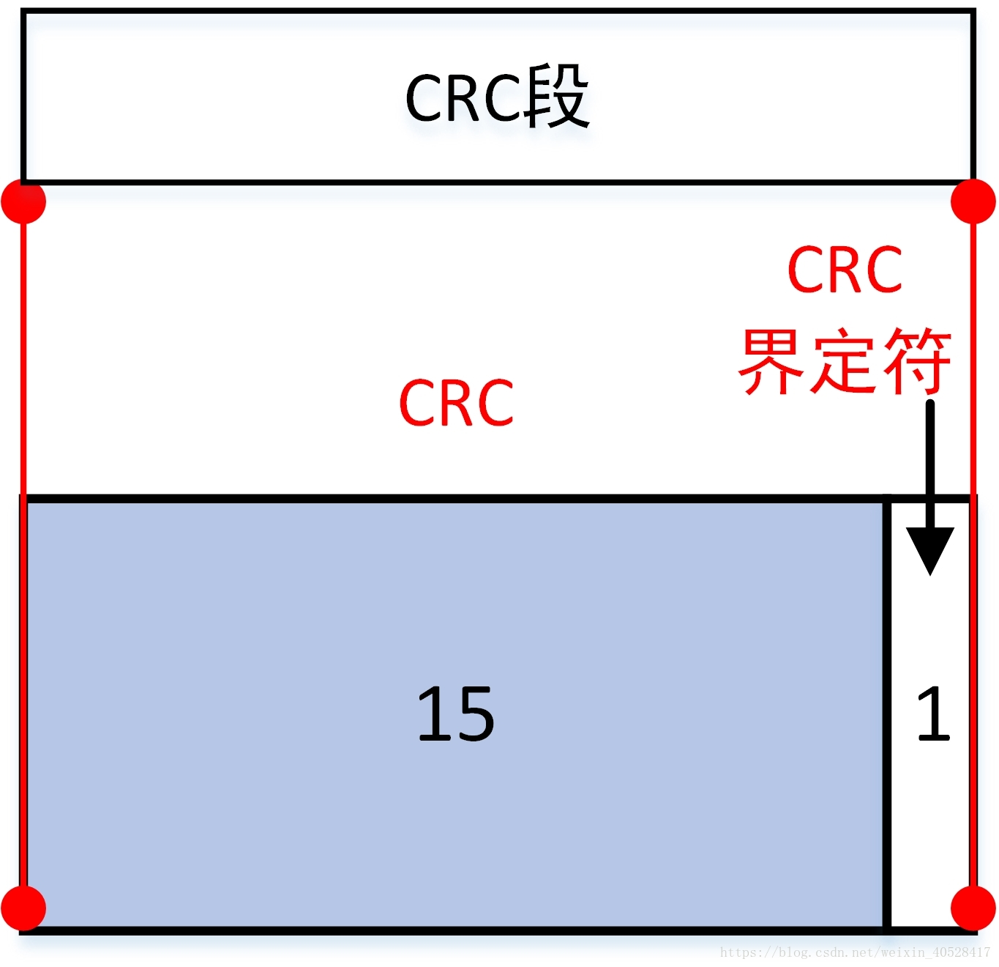
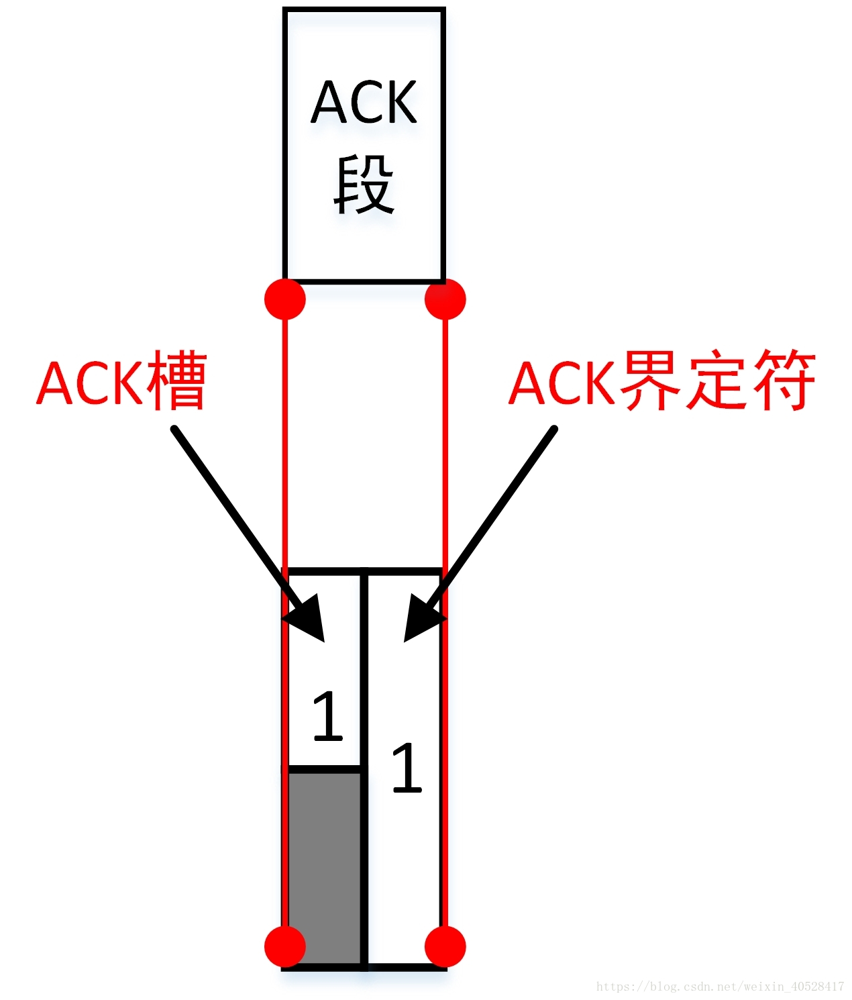
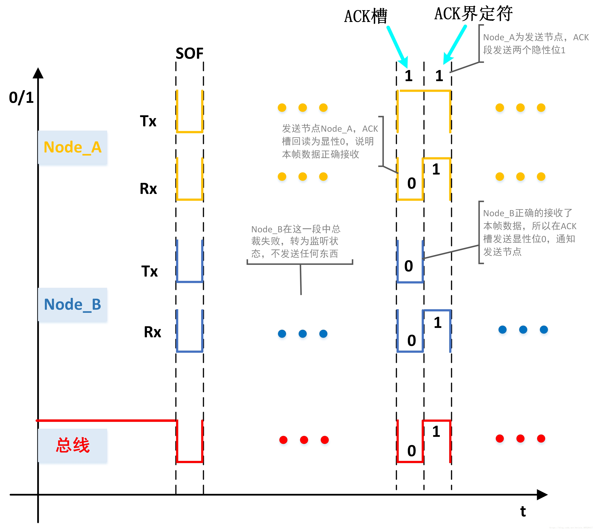

# 基本信息
* 课程名称：控制器局域网络 - CAN
* 讲师：谢胜
* 培训时间：2019/9/29 14:00-16:00
* 培训地点：T3 706
* 培训人数：14人

# 教学要点
* CAN通信连线
* CAN的五种帧结构
* CAN的七种数据段
* CAN的过滤器
* CAN的API

# 教学重点
* 数据帧、遥控帧
* CAN的仲裁机制
* CAN的过滤器

# 教学难点
* 全是难点
* 我太难了

# 教学准备
1. 学生准备：电脑、单片机、下载器
2. 教师准备：借教室

# 教学过程
## 第一步：CAN介绍
CAN 是 Controller Area Network 的缩写，是 ISO 国际标准化的串行通信协议，用于在不同的MCU之间传输数据。

CAN总线有两个ISO国际标准：ISO11898 和 ISO11519。其中：
* ISO11898 定义了通信速率为 125 kbps～1 Mbps 的高速 CAN 通信标准，属于闭环总线，传输速率可达1Mbps，总线长度 ≤ 40米。
* ISO11519 定义了通信速率为 10～125 kbps 的低速 CAN 通信标准，属于开环总线，传输速率为40kbps时，总线长度可达10000米。

下面的内容都针对IS011898标准。

CAN具有很高的可靠性和良好的错误检测能力，广泛应用于汽车计算机控制系统和环境温度恶劣/电磁辐射强及振动大的工业环境。


上图中，左边是高速CAN总线的拓扑结构，右边是低速CAN总线的拓扑结构。如图中所示，CAN总线包括CAN_H 和 CAN_L 两根线。节点通过CAN控制器和CAN收发器连接到CAN总线上。

*STM32内部没有集成CAN控制器和CAN收发器，需要自己外加。*

CAN的特点：

* 多主控制。总线空闲时，所有单元都可发送消息，而两个以上的单元同时发送消息时，根据标识符(ID, 非地址)决定优先级。两个以上的单元同时开始发送消息时，对各消息ID的每个位进行逐个仲裁比较。仲裁获胜(优先级最高)的单元可继续发送消息，仲裁失利的单元则立即停止发送而进行接收工作。
* 系统柔软性。连接总线的单元，没有类似"地址"的信息。因此，在总线上添加单元时，以连接的其他单元的软硬件和应用层都不需要做改变。
* 速度快，距离远。最高1Mbps(距离<40m)，最远可达10KM(速率<5Kbps)。CAN物理层的形式主要分为闭环总线和开环总线，一个适合于高速通讯，一个适合于远距离通讯(速度慢)。闭环通讯网络是一种高速、短距离网络，它的总线最大长度为40m，通信速度最高1Mbps，总线的两端各要求有一个"120欧"的电阻。开环总线网络是低速、远距离网络，它的最大传输距离1km，最高通讯速率为125kbps，两根总线是独立的、不形成闭环，要求每根总线上各串联有一个"2.2千欧"的电阻。
* 具有错误检测/错误通知和错误恢复功能。所有单元都可以检测错误(错误检测功能)，检测出错误的单元会立即同时通知其他所有单元(错误通知功能)，正在发送消息的单元一旦检测出错误，会强制结束当前的发送。强制结束发送的单元会不断反复地重新发送次消息直到成功发送位置(错误恢复功能)。
* 故障封闭功能。CAN可以判断出错误的类型是总线上数据错误(如外部噪声等)还是持续的数据错误(如单元内部故障、驱动器故障、断线等)。由此功能，当总线上发生次序数据错误时，可将引起此故障的单元从总线上隔离出去。
* 连接节点多。CAN总线可同时可同时连接多个单元。可连接的单元总数理论上是没有限制的。但实际上可连接的单元受总线上的时间延迟及电气负载的限制。降低通信速度，可连接的单元数增加；提高通信速度，则可连接的单元数减少。

## 第二步：CAN的重点概念
### 物理层特征
与I2C/SPI等具有始终信号的同步通讯方式不同，CAN通讯兵不是以时钟信号来进行同步的，它是一种异步通信，只具有CAN_High和CAN_Low两条信号线，共同构成一组差分信号线，以差分信号的形式进行通讯。

CAN控制器根据CAN_L和CAN_H上的电位差来判断总线电平。总线电平分为显性电平和隐形电平,二者比居其一。发送方通过使总线电平发生变化，将消息发送给接收方。

显性电平对应逻辑：0
    CAN_High的电平为3.5V，CAN_Low线的电平为1.5V，CAN_H和CAN_L的电压差为2V左右。

隐性电平对应逻辑：1
    CAN_High和CAN_Low线上的电压均为2.5v, CAN_H和CAN_L之间的电压差为0V。

**显性电平具有优先权**，只要有一个单元输出显性电平，总线上即为显性电平。而隐形电平则具有包容的意味，只有所有的单元都输出隐形电平，总线上才为隐形电平(显性电平比隐形电平更强)。



### 通讯节点
CAN总线上可以挂载多个通讯节点，节点之间的信号经过总线传输，实现节点间通讯。由于CAN通讯协议不对节点进行地址编码，而是对数据内容进行编码，所以网络中的节点个数理论上不受限制。

当CAN节点需要发送数据时，控制器把要发送的二进制编码通过CAN_Tx线发送到收发器，然后有收发器把这个普通的逻辑电平转化为差分信号，通过差分线CAN_High和CAN_Low线输出到CAN总线网络。而通过收发器接收总线上的数据到控制器时，则是相反的过程，收发器把总线上收到的CAN_High及CAN_Low信号转化为普通的逻辑电平信号，通过CAN_Rx输出到控制器中。

由于CAN总线协议的物理层只有1对差分线，在一个时刻只能表示一个信号，所以对通讯节点来说，CAN通讯是半双工的，收发数据需要分时进行。在CAN的通讯网络中，因为共用总线，在整个网络中同一时刻只能有一个通讯节点发送信号，其余的节点在该时刻都只能接收。

### 位时序分解
CAN使用"位同步"的方式来抗干扰/吸收误差，实现对总线电平信号进行正确的采样，确保通讯正常。

为了实现位同步，CAN协议把每一个数据位的时序分解成SS段，PTS段，PBS1段，PBS2段，这四段的长度加起来即为一个CAN数据位的长度。分解后最小的时间单位是Tq，而一个完整的位由8~25个Tq组成。

* SS(SYNC SEG)段：SS段译为同步段，若通讯节点检测到总线上信号的跳变被包含在SS段的范围之内，则表示节点与总线的时序是同步的，当节点与总线同步时，采样点采集到的总线电平即可被确定为该位的电平。SS段固定大小为1Tq。
* PTS段(PROP SEG)：PTS段译为传播时间段，这个时间段是用于补偿网络的物理延时时间。是总线上输入比较器延时和输出驱动器延时总和的两倍。PTS段的大小可以为1~8Tq。
* PBS1段(PHASE SEG1)：PBS1译为相位缓冲段，主要用来补偿边沿阶段的误差，它的时间长度在重新同步的时候可以加长。PBS1段的初始大小可以为1~8Tq。
* PBS2段(PHASE SEG2)：PBS2是另一个相位缓冲段，也是用来补偿边沿阶段误差的，它的时间长度在重新同步时可以缩短。PBS2段的初始大小可以为2~8Tq。

信号的采样点位于PBS1段与PBS2段之间，通过控制各段的长度，可以对采样点的位置进行偏移，以便准确地采样。

### 非破坏性位仲裁机制
在CAN协议中，所有的消息都以固定的帧格式发送。当多个节点同时向总线发送消息时，对各个消息的标识符（即ID号）进行逐位仲裁，如果某个节点发送的消息仲裁获胜，那么这个节点将获取总线的发送权，仲裁失败的节点则立即停止发送并转变为监听（接收）状态。

这种仲裁机制既不会造成已发送数据的延迟，也不会破坏已经发送的数据，所以称为非破坏性仲裁机制。

### 帧种类介绍
CAN通信以5种类型的帧进行： 
* 数据帧：用于通讯节点向外传送数据。 
* 遥控帧：用于向远端节点请求数据。 
* 错误帧：用于向远端节点通知校验错误，请求重新发送上一个数据。 
* 过载帧：用于通知远端节点：本节点尚未做好接受准备。 
* 间隔帧：用于将数据帧及遥控帧与前面的帧分离开来的帧。 

#### 数据帧介绍
所谓数据帧，就是包含了我们要传输的数据的帧，其作用当然也就是承载发送节点要传递给接收节点的数据。


#### 遥控帧


遥控帧相比于数据帧，从帧结构上来看，只是少了数据段，包含六个段：帧起始、仲裁段、控制段、CRC段、ACK段、帧结束。

数据帧和遥控帧都分为标准帧（CAN2.0A）和扩展帧（CAN2.0B）两种结构。

遥控帧相比于数据帧除了缺少数据段之外，遥控帧的RTR位恒为隐性1，数据帧的RTR位恒为显性0。

## 第三步：数据段详解
### 帧起始
帧的最开始的一位是帧起始，也叫SOF（Start Of Frame），SOF恒为显性位，即逻辑 0 。

帧起始表示CAN_H 和 CAN_L上有了电位差，也就是说，一旦总线上有了SOF就表示总线上开始有报文了。

### 仲裁段
仲裁段是用来判定一帧报文优先级的依据，仲裁段中的ID号也是实现报文过滤机制的基础。


可以看到相比于数据帧仲裁段RTR位恒为显性0，遥控帧仲裁段的RTR位恒为隐性1。

#### 仲裁过程
在CAN总线通信中，有一种回读机制：指的是节点在向总线上发送报文的过程中，同时也对总线上的二进制位进行“回读”。通过这种机制，节点就可以判断出本节点发出的二进制位与总线上当前的二进制位是否一致。

还有一种叫做线与机制：指的是在总线上，显性位能够覆盖隐性位。
举个例子：在某一个时刻，节点Node_A向总线发送了一个显性位0，Node_B向总线发送了一个隐性位1，那么在该时刻，总线上的电平为显性0。

*举个例子：在某一个时刻，节点Node_A向总线发送了一个显性位0，Node_B向总线发送了一个隐性位1，那么在该时刻，总线上的电平为显性0。*

下面将以标准数据帧的一个例子来分析CAN总线的非破坏性逐位仲裁机制。

一条CAN总线上有Node_A 和 Node_B两个节点，在总线空闲时，总线上为隐性电平，就在这个时候Node_A 和 Node_B 这两个节点同时向总线上发送数据，如下图：



* 在Node_A获取总线的发送权之后，Node_A接着发送自己的Msg_A，因此在竞争总线的过程中不会对Msg_A的传输造成延时；
* 在两个节点竞争总线的过程中，不会破坏Msg_A;

通过上面仲裁过程的分析，我们可以解释CAN总线通信的三个特点：
1. 多主控制方式：只要总线空闲，总线上的任意节点都可以向总线上发送数据，直到节点在仲裁中一个个失败，最后只留下一个节点获得总线的发送权。
2. 非破坏性仲裁机制：仲裁段逐位总裁，依靠回读机制、线与机制得以实现。
3. 半双工通信：所谓半双工通信，指的是节点不能在自己发送报文的时候，同时接收其他节点发送来的报文。这是显然的，一个节点正在发送报文时，已经占据了总线的发送权，其他节点肯定不能向总线上发送报文。

看一个CAN报文发送的实例，CAN总线上有四个节点：Node_A、Node_B、Node_C、Node_D。发送的报文的ID号分别为5、7、3、6:


#### 仲裁段中的RTR，SRR和IDE位
1、RTR位：Tranmission Request Bit （远程发送请求位）。在数据帧中，RTR位恒为显性位0，在遥控帧中，恒为隐性1。

这么做的原因是保证数据帧优先级高于遥控帧。比如：在某一时刻t，节点Node_A发出了ID号为ID_2遥控帧报文来请求总线上的其它节点发出ID号为ID_2的数据帧报文。但是就在同一时刻t，节点Node_B发出了ID号为ID_2的数据帧报文。这个时候怎么办呢，显然依靠ID号不能仲裁出这两帧报文（一个遥控帧，一个数据帧，ID号相同）谁能占据总线的发送权，这种情况下，RTR位就起作用了，由于RTR在数据帧中恒为显性0，在遥控帧中恒为隐性1，所以在ID号相同的情况下，一定是数据帧仲裁获胜。这就解释了 **RTR位的作用：在ID号相同的情况下，保证数据帧的优先级高于遥控帧。**

2、SRR位：Substitutes for Remote Requests Bit（替代远程请求位），在扩展帧（数据帧或遥控帧）中，SRR恒为隐性位1，并且可以发现，扩展帧的隐性SRR位正好对应标准帧的显性RTR位，这就解释了 **SRR位的作用：在前11位ID号相同的情况下，标准数据帧的优先级高于扩展数据帧；**



3、IDE位：Identifier Extension Bit（标识符扩展位）。在扩展帧中恒为隐性1，在标准帧中，IDE位于控制段，且恒为显性0。且扩展帧IDE位和标准帧IDE位位置对应，这就保证了： **在前11位ID号相同的情况下，标准遥控帧的优先级一定高于扩展遥控帧。**



**总结：**

在ID号前11位相同的情况下：
* RTR：保证数据帧优先级高于遥控帧；
* SRR ：保证标准数据帧的优先级高于扩展数据帧。
* IDE ：保证标准遥控帧的优先级高于扩展遥控帧。

#### 报文过滤
在CAN总线中没有地址的概念，CAN总线是通过报文ID来实现收发数据的。CAN节点上都会有一个验收滤波ID表，其位于CAN节点的验收滤波器中，如果总线上的报文的ID号在某个节点的验收滤波ID表中，那么这一帧报文就能通过该节点验收滤波器的验收，该节点就会接收这一帧报文。

> 比如：Node_A发送了一帧ID号为ID_1的报文Msg_1，Node_B的验收滤波ID表中恰好有ID_1，于是乎Msg_1就会被Node_B接收。

报文过滤机制体现了CAN通信的两条特点：
1. 一对一、组播和广播
2. 系统的柔性：正是因为CAN总线上收发报文是基于报文ID实现的，所以总线上添加节点时不会对总线上已有的节点造成影响。

### 控制段
数据帧和遥控帧的控制段结构相同：


4位的DLC（DLC3、DLC2、DLC1、DLC0）代表数据长度，指示了数据段中的字节数。对于没有数据段的遥控帧，DLC表示该遥控帧对应的数据帧的数据段的字节数。

### 数据段
数据段可以包含0~8个字节的数据，从MSB（最高位）开始输出。

### CRC段


CRC校验序列是根据多项式生成的CRC值，其计算范围包括：帧起始、仲裁段、控制段和数据段。

CRC界定符恒为隐性1。

### ACK段


* 发送节点在ACK段发送两个隐性位，即发送方发出的报文中ACK槽为隐性1；
* 接收节点在接收到正确的报文之后会在ACK槽发送显性位0，通知发送节点正常接收结束。

我们以标准数据帧为例来分析ACK段的工作方式

如图所示，Node_A为发送节点，Node_B为接收节点。Node_A在ACK段发送两个隐性位1。Node_B正确接收到这一报文后，在ACK段的ACK槽中填充了一个显性位0。注意，这个时候Node_A回读到的总线上的额电平为显性0，于是这个时候，Node_A就知道自己发出去的报文至少有一个节点正确接收了。



### 帧结束
帧结束段表示该帧报文的结束，由7个隐性位构成。

## 第四步：去世
请安详去世。

## 第五步：CAN过滤器
详见[再谈STM32的CAN过滤器-bxCAN的过滤器的4种工作模式以及使用方法总结](https://blog.csdn.net/flydream0/article/details/52317532)

## 第六步：CAN API
```c
/**
  * @brief  CAN filter configuration structure definition
  */
typedef struct
{
  uint32_t FilterIdHigh;          /*!< Specifies the filter identification number (MSBs for a 32-bit
                                       configuration, first one for a 16-bit configuration).
                                       This parameter must be a number between Min_Data = 0x0000 and Max_Data = 0xFFFF. */

  uint32_t FilterIdLow;           /*!< Specifies the filter identification number (LSBs for a 32-bit
                                       configuration, second one for a 16-bit configuration).
                                       This parameter must be a number between Min_Data = 0x0000 and Max_Data = 0xFFFF. */

  uint32_t FilterMaskIdHigh;      /*!< Specifies the filter mask number or identification number,
                                       according to the mode (MSBs for a 32-bit configuration,
                                       first one for a 16-bit configuration).
                                       This parameter must be a number between Min_Data = 0x0000 and Max_Data = 0xFFFF. */

  uint32_t FilterMaskIdLow;       /*!< Specifies the filter mask number or identification number,
                                       according to the mode (LSBs for a 32-bit configuration,
                                       second one for a 16-bit configuration).
                                       This parameter must be a number between Min_Data = 0x0000 and Max_Data = 0xFFFF. */

  uint32_t FilterFIFOAssignment;  /*!< Specifies the FIFO (0 or 1U) which will be assigned to the filter.
                                       This parameter can be a value of @ref CAN_filter_FIFO */

  uint32_t FilterBank;            /*!< Specifies the filter bank which will be initialized.
                                       For single CAN instance(14 dedicated filter banks),
                                       this parameter must be a number between Min_Data = 0 and Max_Data = 13.
                                       For dual CAN instances(28 filter banks shared),
                                       this parameter must be a number between Min_Data = 0 and Max_Data = 27. */

  uint32_t FilterMode;            /*!< Specifies the filter mode to be initialized.
                                       This parameter can be a value of @ref CAN_filter_mode */

  uint32_t FilterScale;           /*!< Specifies the filter scale.
                                       This parameter can be a value of @ref CAN_filter_scale */

  uint32_t FilterActivation;      /*!< Enable or disable the filter.
                                       This parameter can be a value of @ref CAN_filter_activation */

  uint32_t SlaveStartFilterBank;  /*!< Select the start filter bank for the slave CAN instance.
                                       For single CAN instances, this parameter is meaningless.
                                       For dual CAN instances, all filter banks with lower index are assigned to master
                                       CAN instance, whereas all filter banks with greater index are assigned to slave
                                       CAN instance.
                                       This parameter must be a number between Min_Data = 0 and Max_Data = 27. */

} CAN_FilterTypeDef;
```

```c
/**
  * @brief  Configures the CAN reception filter according to the specified
  *         parameters in the CAN_FilterInitStruct.
  * @param  hcan pointer to a CAN_HandleTypeDef structure that contains
  *         the configuration information for the specified CAN.
  * @param  sFilterConfig pointer to a CAN_FilterTypeDef structure that
  *         contains the filter configuration information.
  * @retval None
  */
HAL_StatusTypeDef HAL_CAN_ConfigFilter(CAN_HandleTypeDef *hcan, CAN_FilterTypeDef *sFilterConfig)
```

```c
/**
  * @brief  Start the CAN module.
  * @param  hcan pointer to an CAN_HandleTypeDef structure that contains
  *         the configuration information for the specified CAN.
  * @retval HAL status
  */
HAL_StatusTypeDef HAL_CAN_Start(CAN_HandleTypeDef *hcan)
```

```c
/**
  * @brief  Enable interrupts.
  * @param  hcan pointer to an CAN_HandleTypeDef structure that contains
  *         the configuration information for the specified CAN.
  * @param  ActiveITs indicates which interrupts will be enabled.
  *         This parameter can be any combination of @arg CAN_Interrupts.
  * @retval HAL status
  */
HAL_StatusTypeDef HAL_CAN_ActivateNotification(CAN_HandleTypeDef *hcan, uint32_t ActiveITs)
```

```c
/**
  * @brief  Add a message to the first free Tx mailbox and activate the
  *         corresponding transmission request.
  * @param  hcan pointer to a CAN_HandleTypeDef structure that contains
  *         the configuration information for the specified CAN.
  * @param  pHeader pointer to a CAN_TxHeaderTypeDef structure.
  * @param  aData array containing the payload of the Tx frame.
  * @param  pTxMailbox pointer to a variable where the function will return
  *         the TxMailbox used to store the Tx message.
  *         This parameter can be a value of @arg CAN_Tx_Mailboxes.
  * @retval HAL status
  */
HAL_StatusTypeDef HAL_CAN_AddTxMessage(CAN_HandleTypeDef *hcan, CAN_TxHeaderTypeDef *pHeader, uint8_t aData[], uint32_t *pTxMailbox)
```

```c
/**
  * @brief  Get an CAN frame from the Rx FIFO zone into the message RAM.
  * @param  hcan pointer to an CAN_HandleTypeDef structure that contains
  *         the configuration information for the specified CAN.
  * @param  RxFifo Fifo number of the received message to be read.
  *         This parameter can be a value of @arg CAN_receive_FIFO_number.
  * @param  pHeader pointer to a CAN_RxHeaderTypeDef structure where the header
  *         of the Rx frame will be stored.
  * @param  aData array where the payload of the Rx frame will be stored.
  * @retval HAL status
  */
HAL_StatusTypeDef HAL_CAN_GetRxMessage(CAN_HandleTypeDef *hcan, uint32_t RxFifo, CAN_RxHeaderTypeDef *pHeader, uint8_t aData[])
```

## 第七步：CAN通信实验
```c
HAL_StatusTypeDef CanFilterInit(CAN_HandleTypeDef* hcan)
{
	CAN_FilterTypeDef  sFilterConfig;

	sFilterConfig.FilterBank = 0;
	sFilterConfig.FilterMode = CAN_FILTERMODE_IDMASK;
	sFilterConfig.FilterScale = CAN_FILTERSCALE_32BIT;
	sFilterConfig.FilterIdHigh = 0x0000;
	sFilterConfig.FilterIdLow = 0x0000;
	sFilterConfig.FilterMaskIdHigh = 0x0000;
	sFilterConfig.FilterMaskIdLow = 0x0000;
	sFilterConfig.FilterFIFOAssignment = CAN_RX_FIFO0;
	sFilterConfig.FilterActivation = ENABLE;
	sFilterConfig.SlaveStartFilterBank = 14;
	sFilterConfig.FilterBank = 0;
	HAL_CAN_ConfigFilter(hcan, &sFilterConfig);
	
	HAL_CAN_Start(hcan);
	HAL_CAN_ActivateNotification(hcan, CAN_IT_RX_FIFO0_MSG_PENDING);
	
	return HAL_OK;
}
```

```c
void CanTransmit_1234(CAN_HandleTypeDef *hcanx, int16_t cm1_iq, int16_t cm2_iq, int16_t cm3_iq, int16_t cm4_iq)
{
	CAN_TxHeaderTypeDef TxMessage;

	TxMessage.DLC=0x08;
	TxMessage.StdId=0x200;
	TxMessage.IDE=CAN_ID_STD;
	TxMessage.RTR=CAN_RTR_DATA;
	uint8_t TxData[8];

	TxData[0] = (uint8_t)(cm1_iq >> 8);
	TxData[1] = (uint8_t)cm1_iq;
	TxData[2] = (uint8_t)(cm2_iq >> 8);
	TxData[3] = (uint8_t)cm2_iq;
	TxData[4] = (uint8_t)(cm3_iq >> 8);
	TxData[5] = (uint8_t)cm3_iq;
	TxData[6] = (uint8_t)(cm4_iq >> 8);
	TxData[7] = (uint8_t)cm4_iq;

	HAL_CAN_AddTxMessage(hcanx,&TxMessage,TxData,(uint32_t*)CAN_TX_MAILBOX0);
}
```

```c
/*
 * @brief CAN通信接收中断回调函数
 * @param CAN序号
 * @retval None
 */
void HAL_CAN_RxFifo0MsgPendingCallback(CAN_HandleTypeDef *hcan)
{
    CAN_RxHeaderTypeDef   RxHeader;
    HAL_CAN_GetRxMessage(hcan, CAN_RX_FIFO0, &RxHeader, CanReceiveData);
    CanDataReceive(RxHeader.StdId);   //进行电机数据解析
}
```

# 参考
* [CAN总线学习笔记（1）- CAN基础知识](https://blog.csdn.net/weixin_40528417/article/details/79476186)
* [CAN总线学习笔记（2）- CAN协议数据帧与遥控帧](https://blog.csdn.net/weixin_40528417/article/details/79534483)
* [CAN总线学习笔记（3）- CAN协议错误帧](https://blog.csdn.net/weixin_40528417/article/details/79771270)
* [CAN总线学习笔记（4）- CAN协议过载帧和帧间隔](https://blog.csdn.net/weixin_40528417/article/details/79871311)
* [CAN总线学习笔记（5）- CAN通信的位定时与同步](https://blog.csdn.net/weixin_40528417/article/details/79936476)
* [再谈STM32的CAN过滤器-bxCAN的过滤器的4种工作模式以及使用方法总结](https://blog.csdn.net/flydream0/article/details/52317532)