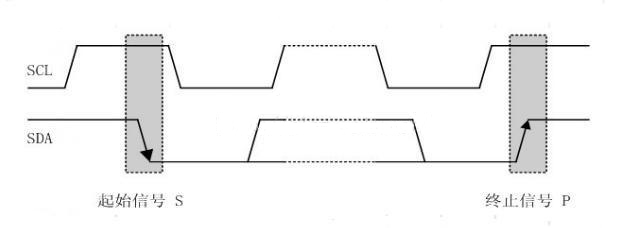
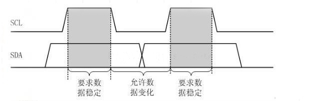
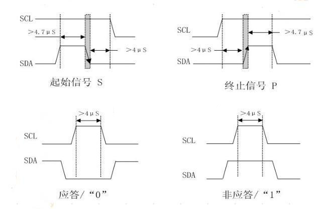
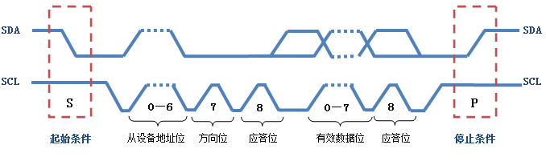
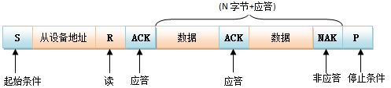

# 基本信息
* 课程名称：Inter-Integrated Circuit - IIC
* 讲师：谢胜
* 培训时间：2019/9/28 14:00-16:00
* 培训地点：T3 706
* 培训人数：14人

# 教学要点
* IIC时序图
* IIC时序模拟

# 教学重点
* IIC时序图

# 教学难点
* IIC时序图

# 教学准备
1. 学生准备：电脑、单片机、下载器
2. 教师准备：借教室

# 教学过程
## 第一步：IIC简介
IIC（Inter－Integrated Circuit）总线是一种由PHILIPS公司在80年代开发的两线式串行总线，用于连接微控制器及其外围设备。它是半双工通信方式。

* IIC总线最主要的优点是其简单性和有效性。由于接口直接在组件之上，因此IIC总线占用的空间非常小，减少了电路板的空间和芯片管脚的数量，降低了互联成本。总线的长度可高达25英尺，并且能够以10Kbps的最大传输速率支持40个组件。
* IIC总线的另一个优点是，它支持**多主控(multimastering)**， 其中任何能够进行发送和接收的设备都可以成为主总线。一个主控能够控制信号的传输和时钟频率。当然，在任何时间点上只能有一个主控。

IIC串行总线一般有两根信号线，一根是双向的数据线SDA，另一根是时钟线SCL，其时钟信号是由主控器件产生。所有接到IIC总线设备上的串行数据SDA都接到总线的SDA上，各设备的时钟线SCL接到总线的SCL上。对于并联在一条总线上的每个IC都有唯一的地址。


一般情况下，数据线SDA和时钟线SCL都是处于上拉电阻状态。因为：在总线空闲状态时，这两根线一般被上面所接的上拉电阻拉高，保持着高电平。

目前绝大多数的MCU都附带IIC总线接口，STM32也不例外。但我们不使用STM32的硬件IIC，而是通过软件的方式来模拟，因为STM32的硬件IIC非常复杂，更重要的是它并不稳定，故不推荐使用。

## 第二步：IIC时序图详解
IIC总线在传输数据的过程中一共有三种类型信号，分别为：开始信号、结束信号和应答信号。


### 空闲状态
当IIC总线的数据线SDA和时钟线SCL两条信号线同时处于高电平时，规定为总线的空闲状态。此时各个器件的输出级场效应管均处在截止状态，即释放总线，由两条信号线各自的上拉电阻把电平拉高。 

### 起始信号与停止信号
* 起始信号：当时钟线SCL为高期间，数据线SDA由高到低的跳变；启动信号是一种电平跳变时序信号，而不是一个电平信号；
* 停止信号：当时钟线SCL为高期间，数据线SDA由低到高的跳变；停止信号也是一种电平跳变时序信号，而不是一个电平信号。



### 应答信号
发送器每发送一个字节（8个bit），就在时钟脉冲9期间释放数据线，由接收器反馈一个应答信号。 

* 应答信号为低电平时，规定为有效应答位（ACK，简称应答位），表示接收器已经成功地接收了该字节；
* 应答信号为高电平时，规定为非应答位（NACK），一般表示接收器接收该字节没有成功。 


对于反馈有效应答位ACK的要求是：接收器在第9个时钟脉冲之前的低电平期间将数据线SDA拉低，并且确保在该时钟的高电平期间为稳定的低电平。

如果接收器是主控器，则在它收到最后一个字节后，发送一个NACK信号，以通知被控发送器结束数据发送，并释放数据线SDA，以便主控接收器发送一个停止信号P。

### 数据有效性
IIC总线进行数据传送时，时钟信号为高电平期间，数据线上的数据必须保持稳定；只有在时钟线上的信号为低电平期间，数据线上的高电平或低电平状态才允许变化。 

即：数据在时钟线SCL的上升沿到来之前就需准备好。并在在下降沿到来之前必须稳定。



### 数据的传达
在IIC总线上传送的每一位数据都有一个时钟脉冲相对应（或同步控制），即在SCL串行时钟的配合下，在SDA上逐位地串行传送每一位数据。数据位的传输是边沿触发。

### 延时时间


### IIC总线的数据传送
IIC总线上的每一个设备都可以作为主设备或者从设备，而且每一个设备都会对应一个唯一的地址（地址通过物理接地或者拉高），主从设备之间就通过这个地址来确定与哪个器件进行通信。

也就是说，主设备在传输有效数据之前要先指定从设备的地址，地址指定的过程和上面数据传输的过程一样，只不过大多数从设备的地址是7位的，然后协议规定再给地址添加一个最低位用来表示接下来数据传输的方向，0表示主设备向从设备写数据，1表示主设备向从设备读数据。



主设备往从设备中写数据。数据传输格式如下：


> 淡蓝色部分表示数据由主机向从机传送，粉红色部分则表示数据由从机向主机传送。写用0来表示（高电平），读用1来表示（低电平）。

主设备从从设备中读数据。数据传输格式如下：



在从机产生响应时，主机从发送变成接收，从机从接收变成发送。之后，数据由从机发送，主机接收，每个应答由主机产生，时钟信号仍由主机产生。若主机要终止本次传输，则发送一个非应答信号，接着主机产生停止条件。

### IIC仲裁
在多主的通信系统中，总线上有多个节点，它们都有自己的寻址地址，可以作为从节点被别的节点访问，同时它们都可以作为主节点向其它的节点发送控制字节和传送数据。但是如果有两个或两个以上的节点都向总线上发送启动信号并开始传送数据，这样就形成了冲突。要解决这种冲突，就要进行仲裁的判决，这就是I2C总线上的仲裁。

## 第三步：GPIO模拟IIC时序
```c
#define IIC_SDA_H() HAL_GPIO_WritePin(SDA_GPIO, SDA, GPIO_PIN_SET)
#define IIC_SDA_L() HAL_GPIO_WritePin(SDA_GPIO, SDA, GPIO_PIN_RESET)
#define IIC_SCL_H() HAL_GPIO_WritePin(SCL_GPIO, SCL, GPIO_PIN_SET)
#define IIC_SCL_L() HAL_GPIO_WritePin(SCL_GPIO, SCL, GPIO_PIN_RESET)
#define IIC_SDA_Read() HAL_GPIO_ReadPin(SDA_GPIO, SDA)

void IIC_Delay(uint16_t time)
{
    uint16_t count;
    count = time * 6;
    while(count --);
}

void IIC_SDA_Out(void)
{
    GPIO_InitTypeDef GPIO_InitStruct = {0};
    GPIO_InitStruct.Pin = SDA;
    GPIO_InitStruct.Mode = GPIO_MODE_OUTPUT_PP;
    GPIO_InitStruct.Pull = GPIO_NOPULL;
    GPIO_InitStruct.Speed = GPIO_SPEED_FREQ_HIGH;
    HAL_GPIO_Init(SDA_GPIO, &GPIO_InitStruct);
}

void IIC_SDA_In(void)
{
    GPIO_InitTypeDef GPIO_InitStruct = {0};
    GPIO_InitStruct.Pin = SDA;
    GPIO_InitStruct.Mode = GPIO_MODE_INPUT;
    GPIO_InitStruct.Pull = GPIO_NOPULL;
    GPIO_InitStruct.Speed = GPIO_SPEED_FREQ_HIGH;
    HAL_GPIO_Init(SDA_GPIO, &GPIO_InitStruct);
}

void IIC_Start(void)
{
    IIC_SDA_Out();
    IIC_SDA_H();
    IIC_SCL_H();
    IIC_Delay(1);
    IIC_SDA_L();
    IIC_Delay(1);
    IIC_SCL_L();
}

void IIC_Stop(void)
{
    IIC_SDA_Out();
    IIC_SCL_L();
    IIC_SDA_L();
    IIC_Delay(1);
    IIC_SCL_H();
    IIC_SDA_H();
    IIC_Delay(1);
}

void IIC_Ack(uint8_t re)					     
{
    IIC_SDA_Out();
    if(re)
        IIC_SDA_H();
    else
        IIC_SDA_L();
    IIC_SCL_H();
    IIC_Delay(1);
    IIC_SCL_L();
    IIC_Delay(1);
}

int IIC_WaitAck(void)
{
    uint16_t Out_Time=1000;

    IIC_SDA_H();
    IIC_SDA_In();
    IIC_Delay(1);
    IIC_SCL_H();
    IIC_Delay(1);
    while(IIC_SDA_Read())
    {
        if(--Out_Time)
        {
            IIC_Stop();
            return 0xff;
        }
    }
    IIC_SCL_L();
    return 0;
}

void IIC_WriteBit(uint8_t Temp)
{
    uint8_t i;
    IIC_SDA_Out();
    IIC_SCL_L();
    for(i=0;i<8;i++)
    {
        if(Temp&0x80)
        {
            IIC_SDA_H();
        }
        else
        {
            IIC_SDA_L();
        }
        Temp<<=1;
        IIC_Delay(1);
        IIC_SCL_H();
        IIC_Delay(1);
        IIC_SCL_L();
    }
}

uint8_t IIC_ReadBit(void)
{
    uint8_t i,Temp=0;
    IIC_SDA_In();
    for(i=0;i<8;i++)
    {
        IIC_SCL_L();
        IIC_Delay(1);
        IIC_SCL_H();
        Temp<<=1;
        if(IIC_SDA_Read())
            Temp++;
        IIC_Delay(1);
    }
    IIC_SCL_L();
    return Temp;
}

int IIC_WriteData(uint8_t dev_addr,uint8_t reg_addr,uint8_t data)
{
    IIC_Start();

    IIC_WriteBit(dev_addr);
    if(IIC_WaitAck() == 0xff)
    {
        return 0xff;
    }

    IIC_WriteBit(reg_addr);
    if(IIC_WaitAck() == 0xff)
    {
        return 0xff;
    }

    IIC_WriteBit(data);
    if(IIC_WaitAck() == 0xff)
    {
        return 0xff;
    }

    IIC_Stop();
    return 0;
}

int IIC_ReadData(uint8_t dev_addr, uint8_t reg_addr, uint8_t * pdata, uint8_t count)
{
    uint8_t i;
    IIC_Start();

    IIC_WriteBit(dev_addr);
    if(IIC_WaitAck() == 0xff)
    {
        return 0xff;
    }

    IIC_WriteBit(reg_addr);
    if(IIC_WaitAck() == 0xff)
    {
        return 0xff;
    }

    IIC_Start();

    IIC_WriteBit(dev_addr+1);
    if(IIC_WaitAck() == 0xff)
    {
        return 0xff;
    }

    for(i=0;i<(count-1);i++)
    {
        *pdata=IIC_ReadBit();
        IIC_Ack(0);
        pdata++;
    }

    *pdata=IIC_ReadBit();
    IIC_Ack(1); 

    IIC_Stop(); 

    return 0;    
}

```

# 参考
* [【STM32】IIC的基本原理](https://blog.csdn.net/qq_38410730/article/details/80312357)