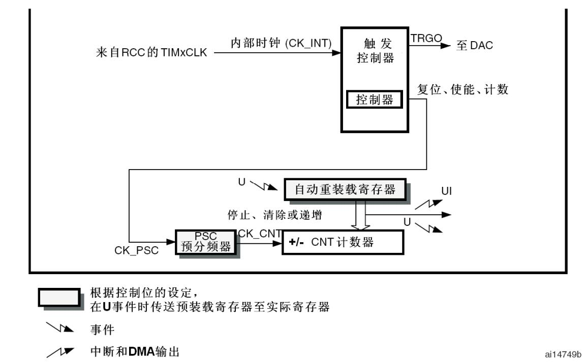
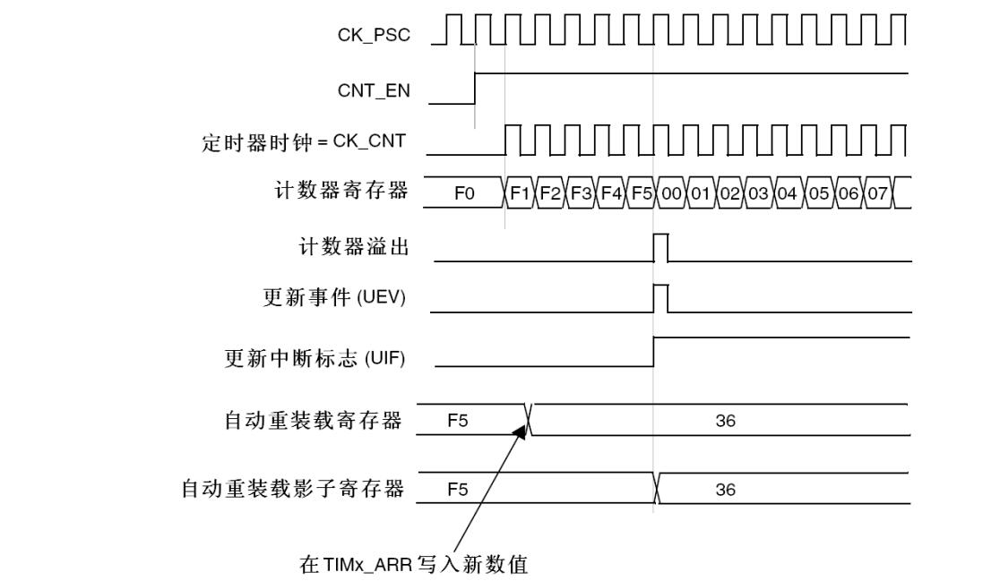
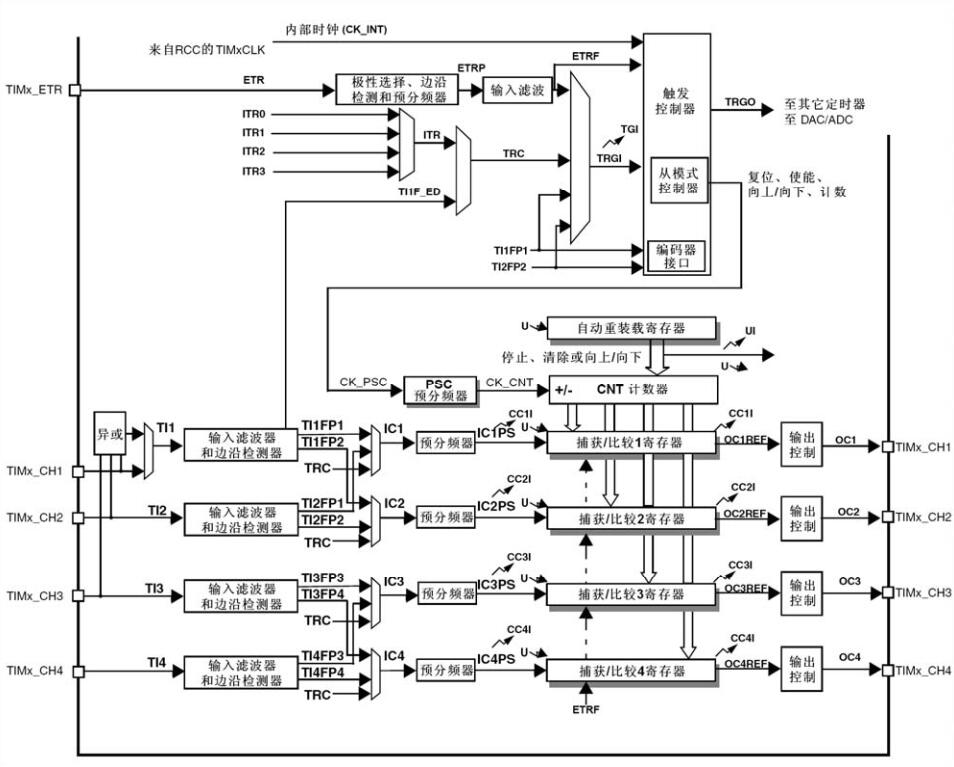
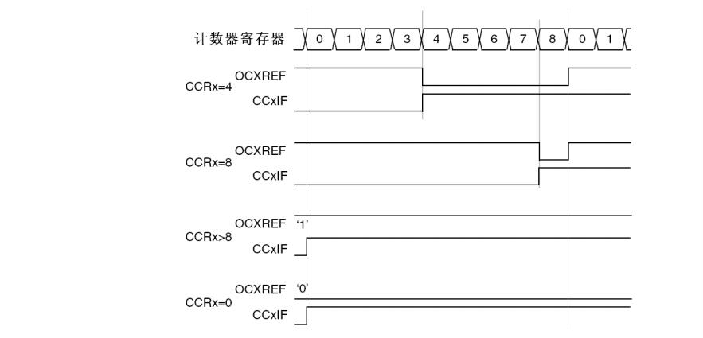
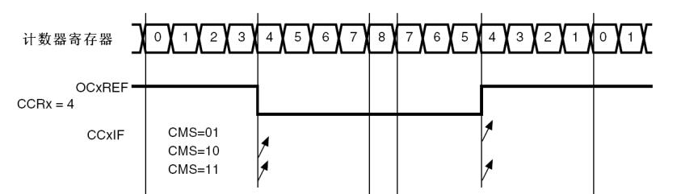
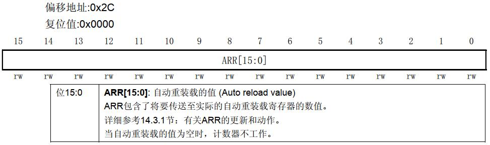

# 基本信息
* 课程名称：定时器 - TIM
* 讲师：谢胜
* 培训时间：2019/9/24 20:30-22:30
* 培训地点：T3 706
* 培训人数：14人

# 教学要点
1. 定时器种类
2. 定时器作用
3. 定时器模式
4. 定时器重要寄存器
5. 定时器中断

# 教学重点
1. 定时器模式
2. 定时器重要寄存器
3. 定时器中断

# 教学难点
1. 定时器模式
2. 定时器重要寄存器
3. 定时器中断

# 教学准备
1. 学生准备：电脑、单片机、下载器
2. 教师准备：借教室

# 教学过程
## 第一步：TIM介绍
STM32中的TIM分为三大类：基本定时器（TIM6和TIM7）、通用定时器（TIMx）和高级控制定时器（TIM1和TIM8）。

基本定时器具有最基本的定时功能，可编程控制定时周期，计数器溢出能产生中断/DMA请求。

通用定时器除了基本定时器的功能外，还可配置计数器装载方式，具有4个独立通道，每个通道均可进行输入捕获、输出比较、PWM输出以及单脉冲模式。中断源更多（向上溢出/向下溢出、计数器初始化/启动/停止、输入捕获、输出比较等）

高级定时器在通用定时器的基础上，还增加了数个功能：可输出嵌入死区时间的互补PWM、允许在指定数目的计数器周期之后更新定时器寄存器的重复计数器、刹车输入信号可以将定时器输出信号置于复位或者一个已知状态，中断源也多了一个刹车信号输入。

死区，简单解释：通常，大功率电机、变频器等，末端都是由大功率管、IGBT等元件组成的H桥或3相桥。每个桥的上半桥和下半桥是是绝对不能同时导通的，但高速的PWM驱动信号在达到功率元件的控制极时，往往会由于各种各样的原因产生延迟的效果，造成某个半桥元件在应该关断时没有关断，造成功率元件烧毁。死区就是在上半桥关断后，延迟一段时间再打开下半桥或在下半桥关断后，延迟一段时间再打开上半桥，从而避免功率元件烧毁。这段延迟时间就是死区。（就是上、下半桥的元件都是关断的）死区时间控制在通常的低端单片机所配备的PWM中是没有的。

刹车功能的目的是保护由这些定时器生成的PWM信号所驱动的功率器件。当被故障触发时，涉车电路会关闭PWM输出，并将其强制设为预定义的安全状态。

## 第二步：基本定时器介绍
TIM6和TIM7为基本定时器，两者资源相互独立不共享。两者各有一个可编程定时器。



### 时基单元
可编程定时器的主要部分是一个带有自动重装载的16位累加计数器，计数器的时钟通过一个预分频器得到。

软件可以读写计数器、自动重装载寄存器和预分频寄存器，即使计数器运行时也可以操作。

时基单元包含：
* 计数器寄存器(TIMx_CNT)
* 预分频寄存器(TIMx_PSC)
* 自动重装载寄存器(TIMx_ARR)

自动重装载寄存器是预加载的，每次读写自动重装载寄存器时，实际上是通过读写预加载寄存器实现。根据TIMx_CR1寄存器中的自动重装载预加载使能位(ARPE)，写入预加载寄存器的内容能够立即或在每次更新事件时，传送到它的影子寄存器。每当计数器达到溢出值时，会产生更新事件，该事件可用于产生中断。

### 预分频
预分频可以以系数介于1至65536之间的任意数值对计数器时钟分频。它是通过一个16位寄存器(TIMx_PSC)的计数实现分频。因为TIMx_PSC控制寄存器具有缓冲，可以在运行过程中改变它的数值，新的预分频数值将在下一个更新事件时起作用。

### 计数器模式
计数器从0累加计数到自动重装载数值(TIMx_ARR寄存器)，然后重新从0开始计数并产生一个计数器溢出事件。每次计数器溢出时可以产生更新事件。




## 第三步：通用定时器介绍
在STM32F10x系列中，通用定时器有TIM2、TIM3、TIM4和TIM5，每个定时器都是完全独立的，没有互相共享任何资源。它们可以一起同步操作。



### 计数器模式
分为向上计数、向下计数和中央对齐模式（向上/向下计数）


### 输入捕获模式
在输入捕获模式下，当检测到信号上相应的边沿后，计数器的当前值被锁存到捕获/比较寄存器(TIMx_CCRx)中，同时产生输入捕获事件，该事件可以被用于产生中断。

### PWM模式
脉冲宽度调制模式可以产生一个由TIMx_ARR寄存器确定频率、由TIMx_CCRx寄存器确定占空比的信号。

在PWM模式(模式1或模式2)下， TIMx_CNT和TIMx_CCRx始终在进行比较， (依据计数器的计数方向)以确 定是否符合TIMx_CCRx≤TIMx_CNT或者TIMx_CNT≤TIMx_CCRx。

#### 向上计数

当TIMx_CR1寄存器中的DIR位为低的时候执行向上计数。



#### 向下计数

当TIMx_CR1寄存器的DIR位为高时执行向下计数。

#### 中央对齐模式



## 第四步：TIM中断
* 定时器溢出中断
* 定时器输入捕获中断

## 第五步：TIM重要寄存器
1. 计数器(TIMx_CNT)


2. 预分频器(TIMx_PSC)


3. 自动重装载寄存器(TIMx_ARR)



4. 捕获/比较寄存器(TIMx_CCRx)


## 第四步：TIM API
```c
/**
  * @brief  Starts the TIM Input Capture measurement in interrupt mode.
  * @param  htim TIM Input Capture handle
  * @param  Channel TIM Channels to be enabled
  *          This parameter can be one of the following values:
  *            @arg TIM_CHANNEL_1: TIM Channel 1 selected
  *            @arg TIM_CHANNEL_2: TIM Channel 2 selected
  *            @arg TIM_CHANNEL_3: TIM Channel 3 selected
  *            @arg TIM_CHANNEL_4: TIM Channel 4 selected
  * @retval HAL status
  */
HAL_StatusTypeDef HAL_TIM_IC_Start_IT(TIM_HandleTypeDef *htim, uint32_t Channel)
```

```c
/**
  * @brief  Stops the TIM Input Capture measurement in interrupt mode.
  * @param  htim TIM Input Capture handle
  * @param  Channel TIM Channels to be disabled
  *          This parameter can be one of the following values:
  *            @arg TIM_CHANNEL_1: TIM Channel 1 selected
  *            @arg TIM_CHANNEL_2: TIM Channel 2 selected
  *            @arg TIM_CHANNEL_3: TIM Channel 3 selected
  *            @arg TIM_CHANNEL_4: TIM Channel 4 selected
  * @retval HAL status
  */
HAL_StatusTypeDef HAL_TIM_IC_Stop_IT(TIM_HandleTypeDef *htim, uint32_t Channel)
```

```c
/**
  * @brief  Starts the PWM signal generation.
  * @param  htim TIM handle
  * @param  Channel TIM Channels to be enabled
  *          This parameter can be one of the following values:
  *            @arg TIM_CHANNEL_1: TIM Channel 1 selected
  *            @arg TIM_CHANNEL_2: TIM Channel 2 selected
  *            @arg TIM_CHANNEL_3: TIM Channel 3 selected
  *            @arg TIM_CHANNEL_4: TIM Channel 4 selected
  * @retval HAL status
  */
HAL_StatusTypeDef HAL_TIM_PWM_Start(TIM_HandleTypeDef *htim, uint32_t Channel)
```

```c
/**
  * @brief  Stops the PWM signal generation.
  * @param  htim TIM PWM handle
  * @param  Channel TIM Channels to be disabled
  *          This parameter can be one of the following values:
  *            @arg TIM_CHANNEL_1: TIM Channel 1 selected
  *            @arg TIM_CHANNEL_2: TIM Channel 2 selected
  *            @arg TIM_CHANNEL_3: TIM Channel 3 selected
  *            @arg TIM_CHANNEL_4: TIM Channel 4 selected
  * @retval HAL status
  */
HAL_StatusTypeDef HAL_TIM_PWM_Stop(TIM_HandleTypeDef *htim, uint32_t Channel)
```

```c
/**
  * @brief  Starts the TIM Base generation.
  * @param  htim TIM Base handle
  * @retval HAL status
  */
HAL_StatusTypeDef HAL_TIM_Base_Start(TIM_HandleTypeDef *htim)
```

```c
/**
  * @brief  Stops the TIM Base generation.
  * @param  htim TIM Base handle
  * @retval HAL status
  */
HAL_StatusTypeDef HAL_TIM_Base_Stop(TIM_HandleTypeDef *htim)
```

```c
/**
  * @brief  Starts the TIM Base generation in interrupt mode.
  * @param  htim TIM Base handle
  * @retval HAL status
  */
HAL_StatusTypeDef HAL_TIM_Base_Start_IT(TIM_HandleTypeDef *htim)
```

```c
/**
  * @brief  Stops the TIM Base generation in interrupt mode.
  * @param  htim TIM Base handle
  * @retval HAL status
  */
HAL_StatusTypeDef HAL_TIM_Base_Stop_IT(TIM_HandleTypeDef *htim)
```

```c
/**
  * @brief  Period elapsed callback in non-blocking mode
  * @param  htim TIM handle
  * @retval None
  */
__weak void HAL_TIM_PeriodElapsedCallback(TIM_HandleTypeDef *htim)
{
  /* Prevent unused argument(s) compilation warning */
  UNUSED(htim);

  /* NOTE : This function should not be modified, when the callback is needed,
            the HAL_TIM_PeriodElapsedCallback could be implemented in the user file
   */
}
```

```c
/**
  * @brief  Input Capture callback in non-blocking mode
  * @param  htim TIM IC handle
  * @retval None
  */
__weak void HAL_TIM_IC_CaptureCallback(TIM_HandleTypeDef *htim)
{
  /* Prevent unused argument(s) compilation warning */
  UNUSED(htim);

  /* NOTE : This function should not be modified, when the callback is needed,
            the HAL_TIM_IC_CaptureCallback could be implemented in the user file
   */
}
```

## 第五步：实现简单定时实验
定时改变LED灯的状态。

## 第六步：实现PWM输出实验
输出指定周期和占空比的PWM波，驱动蜂鸣器。
```c
#define L_Do 3822
#define L_Re 3405
#define L_Mi 3033
#define L_Fa 2863
#define L_So 2551
#define L_La 2272
#define L_Xi 2024
#define M_Do 1911
#define M_Re 1702
#define M_Mi 1526
#define M_Fa 1431
#define M_So 1275
#define M_La 1136
#define M_Xi 1012
#define H_Do 955
#define H_Re 851
#define H_Mi 758
#define H_Fa 715
#define H_So 637
#define H_La 568
#define H_Xi 506
```

## 第七步：实现输入捕获实验
读取第六步输出的PWM一个周期内的高电平时间和低电平时间。

```c
int high_time, low_time;
int tim4_count, tim4_last_count;

void HAL_TIM_IC_CaptureCallback(TIM_HandleTypeDef *htim)
{
    static uint8_t flag = 0; //0代表上升沿触发；1代表下降沿触发

    tim4_last_count = tim4_count;
    if(flag == 0)
    {
        tim4_count = TIM4->CCR4;
        low_time = tim4_count - tim4_last_count;
				if(low_time < 0) low_time += 19999;
				else low_time += 1;
        TIM_RESET_CAPTUREPOLARITY(&htim4, TIM_CHANNEL_4);
        TIM_SET_CAPTUREPOLARITY(&htim4, TIM_CHANNEL_4, TIM_ICPOLARITY_FALLING);
        flag = 1;
    }
    else if(flag == 1)
    {
        tim4_count = TIM4->CCR4;
        high_time = tim4_count - tim4_last_count+1;
				TIM_RESET_CAPTUREPOLARITY(&htim4, TIM_CHANNEL_4);
        TIM_SET_CAPTUREPOLARITY(&htim4, TIM_CHANNEL_4, TIM_ICPOLARITY_RISING);
        flag = 0;
    }
}
```

# 参考
* 《STM32中文参考手册》